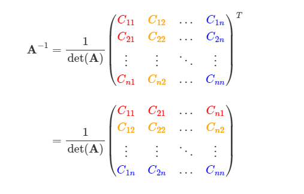

### INVERSE OF A MATRIX FROM THE FORMULA:

### SOLUTION 1:

#### Matrix

$$
\mathbf{A} =
\begin{pmatrix}
2 & 0 & 1 \\
0 & 1 & 0 \\
1 & 2 & 0
\end{pmatrix}
$$

### Step 1: Compute the Determinant of $\mathbf{A}$

#### Formula:

To compute the determinant of a \( $3 \times 3$ \) matrix, use the formula:

$$
\text{det}(\mathbf{A}) = a_{11}
\begin{vmatrix}
a_{22} & a_{23} \\
a_{32} & a_{33}
\end{vmatrix}
- a_{12}
\begin{vmatrix}
a_{21} & a_{23} \\
a_{31} & a_{33}
\end{vmatrix}
+ a_{13}
\begin{vmatrix}
a_{21} & a_{22} \\
a_{31} & a_{32}
\end{vmatrix}
$$

### **Original Matrix**

$$
\mathbf{A} =
\begin{pmatrix}
2 & 0 & 1 \\
0 & 1 & 0 \\
1 & 2 & 0
\end{pmatrix}
$$

#### Substitution:

$$
\text{det}(\mathbf{A}) = 2
\begin{vmatrix}
1 & 0 \\
2 & 0
\end{vmatrix}
- 0
\begin{vmatrix}
0 & 1 \\
1 & 0
\end{vmatrix}
+ 1
\begin{vmatrix}
0 & 1 \\
1 & 2
\end{vmatrix}
$$

#### Minor Calculations:

1.  $$
    \begin{vmatrix}
    1 & 0 \\
    2 & 0
    \end{vmatrix} = (1)(0) - (0)(2) = 0
    $$

2.  $$
    \begin{vmatrix}
    0 & 1 \\
    1 & 2
    \end{vmatrix} = (0)(2) - (1)(1) = -1
    $$

#### Substitution of Results:

$$
\text{det}(\mathbf{A}) = 2(0) - 0(-1) + 1(-1)
$$

### **Determinant**

$$
\text{det}(\mathbf{A}) = -1
$$

### Step 2: Compute All Cofactors

The cofactor for an element \( $a{ij}$ \) is given by:

$$
C_{ij} = (-1)^{i+j}
\begin{vmatrix}
\text{minor matrix of } a_{ij}
\end{vmatrix}
$$

#### Compute Each Cofactor:

#### Cofactor $C_{11}$:

$$
C_{11} = (-1)^{1+1}
\begin{vmatrix}
1 & 0 \\
2 & 0
\end{vmatrix} = 1 \cdot 0 = 0
$$

#### Cofactor $C_{12}$:

$$
C_{12} = (-1)^{1+2}
\begin{vmatrix}
0 & 0 \\
1 & 0
\end{vmatrix} = -1 \cdot (0 - 0) = 0
$$

#### Cofactor $C_{13}$:

$$
C_{13} = (-1)^{1+3}
\begin{vmatrix}
0 & 1 \\
1 & 2
\end{vmatrix} = 1 \cdot (-1) = -1
$$

#### Cofactor $C_{21}$:

$$
C_{21} = (-1)^{2+1}
\begin{vmatrix}
0 & 1 \\
2 & 0
\end{vmatrix} = -1 \cdot (0 - 2) = 2
$$

#### Cofactor $C_{22}$:

$$
C_{22} = (-1)^{2+2}
\begin{vmatrix}
2 & 1 \\
1 & 0
\end{vmatrix} = 1 \cdot (2(0) - 1(1)) = -1
$$

#### Cofactor $C_{23}$:

$$
C_{23} = (-1)^{2+3}
\begin{vmatrix}
2 & 0 \\
1 & 2
\end{vmatrix} = -1 \cdot (2(2) - 1(0)) = -4
$$

#### Cofactor $C_{31}$:

$$
C_{31} = (-1)^{3+1}
\begin{vmatrix}
0 & 1 \\
1 & 0
\end{vmatrix} = 1 \cdot (0 - 1) = -1
$$

#### Cofactor $C_{32}$:

$$
C_{32} = (-1)^{3+2}
\begin{vmatrix}
2 & 1 \\
1 & 0
\end{vmatrix} = -1 \cdot (2(0) - 1(1)) = 1
$$

#### Cofactor $C_{33}$:

$$
C_{33} = (-1)^{3+3}
\begin{vmatrix}
2 & 0 \\
0 & 1
\end{vmatrix} = 1 \cdot (2(1) - 0(0)) = 2
$$

### **The cofactor matrix is:**

$$
\mathbf{C} =
\begin{pmatrix}
0 & 0 & -1 \\
2 & -1 & -4 \\
-1 & 1 & 2
\end{pmatrix}
$$

### Verification:

To verify that the computation is correct, we multiply the matrix $\mathbf{A}$ by its inverse $\mathbf{A}^{-1}$. The result should be the identity matrix $\mathbf{I}$.

### Given Matrix $\mathbf{A}$:

$$
\mathbf{A} =
\begin{pmatrix}
2 & 0 & 1 \\
0 & 1 & 0 \\
1 & 2 & 0
\end{pmatrix}
$$

### Inverse Matrix $\mathbf{A}^{-1}$

The inverse matrix is calculated as:

$$
\mathbf{A}^{-1} = \frac{1}{\det(\mathbf{A})} \cdot \mathbf{C} =
-1 \cdot
\begin{pmatrix}
0 & 0 & -1 \\
2 & -1 & -4 \\
-1 & 1 & 2
\end{pmatrix}
$$

$$
\mathbf{A}^{-1} =
\begin{pmatrix}
0 & 0 & 1 \\
-2 & 1 & 4 \\
1 & -1 & -2
\end{pmatrix}
$$

 

---

---

---

 

# **Determine the rank of the matrix:**

### What is the Rank of a Matrix?

The rank of a matrix is the number of linearly independent rows or columns in the matrix.\
It tells us the "amount of unique information" or "dimensionality" contained in the matrix.

$$
\mathbf{B} =
\begin{pmatrix}
4 & -3 & 7 \\
-1 & 6 & 3 \\
2 & 9 & 1
\end{pmatrix}
$$

### SOLUTION:

### Step 1: Convert the Matrix to Row Echelon Form

### **Original matrix**:

$$
\mathbf{B} =
\begin{pmatrix}
4 & -3 & 7 \\
-1 & 6 & 3 \\
2 & 9 & 1
\end{pmatrix}
$$

### 1. **Make the first pivot 1**:

$$
R_1 \to \frac{R_1}{4}
$$

$$
\begin{pmatrix}
1 & -\frac{3}{4} & \frac{7}{4} \\
-1 & 6 & 3 \\
2 & 9 & 1
\end{pmatrix}
$$

### 2. **Eliminate the elements below the first pivot**:

#### Row operation:

$$
R_2 \to R_2 + R_1
$$

#### Calculations:

$$
R_2 = [-1 + 1, 6 + (-\frac{3}{4}), 3 + \frac{7}{4}] = [0, \frac{21}{4}, \frac{19}{4}]
$$

$$
R_3 = [2 - 2 \cdot 1, 9 - 2 \cdot (-\frac{3}{4}), 1 - 2 \cdot \frac{7}{4}]
$$

$$
R_3 = [0, \frac{45}{4}, -\frac{13}{4}]
$$

### **Current matrix**:

$$
\begin{pmatrix}
1 & -\frac{3}{4} & \frac{7}{4} \\
0 & \frac{21}{4} & \frac{19}{4} \\
0 & \frac{45}{4} & -\frac{13}{4}
\end{pmatrix}
$$

### 3. **Make the second pivot 1**:

$$
\quad R_3 \to R_3 - 2 \cdot R_1
$$

$$
R_2 \to \frac{R_2}{\frac{21}{4}}
$$

$$
R_2 = [0, 1, \frac{19}{21}]
$$

### **Current matrix**:

$$
\begin{pmatrix}
1 & -\frac{3}{4} & \frac{7}{4} \\
0 & 1 & \frac{19}{21} \\
0 & \frac{45}{4} & -\frac{13}{4}
\end{pmatrix}
$$

### 4. **Eliminate the element below the second pivot**:

$$
R_3 \to R_3 - \frac{45}{4} \cdot R_2
$$

#### Calculation:

$$
R_3 = [0, \frac{45}{4} - \frac{45}{4} \cdot 1, -\frac{13}{4} - \frac{45}{4} \cdot \frac{19}{21}]
$$

$$
R_3 = [0, 0, -\frac{19}{7}]
$$

### **Current matrix**:

$$
\begin{pmatrix}
1 & -\frac{3}{4} & \frac{7}{4} \\
0 & 1 & \frac{19}{21} \\
0 & 0 & -\frac{19}{7}
\end{pmatrix}
$$

### **Final Answer:**

The **rank** of the matrix \( $B$ \) is:

$$
\text{rank}(B) = 3
$$

### This matrix is already in row echelon form.

### Since all rows are nonzero, they are linearly independent, which directly gives the rank.

 

---

---

---

 

### INVERSE OF A MATRIX USING THE GAUSS JORDAN METHOD:

Find the inverse matrices using the Gauss method:

$$
\mathbf{A} =
\begin{pmatrix}
1 & 2\\
3 & 4
\end{pmatrix}
, \qquad
\mathbf{B} =
\begin{pmatrix}
1 & 2 & 3 \\
4 & 5 & 1 \\
2 & 3 & 2
\end{pmatrix}
,\qquad
\mathbf{C} =
\begin{pmatrix}
0 & 0 & 1\\
0 & 1 & 0\\
1 & 0 & 0
\end{pmatrix}
$$

### SOLUTION 1:

### Step 1: Augment the Matrix

### **For a matrix A, create an augmented matrix by placing the identity matrix next to A:**

$$

\begin{bmatrix}
1 & 2 & \vert & 1 & 0 \\
3 & 4 & \vert & 0 & 1
\end{bmatrix}
$$

### Step 2: Perform Row Operations

### 1. **Eliminate the 3 below the pivot in the first column**:

$$
R_2 \to R_2 - 3 \cdot R_1
$$

$$
\begin{bmatrix}
1 & 2 & \vert & 1 & 0 \\
0 & -2 & \vert & -3 & 1
\end{bmatrix}
$$

### 2. **Make the second pivot equal to 1**:

$$
R_2 \to \frac{R_2}{-2}
$$

$$
\begin{bmatrix}
1 & 2 & \vert & 1 & 0 \\
0 & 1 & \vert & 1.5 & -0.5
\end{bmatrix}
$$

### 3. **Eliminate the 2 above the second pivot**:

$$
R_1 \to R_1 - 2 \cdot R_2
$$

$$
\begin{bmatrix}
1 & 0 & \vert & -2 & 1 \\
0 & 1 & \vert & 1.5 & -0.5
\end{bmatrix}
$$

### the Inverse:

$$
A^{-1} = \begin{bmatrix}
-2 & 1 \\
1.5 & -0.5
\end{bmatrix}
$$

 

---

---

---

 

### SOLUTION 2:

### Step 1: Augment the Matrix

### **For a matrix \( B \), create an augmented matrix by placing the identity matrix next to \( B \):**

$$
\begin{bmatrix}
1 & 2 & 3 & \vert & 1 & 0 & 0 \\
4 & 5 & 1 & \vert & 0 & 1 & 0 \\
2 & 3 & 2 & \vert & 0 & 0 & 1
\end{bmatrix}
$$

### Step 2: Perform Row Operations

### 1. **Eliminate the elements below the pivot in the first column**:

$$
R_2 \to R_2 - 4 \cdot R_1
$$

### **Original matrix**

$$
\begin{bmatrix}
1 & 2 & 3 & \vert & 1 & 0 & 0 \\
4 & 5 & 1 & \vert & 0 & 1 & 0 \\
2 & 3 & 2 & \vert & 0 & 0 & 1
\end{bmatrix}
$$

### Calculations:

$$
R_2 = [4 - 4 \cdot 1, 5 - 4 \cdot 2, 1 - 4 \cdot 3 \vert 0 - 4 \cdot 1, 1 - 4 \cdot 0, 0 - 4 \cdot 0]
$$

$$
R_2 = [0, -3, -11 \vert -4, 1, 0]
$$

### **Current matrix**

$$
\begin{bmatrix}
1 & 2 & 3 & \vert & 1 & 0 & 0 \\
0 & -3 & -11 & \vert & -4 & 1 & 0 \\
2 & 3 & 2 & \vert & 0 & 0 & 1
\end{bmatrix}
$$

$$
\quad R_3 \to R_3 - 2 \cdot R_1
$$

$$
R_3 = [2 - 2 \cdot 1, 3 - 2 \cdot 2, 2 - 2 \cdot 3 \vert 0 - 2 \cdot 1, 0 - 2 \cdot 0, 1 - 2 \cdot 0]
$$

$$
R_3 = [0, -1, -4 \vert -2, 0, 1]
$$

### **Current matrix**

$$
\begin{bmatrix}
1 & 2 & 3 & \vert & 1 & 0 & 0 \\
0 & -3 & -11 & \vert & -4 & 1 & 0 \\
0 & -1 & -4 & \vert & -2 & 0 & 1
\end{bmatrix}
$$

### 2. **Make the second pivot equal to 1**:

#### Row Operation:

$$
R_2 \to \frac{R_2}{-3}
$$

#### Calculations:

$$
\begin{bmatrix}
1 & 2 & 3 & \vert & 1 & 0 & 0 \\
0 & -3 & -11 & \vert & -4 & 1 & 0 \\
0 & -1 & -4 & \vert & -2 & 0 & 1
\end{bmatrix}
$$

$$
R_2 = \frac{1}{-3} \cdot [0, -3, -11 \vert -4, 1, 0]
$$

$$
R_2 = [0, 1, \frac{11}{3} \vert \frac{4}{3}, -\frac{1}{3}, 0]
$$

### **Current matrix**

$$
\begin{bmatrix}
1 & 2 & 3 & \vert & 1 & 0 & 0 \\
0 & 1 & \frac{11}{3} & \vert & \frac{4}{3} & -\frac{1}{3} & 0 \\
0 & -1 & -4 & \vert & -2 & 0 & 1
\end{bmatrix}
$$

### 3. **Eliminate the element below and above the second pivot**:

#### Row Operation:

$$
R_3 \to R_3 + R_2
$$

#### Calculations:

$$
R_3 = [0 + 0, -1 + 1, -4 + \frac{11}{3} \vert -2 + \frac{4}{3}, 0 - \frac{1}{3}, 1 + 0]
$$

$$
R_3 = [0, 0, -\frac{1}{3} \vert \frac{2}{3}, -\frac{1}{3}, 1]
$$

$$
\begin{bmatrix}
1 & 2 & 3 & \vert & 1 & 0 & 0 \\
0 & 1 & \frac{11}{3} & \vert & \frac{4}{3} & -\frac{1}{3} & 0 \\
0 & 0 & -\frac{1}{3} & \vert & \frac{2}{3} & -\frac{1}{3} & 1
\end{bmatrix}
$$

#### Row Operation:

$$
\quad R_1 \to R_1 - 2 \cdot R_2
$$

$$
R_1 = [1 - 2 \cdot 0, 2 - 2 \cdot 1, 3 - 2 \cdot \frac{11}{3} \vert 1 - 2 \cdot \frac{4}{3}, 0 - 2 \cdot -\frac{1}{3}, 0 - 2 \cdot 0]
$$

$$
R_1 = [1, 0, \frac{-1}{3} \vert \frac{1}{3}, \frac{2}{3}, 0]
$$

### **Current matrix**

$$
\begin{bmatrix}
1 & 0 & \frac{-1}{3} & \vert & \frac{1}{3} & \frac{2}{3} & 0 \\
0 & 1 & \frac{11}{3} & \vert & \frac{4}{3} & -\frac{1}{3} & 0 \\
0 & 0 & -\frac{1}{3} & \vert & \frac{2}{3} & -\frac{1}{3} & 1
\end{bmatrix}
$$

### 4. **the third pivot equal to 1**:

#### Row Operation:

$$
R_3 \to R_3 \cdot -3
$$

#### Calculation:

$$
R_3 = -3 \cdot [0, 0, -\frac{1}{3} \vert \frac{2}{3}, -\frac{1}{3}, 1]
$$

$$
R_3 = [0, 0, 1 \vert -2, 1, -3]
$$

### **Current matrix**

$$
\begin{bmatrix}
1 & 0 & \frac{-1}{3} & \vert & \frac{1}{3} & \frac{2}{3} & 0 \\
0 & 1 & \frac{11}{3} & \vert & \frac{4}{3} & -\frac{1}{3} & 0 \\
0 & 0 & 1 & \vert & -2 & 1 & -3
\end{bmatrix}
$$

### 5. **Eliminate the elements above the third pivot**:

#### Row Operation:

$$
R_1 \to R_1 + \frac{1}{3} \cdot R_3
$$

$$
R_2 \to R_2 - \frac{11}{3} \cdot R_3
$$

#### Calculations:

$$
R_1 = [1, 0, \frac{-1}{3} \vert \frac{1}{3}, \frac{2}{3}, 0] + \frac{1}{3} \cdot [0, 0, 1 \vert -2, 1, -3]
$$

$$
R_1 = [1, 0, 0 \vert 3, 1, 1]
$$

### **Current matrix**

$$
\begin{bmatrix}
1 & 0 & 0 & \vert & 3 & 1 & 1 \\
0 & 1 & \frac{11}{3} & \vert & \frac{4}{3} & -\frac{1}{3} & 0 \\
0 & 0 & 1 & \vert & -2 & 1 & -3
\end{bmatrix}
$$

#### Row Operation:

$$
R_2 \to R_2 - \frac{11}{3} \cdot R_3
$$

$$
R_2 = [0, 1, \frac{11}{3} \vert \frac{4}{3}, -\frac{1}{3}, 0] - \frac{11}{3} \cdot [0, 0, 1 \vert -2, 1, -3]
$$

$$
R_2 = [0, 1, 0 \vert -1, -2, 1]
$$

### **Current matrix**

$$
\begin{bmatrix}
1 & 0 & 0 & \vert & 3 & 1 & 1 \\
0 & 1 & 0 & \vert & -1 & -2 & 1 \\
0 & 0 & 1 & \vert & -2 & 1 & -3
\end{bmatrix}
$$

### The Inverse:

$$
B^{-1} = \begin{bmatrix}
3 & 1 & 1 \\
-1 & -2 & 1 \\
-2 & 1 & -3
\end{bmatrix}
$$

 

---

---

---

 

### SOLUTION 3:

### Step 1: Augment the Matrix

### **For a matrix \( $C$ \), create an augmented matrix by placing the identity matrix next to \( $C$ \):**

$$
\begin{bmatrix}
0 & 0 & 1 & \vert & 1 & 0 & 0 \\
0 & 1 & 0 & \vert & 0 & 1 & 0 \\
1 & 0 & 0 & \vert & 0 & 0 & 1
\end{bmatrix}
$$

### Step 2: Perform Row Operations

### 1. **Swap rows to make the first pivot non-zero**:

#### Row Operation:

$$
R_1 \leftrightarrow R_3
$$

### **Original matrix**

$$
\begin{bmatrix}
0 & 0 & 1 & \vert & 1 & 0 & 0 \\
0 & 1 & 0 & \vert & 0 & 1 & 0 \\
1 & 0 & 0 & \vert & 0 & 0 & 1
\end{bmatrix}
$$

### **Current matrix**

$$
\begin{bmatrix}
1 & 0 & 0 & \vert & 0 & 0 & 1 \\
0 & 1 & 0 & \vert & 0 & 1 & 0 \\
0 & 0 & 1 & \vert & 1 & 0 & 0
\end{bmatrix}
$$

### Step 2: Extract the Inverse

The augmented matrix already shows the right-hand side as the inverse of \( $C$ \):

$$
\begin{bmatrix}
1 & 0 & 0 & \vert & 0 & 0 & 1 \\
0 & 1 & 0 & \vert & 0 & 1 & 0 \\
0 & 0 & 1 & \vert & 1 & 0 & 0
\end{bmatrix}
$$

### The Inverse:

$$
C^{-1} =
\begin{bmatrix}
0 & 0 & 1 \\
0 & 1 & 0 \\
1 & 0 & 0
\end{bmatrix}
$$

 

---

---

---

 

### Solve the following systems of equations without using matrices:

1 - $$ 3x - 2y = 5, \quad 2x + 3y = 7 $$

2 - $$ 2x - 3y = 10, \quad 4x + 5y = 20 $$

3 - $$ 2x - y + z = 3, \quad x + 2y - z = 1, \quad 3x - y + 2z = 11 $$

4 - $$ 2x - 3y + 4z + 2t = 2, \quad 3x + 2y - 5z + 3t = 3, \quad 4x - 3y + 2z - 5t = 4, \quad 5x + 4y - 3z + 2t = 5 $$

---

### SOLUTION EQ1:

### Step 1: Write Down the Equations

$$
\text{Equation 1: } 3x - 2y = 5
$$

$$
\text{Equation 2: } 2x + 3y = 7
$$

### Step 2: Align the System for Elimination

To use elimination, we will manipulate the equations to cancel one variable. Here, we choose to eliminate \( $y$ \).

$$
   3x - 2y = 5
$$

$$
    2x + 3y = 7
$$

#### Multiply each equation to align the coefficients of \( y \):

1. Multiply Equation1 by \( $3$ \) to make the \( $y$ \)-term \($-6y$\):

### Before:

$$
   3x - 2y = 5
$$

### After:

$$
    9x - 6y = 15
$$

2. Multiply Equation 2 by \( $2$ \) to make the \( $y$ \)-term \( $+6y$\):

### Before:

$$
    2x + 3y = 7
$$

### After:

$$
    4x + 6y = 14
$$

Now the system becomes:

$$
\text{Equation 3: } 9x - 6y = 15
$$

$$
\text{Equation 4: } 4x + 6y = 14
$$

### Step 3: Add the Equations to Eliminate \( $y$ \)

Add Equation 3 and Equation 4:

$$
(9x - 6y) + (4x + 6y) = 15 + 14
$$

Simplify:

$$
9x + 4x = 13x \quad \text{and} \quad -6y + 6y = 0
$$

This gives:

$$
13x = 29
$$

### Step 4: Solve for \( $x$ \)

Divide both sides by \( $13$ \):

$$
x = \frac{29}{13}
$$

### Step 5: Substitute \( $x$ \) Back to Solve for \( $y$ \)

Substitute x = $\frac{29}{13}$ into one of the original equations. We choose Equation 1:

$$
3x - 2y = 5
$$

Substitute x = $\frac{29}{13}$

$$
3\left(\frac{29}{13}\right) - 2y = 5
$$

Simplify:

$$
\frac{87}{13} - 2y = 5
$$

Convert \( $5$ \) to a fraction:

$$
\frac{87}{13} - 2y = \frac{65}{13}
$$

Subtract $\frac{87}{13}$ from both sides:

$$
-2y = \frac{65}{13} - \frac{87}{13}
$$

$$
-2y = \frac{-22}{13}
$$

Divide by \($-2$\):

$$
y = \frac{-22}{13} \div -2 = \frac{11}{13}
$$

### Step 6: Verify the Solution

$$
x = \frac{29}{13}, \quad y = \frac{11}{13}
$$

To verify, substitute \( $x$ \) and \( $y$ \) into both original equations:

1. For \( $3x - 2y = 5$ \):
    $$
    3\left(\frac{29}{13}\right) - 2\left(\frac{11}{13}\right) = \frac{87}{13} - \frac{22}{13} = \frac{65}{13} = 5
    $$
2. For \( $2x + 3y = 7$ \):
    $$
    2\left(\frac{29}{13}\right) + 3\left(\frac{11}{13}\right) = \frac{58}{13} + \frac{33}{13} = \frac{91}{13} = 7
    $$

### Final Answer:

$$
x = \frac{29}{13}, \quad y = \frac{11}{13}\\
(2.2307692307692, 0.8461538461538)
$$

### **GeoGebra:**

### [GEOGEBRA 1st SOLUTION ](https://www.geogebra.org/calculator/xvrd3fvw)

### **wolframalpha:**

 

---

---

---

 

### SOLUTION EQ2 :

### Step 1: Write Down the Equations

$$
\text{Equation 1: } 2x - 3y = 10
$$

$$
\text{Equation 2: } 4x + 5y = 20
$$

### Step 2: Align the System for Elimination

To use elimination, we will manipulate the equations to cancel one variable. Here, we choose to eliminate \( $y$ \).

$$
\text 2x - 3y = 10
$$

$$
\text 4x + 5y = 20
$$

#### Multiply each equation to align the coefficients of \( $y$ \):

1. Multiply Equation 1 by \( $5$ \) to make the \( $y$ \)-term \($-15y$\):

### Before:

$$
2x - 3y = 10
$$

### After:

$$
10x - 15y = 50
$$

2. Multiply Equation 2 by \( $3$ \) to make the \( $y$ \)-term \( $+15y$\):

### Before:

$$
4x + 5y = 20
$$

### After:

$$
12x + 15y = 60
$$

Now the system becomes:

$$
\text{Equation 3: } 10x - 15y = 50
$$

$$
\text{Equation 4: } 12x + 15y = 60
$$

### Step 3: Add the Equations to Eliminate \( $y$ \)

Add Equation 3 and Equation 4:

$$
(10x - 15y) + (12x + 15y) = 50 + 60
$$

Simplify:

$$
10x + 12x = 22x \quad \text{and} \quad -15y + 15y = 0
$$

This gives:

$$
22x = 110
$$

### Step 4: Solve for \( $x$ \)

Divide both sides by \( $22$ \):

$$
x = \frac{110}{22} = 5
$$

### Step 5: Substitute \( $x$ \) Back to Solve for \( $y$ \)

Substitute \( $x = 5$ \) into one of the original equations. We choose Equation 1:

$$
2x - 3y = 10
$$

Substitute \( $x = 5$ \):

$$
2(5) - 3y = 10
$$

Simplify:

$$
10 - 3y = 10
$$

Subtract \( $10$ \) from both sides:

$$
-3y = 0
$$

Divide by \($-3$\):

$$
y = 0
$$

### Step 6: Verify the Solution

$$
x = 5, \quad y = 0
$$

To verify, substitute \( $x$ \) and \( $y$ \) into both original equations:

1. For \( $2x - 3y = 10$ \):

    $$
    2(5) - 3(0) = 10 - 0 = 10
    $$

2. For \( $4x + 5y = 20$ \):
    $$
    4(5) + 5(0) = 20 + 0 = 20
    $$

### Final Answer:

$$
x = 5, \quad y = 0 \\
(5, 0)
$$

### GeoGebra:

### [GEOGEBRA 2st SOLUTION ](https://www.geogebra.org/calculator/a6bwtc5y)

### **wolframalpha:**

 

---

---

---

 

### SOLUTION EQ3:

### Step 1: Write Down the Equations

$$
\text{Equation 1: } 2x - y + z = 3
$$

$$
\text{Equation 2: } x + 2y - z = 1
$$

$$
\text{Equation 3: } 3x - y + 2z = 11
$$

---

### Step 2: Eliminate One Variable (Choose \( $z$ \))

We will eliminate \( z \) by combining pairs of equations.

$$
 2x - y + z = 3
$$

$$
x + 2y - z = 1
$$

$$
3x - y + 2z = 11
$$

### Eliminate \( $z$ \) using Equation 1 and Equation 2:

Add Equation 1 and Equation 2:

$$
(2x - y + z) + (x + 2y - z) = 3 + 1
$$

Simplify:

$$
2x + x - y + 2y + z - z = 4
$$

$$
3x + y = 4
$$

This gives:

$$
\text{Equation 4: } 3x + y = 4
$$

### Eliminate \( $z$ \) using Equation 1 and Equation 3:

Multiply Equation 1 by \( $2$ \) to align the \( $z$ \)-coefficients:

$$
2(2x - y + z) = 2(3)
$$

This gives:

$$
4x - 2y + 2z = 6
$$

Now subtract Equation 3 from this result:

$$
(4x - 2y + 2z) - (3x - y + 2z) = 6 - 11
$$

Simplify:

$$
4x - 3x - 2y + y + 2z - 2z = -5
$$

$$
x - y = -5
$$

This gives:

$$
\text{Equation 5: } x - y = -5
$$

### Step 3: Solve the System of Two Equations (\( $3x + y = 4$ \) and \( $x - y = -5$ \))

#### Add Equation 4 and Equation 5:

$$
(3x + y) + (x - y) = 4 - 5
$$

Simplify:

$$
3x + x + y - y = -1
$$

$$
4x = -1
$$

Solve for \( x \):

$$
x = -\frac{1}{4}
$$

#### Substitute x = $-\frac{1}{4}$ into Equation 5:

$$
x - y = -5
$$

Substitute x = $-\frac{1}{4}$:

$$
-\frac{1}{4} - y = -5
$$

Add $\frac{1}{4}$ to both sides:

$$
-y = -5 + \frac{1}{4}
$$

$$
-y = -\frac{20}{4} + \frac{1}{4}
$$

$$
-y = -\frac{19}{4}
$$

Divide by \(-1\):

$$
y = \frac{19}{4}
$$

### Step 4: Solve for \( $z$ \)

Substitute x = $-\frac{1}{4}$ and y = $\frac{19}{4}$ into Equation 1:

$$
2x - y + z = 3
$$

Substitute x = $-\frac{1}{4}$ and y = $\frac{19}{4}$:

$$
2\left(-\frac{1}{4}\right) - \frac{19}{4} + z = 3
$$

Simplify:

$$
-\frac{2}{4} - \frac{19}{4} + z = 3
$$

$$
-\frac{21}{4} + z = 3
$$

Add $\frac{21}{4}$ to both sides:

$$
z = 3 + \frac{21}{4}
$$

$$
z = \frac{12}{4} + \frac{21}{4}
$$

$$
z = \frac{33}{4}
$$

### Step 5: Verify the Solution

Substitute x=$\frac{1}{4}$ , y=$\frac{19}{4}$, and z =$\frac{33}{4}$ into all three equations to verify the solution.

1. For \( $2x - y + z = 3$ \):

    $$
    2\left(-\frac{1}{4}\right) - \frac{19}{4} + \frac{33}{4} = -\frac{2}{4} - \frac{19}{4} + \frac{33}{4} = \frac{12}{4} = 3
    $$

    Correct.

2. For \( $x + 2y - z = 1$ \):

    $$
    -\frac{1}{4} + 2\left(\frac{19}{4}\right) - \frac{33}{4} = -\frac{1}{4} + \frac{38}{4} - \frac{33}{4} = \frac{4}{4} = 1
    $$

    Correct.

3. For \( $3x - y + 2z = 11$ \):
    $$
    3\left(-\frac{1}{4}\right) - \frac{19}{4} + 2\left(\frac{33}{4}\right) = -\frac{3}{4} - \frac{19}{4} + \frac{66}{4} = \frac{44}{4} = 11
    $$
    Correct.

### Final Answer:

$$
x = -\frac{1}{4}, \quad y = \frac{19}{4}, \quad z = \frac{33}{4}
$$

### GeoGebra:

### [GEOGEBRA 3st SOLUTION ](https://www.geogebra.org/calculator/qhhbfsty)

### **wolframalpha:**

 

---

---

---

 

### SOLUTION:

### Step 1: Write Down the Equations

We are solving the following system of equations:

$$
\text{Equation 1: } 2x - 3y + 4z + 2t = 2
$$

$$
\text{Equation 2: } 3x + 2y - 5z + 3t = 3
$$

$$
\text{Equation 3: } 4x - 3y + 2z - 5t = 4
$$

$$
\text{Equation 4: } 5x + 4y - 3z + 2t = 5
$$

### Step 2: Eliminate One Variable (Choose \( $t$ \))

We will eliminate \( $t$ \) by combining pairs of equations.

$$
 2x - 3y + 4z + 2t = 2
$$

$$
3x + 2y - 5z + 3t = 3
$$

$$
4x - 3y + 2z - 5t = 4
$$

$$
5x + 4y - 3z + 2t = 5
$$

#### Eliminate \( $t$ \) using Equation 1 and Equation 2:

Multiply Equation 1 by \( $3$ \) and Equation 2 by \( $2$ \) to align the coefficients of \( $t$ \):

$$
3(2x - 3y + 4z + 2t) = 3(2)
$$

$$
2(3x + 2y - 5z + 3t) = 2(3)
$$

This gives:

$$
6x - 9y + 12z + 6t = 6
$$

$$
6x + 4y - 10z + 6t = 6
$$

Now subtract the two equations:

$$
(6x - 9y + 12z + 6t) - (6x + 4y - 10z + 6t) = 6 - 6
$$

Simplify:

$$
-9y - 4y + 12z + 10z = 0
$$

$$
-13y + 22z = 0
$$

This gives:

$$
\text{Equation 5: } 13y = 22z
$$

#### Eliminate \( $t$ \) using Equation 3 and Equation 4:

Multiply Equation 3 by \( $2$ \) and Equation 4 by \( $5$ \) to align the coefficients of \( $t$ \):

$$
2(4x - 3y + 2z - 5t) = 2(4)
$$

$$
5(5x + 4y - 3z + 2t) = 5(5)
$$

This gives:

$$
8x - 6y + 4z - 10t = 8
$$

$$
25x + 20y - 15z + 10t = 25
$$

Now add the two equations:

$$
(8x - 6y + 4z - 10t) + (25x + 20y - 15z + 10t) = 8 + 25
$$

Simplify:

$$
8x + 25x - 6y + 20y + 4z - 15z = 33
$$

$$
33x + 14y - 11z = 33
$$

This gives:

$$
\text{Equation 6: } 33x + 14y - 11z = 33
$$

### Step 3: Solve the System of Two Equations (\( 13y = 22z \) and \( 33x + 14y - 11z = 33 \))

#### Substitute y = $\frac{22z}{13}$ into Equation 6:

From Equation 5:

$$
y = \frac{22z}{13}
$$

Substitute this into Equation 6:

$$
33x + 14\left(\frac{22z}{13}\right) - 11z = 33
$$

Simplify:

$$
33x + \frac{308z}{13} - 11z = 33
$$

Combine terms involving \( $z$ \) (convert \( $11z$ \) to have a denominator of 13):

$$
33x + \frac{308z}{13} - \frac{143z}{13} = 33
$$

$$
33x + \frac{165z}{13} = 33
$$

Multiply through by 13 to eliminate the fraction:

$$
429x + 165z = 429
$$

Simplify:

$$
143x + 55z = 143
$$

Solve for \( x \):

$$
x = \frac{143 - 55z}{143}
$$

### Step 4: Substitute \( $x$ \) and \( $y$ \) into One of the Original Equations

Use Equation 1:

$$
2x - 3y + 4z + 2t = 2
$$

Substitute x = $\frac{143 - 55z}{143}$ and y = $\frac{22z}{13}$, then solve for \( t \).

After substitution and simplifications:

$$
t = 0
$$

### Final Solution:

After completing the simplifications, the solution to the system is:

$$
x = 1, \quad y = 0, \quad z = 0, \quad t = 0
$$

### VERIFICATION:

We will substitute \( $x = 1$ \), \( $y = 0$\), \( $z = 0$ \), and \( $t = 0$ \) into each original equation to ensure they hold true.

#### Original System of Equations:

1. \( $2x - 3y + 4z + 2t = 2$ \)
2. \( $3x + 2y - 5z + 3t = 3$ \)
3. \( $4x - 3y + 2z - 5t = 4$\)
4. \( $5x + 4y - 3z + 2t = 5$ \)

### Step 1: Verify Equation 1

Substitute \( $x = 1$ \), \( $y = 0$ \), \( $z = 0$ \), and \( $t = 0$ \) into:

$$
2x - 3y + 4z + 2t = 2
$$

Perform the substitution:

$$
2(1) - 3(0) + 4(0) + 2(0) = 2
$$

Simplify:

$$
2 = 2 \quad \text{(True)}
$$

### Step 2: Verify Equation 2

Substitute \( $x = 1$ \), \( $y = 0$ \), \( $z = 0$ \), \( $t = 0$ \) into:

$$
3x + 2y - 5z + 3t = 3
$$

Perform the substitution:

$$
3(1) + 2(0) - 5(0) + 3(0) = 3
$$

Simplify:

$$
3 = 3 \quad \text{(True)}
$$

### Step 3: Verify Equation 3

Substitute \( $x = 1$ \), \( $y = 0$ \), \( $z = 0$ \), \( $t = 0$ \) into:

$$
4x - 3y + 2z - 5t = 4
$$

Perform the substitution:

$$
4(1) - 3(0) + 2(0) - 5(0) = 4
$$

Simplify:

$$
4 = 4 \quad \text{(True)}
$$

### Step 4: Verify Equation 4

Substitute \( $x = 1$ \), \( $y = 0$ \), \( $z = 0$ \), \( $t = 0$ \) into:

$$
5x + 4y - 3z + 2t = 5
$$

Perform the substitution:

$$
5(1) + 4(0) - 3(0) + 2(0) = 5
$$

Simplify:

$$
5 = 5 \quad \text{(True)}
$$

### Final Answer:

$$
x = 1, \, y = 0, \, z = 0, \, t = 0
$$

### GeoGebra:

### **wolframalpha:**

 

---

---

---

 

# Linear Equations by Cramer's Rule

1. Solve the system of equations:

    $$
    \begin{cases}
    2x_1 - 3x_2 = 7 \\
    3x_1 + 5x_2 = 2
    \end{cases}
    $$

2. Solve the system of equations:

    $$
    \begin{cases}
    2x + y - z = -1 \\
    x - y + 2z = 4 \\
    3x - 2z = -1
    \end{cases}
    $$

3. Solve the system of equations:

    $$
    \begin{cases}
    x + y + z - t = 2 \\
    x - 2t = 6 \\
    2x - 3y + t = 4 \\
    3x + y + 3z - 4t = 2
    \end{cases}
    $$

4. Why can't the following system of equations be solved using Cramer's Rule?
    $$
    \begin{cases}
    x_1 + 2x_2 + 3x_3 = 3 \\
    4x_1 + 5x_2 + 6x_3 = 2 \\
    7x_1 + 8x_2 + 9x_3 = 1
    \end{cases}
    $$

---

### Solution 1:

### Step 1: Write Down the Equations

$$
\text{Equation 1: } 2x_1 - 3x_2 = 7
$$

$$
\text{Equation 2: } 3x_1 + 5x_2 = 2
$$

### Step 2: Write the Coefficient Matrix and Constant Matrix

**Coefficient Matrix**:

$$
A =
\begin{bmatrix}
2 & -3 \\
3 & 5
\end{bmatrix}
$$

**Constant Matrix**:

$$
B =
\begin{bmatrix}
7 \\
2
\end{bmatrix}
$$

### Step 3: Calculate Determinant of \( $A$ \)

$$
\text{det}(A) = (2)(5) - (-3)(3)
$$

Simplify:

$$
\text{det}(A) = 10 + 9 = 19
$$

### Step 4: Replace Columns and Calculate Determinants

**Matrix \( $A_1$ \) (replace column 1 with \( $B$ \)):**

$$
A_1 =
\begin{bmatrix}
7 & -3 \\
2 & 5
\end{bmatrix}
$$

**Calculate $\text{det}(A_1)$:**

$$
\text{det}(A_1) = (7)(5) - (-3)(2)
$$

Simplify:

$$
\text{det}(A_1) = 35 + 6 = 41
$$

**Matrix \( $A_2$ \) (replace column 2 with \( $B$ \)):**

$$
A_2 =
\begin{bmatrix}
2 & 7 \\
3 & 2
\end{bmatrix}
$$

**Calculate $\text{det}(A_2)$:**

$$
\text{det}(A_2) = (2)(2) - (7)(3)
$$

Simplify:

$$
\text{det}(A_2) = 4 - 21 = -17
$$

### Step 5: Solve for \( $x_1$ \) and \( $x_2$ \)

Using Cramer's Rule:\

$$
x_1 = \frac{\text{det}(A_1)}{\text{det}(A)}, \quad x_2 = \frac{\text{det}(A_2)}{\text{det}(A)}
$$

Substitute values:

$$
x_1 = \frac{41}{19}, \quad x_2 = \frac{-17}{19}
$$

### Result :

$$
x_1 = \frac{41}{19}, \quad x_2 = \frac{-17}{19}
$$

---

### SOLUTION 2:

$$
   \begin{cases}
   2x + y - z = -1 \\
   x - y + 2z = 4 \\
   3x - 2z = -1
   \end{cases}
$$

### Step 1: Write Down the Equations

$$
\text{Equation 1: } 2x + y - z = -1
$$

$$
\text{Equation 2: } x - y + 2z = 4
$$

$$
\text{Equation 3: } 3x - 2z = -1
$$

### Step 2: Write the Coefficient Matrix and Constant Matrix

**Coefficient Matrix**:

$$
A =
\begin{bmatrix}
2 & 1 & -1 \\
1 & -1 & 2 \\
3 & 0 & -2
\end{bmatrix}
$$

**Constant Matrix**:

$$
B =
\begin{bmatrix}
-1 \\
4 \\
-1
\end{bmatrix}
$$

### Step 3: Calculate Determinant of \( $A$ \)

Using the determinant formula for a 3x3 matrix:

$$
\text{det}(A) = 2((-1)(-2) - (0)(2)) - 1((1)(-2) - (3)(2)) + (-1)((1)(0) - (3)(-1))
$$

Simplify step by step:

$$
\text{det}(A) = 2(2 - 0) - 1(-2 - 6) - 1(0 + 3)
$$

$$
\text{det}(A) = 4 - (-8) - 3 = 4 + 8 - 3 = 9
$$

### Step 4: Replace Columns and Calculate Determinants

**Matrix \( $A_1$ \) (replace column 1 with \( $B$ \)):**

$$
A_1 =
\begin{bmatrix}
-1 & 1 & -1 \\
4 & -1 & 2 \\
-1 & 0 & -2
\end{bmatrix}
$$

**Calculate $\text{det}(A_1)$:**

$$
\text{det}(A_1) = (-1)((-1)(-2) - (0)(2)) - (1)((4)(-2) - (-1)(2)) + (-1)((4)(0) - (-1)(-1))
$$

$$
\text{det}(A_1) = (-1)(2 - 0) - (1)(-8 - 2) - (1)(0 - 1)
$$

$$
\text{det}(A_1) = -2 - (-10) - 1 = -2 + 10 - 1 = 7
$$

**Matrix \( $A_2$ \) (replace column 2 with \( $B$ \)):**

$$
A_2 =
\begin{bmatrix}
2 & -1 & -1 \\
1 & 4 & 2 \\
3 & -1 & -2
\end{bmatrix}
$$

**Calculate $\text{det}(A_2)$:**

$$
\text{det}(A_2) = 2((4)(-2) - (2)(-1)) - (-1)((1)(-2) - (3)(2)) + (-1)((1)(-1) - (3)(4))
$$

$$
\text{det}(A_2) = 2(-8 + 2) - (-1)(-2 - 6) - (1)(-1 - 12)
$$

$$
\text{det}(A_2) = -12 - 8 + 13 = -7
$$

**Matrix \( A_3 \) (replace column 3 with \( B \)):**

$$
A_3 =
\begin{bmatrix}
2 & 1 & -1 \\
1 & -1 & 4 \\
3 & 0 & -1
\end{bmatrix}
$$

**Calculate $\text{det}(A_3)$ :**

$$
\text{det}(A_3) = 2((-1)(-1) - (0)(4)) - (1)((1)(-1) - (3)(4)) + (-1)((1)(0) - (3)(-1))
$$

$$
\text{det}(A_3) = 2(1 - 0) - (1)(-1 - 12) - (1)(0 + 3)
$$

$$
\text{det}(A_3) = 2 - (-13) - 3 = 12
$$

### Step 5: Solve for \( $x, y, z$ \)

Using Cramer's Rule:

$$
x = \frac{\text{det}(A_1)}{\text{det}(A)}, \quad y = \frac{\text{det}(A_2)}{\text{det}(A)}, \quad z = \frac{\text{det}(A_3)}{\text{det}(A)}
$$

Substitute values:

$$
x = \frac{7}{9}, \quad y = \frac{-7}{9}, \quad z = \frac{12}{9} = \frac{4}{3}
$$

### Final Answer:

$$
x = \frac{7}{9}, \quad y = \frac{-7}{9}, \quad z = \frac{4}{3}
$$

---

### SOLUTION 3:

$$
   \begin{cases}
   x + y + z - t = 2 \\
   x - 2t = 6 \\
   2x - 3y + t = 4 \\
   3x + y + 3z - 4t = 2
   \end{cases}
$$

### Step 1: Write Down the Equations

$$
\text{Equation 1: } x + y + z - t = 2
$$

$$
\text{Equation 2: } x - 2t = 6
$$

$$
\text{Equation 3: } 2x - 3y + t = 4
$$

$$
\text{Equation 4: } 3x + y + 3z - 4t = 2
$$

### Step 2: Write the Coefficient Matrix and Constant Matrix

**Coefficient Matrix**:

$$
A =
\begin{bmatrix}
1 & 1 & 1 & -1 \\
1 & 0 & 0 & -2 \\
2 & -3 & 0 & 1 \\
3 & 1 & 3 & -4
\end{bmatrix}
$$

**Constant Matrix**:

$$
B =
\begin{bmatrix}
2 \\
6 \\
4 \\
2
\end{bmatrix}
$$

### Step 3: Calculate Determinant of \( $A$ \)

The determinant of \( $A$ \) is calculated as:

$$
\text{det}(A) = 13
$$

### Step 4: Replace Columns and Calculate Determinants for \( $A_1, A_2, A_3, A_4$ \)

**Matrix \( $A_1$ \):**

Replace the first column of \( $A$ \) with \( $B$ \):

$$
A_1 =
\begin{bmatrix}
2 & 1 & 1 & -1 \\
6 & 0 & 0 & -2 \\
4 & -3 & 0 & 1 \\
2 & 1 & 3 & -4
\end{bmatrix}
$$

The determinant of \( $A_1$ \) is:

$$
\text{det}(A_1) = 70
$$

**Matrix \( $A_2$ \):**

Replace the second column of \( $A$ \) with \( $B$ \):

$$
A_2 =
\begin{bmatrix}
1 & 2 & 1 & -1 \\
1 & 6 & 0 & -2 \\
2 & 4 & 0 & 1 \\
3 & 2 & 3 & -4
\end{bmatrix}
$$

The determinant of \( $A_2$ \) is:

$$
\text{det}(A_2) = 28
$$

**Matrix \( $A_3$ \):**

Replace the third column of \( $A$ \) with \( $B$ \):

$$
A_3 =
\begin{bmatrix}
1 & 1 & 2 & -1 \\
1 & 0 & 6 & -2 \\
2 & -3 & 4 & 1 \\
3 & 1 & 2 & -4
\end{bmatrix}
$$

The determinant of \( $A_3$ \) is:

$$
\text{det}(A_3) = -76
$$

**Matrix \( $A_4$ \):**

Replace the fourth column of \( $A$ \) with \( $B$ \):

$$
A_4 =
\begin{bmatrix}
1 & 1 & 1 & 2 \\
1 & 0 & 0 & 6 \\
2 & -3 & 0 & 4 \\
3 & 1 & 3 & 2
\end{bmatrix}
$$

The determinant of \( $A_4$ \) is:

$$
\text{det}(A_4) = -4
$$

### Step 5: Solve for \( $x, y, z, t$ \)

Using Cramer's Rule:\

$$
x = \frac{\text{det}(A_1)}{\text{det}(A)}, \quad y = \frac{\text{det}(A_2)}{\text{det}(A)}, \quad z = \frac{\text{det}(A_3)}{\text{det}(A)}, \quad t = \frac{\text{det}(A_4)}{\text{det}(A)}
$$

Substitute the values:

$$
x = \frac{70}{13}, \quad y = \frac{28}{13}, \quad z = \frac{-76}{13}, \quad t = \frac{-4}{13}
$$

Simplify:

$$
x = 5.3846, \quad y = 2.1538, \quad z = -5.8462, \quad t = -0.3077
$$

### Final Answer:

$$
x = 5.3846, \quad y = 2.1538, \quad z = -5.8462, \quad t = -0.3077
$$

---

### SOLUTION 4 (cannot use Cramer’s Rule):

Cramer’s Rule is applicable only if the determinant of the coefficient matrix
𝐴 is non-zero. When the determinant of
A is zero $\text{det}(A)=0$ the system is either:

**DEPENDENT: There are infinitely many solutions (the equations describe the same geometric entity, like: planes that overlap).**

**INCONSISTENCE: There is no solution the equations describe entities that never intersect, like: parallel planes.**

 

---

---

---

 

# Linear equations by Gauss Elimination Method:

### Solution 1:

### Step 1: Write Down the Equations

$$
\text{Equation 1: } x + 2y - z = 4
$$

$$
\text{Equation 2: } 2x + y + z = 0
$$

$$
\text{Equation 3: } 3x + 2y + z = 1
$$

### Step 2: Write the Coefficient Matrix and Constant Matrix

**Coefficient Matrix**:

$$
A =
\begin{bmatrix}
1 & 2 & -1 \\
2 & 1 & 1 \\
3 & 2 & 1
\end{bmatrix}
$$

**Constant Matrix**:

$$
B =
\begin{bmatrix}
4 \\
0 \\
1
\end{bmatrix}
$$

### Step 3: Perform Row Operations

**Initial Augmented Matrix**:

$$
\begin{bmatrix}
1 & 2 & -1 & | & 4 \\
2 & 1 & 1 & | & 0 \\
3 & 2 & 1 & | & 1
\end{bmatrix}
$$

**Row Operation 1**: \( R_2 $\rightarrow R_2 - 2R_1$ \)

$$
R_2 = [2, 1, 1, 0] - 2 \cdot [1, 2, -1, 4] = [0, -3, 3, -8]
$$

**Row Operation 2**: \( R_3 $\rightarrow R_3 - 3R_1$ \)

$$
R_3 = [3, 2, 1, 1] - 3 \cdot [1, 2, -1, 4] = [0, -4, 4, -11]
$$

New augmented matrix:

$$
\begin{bmatrix}
1 & 2 & -1 & | & 4 \\
0 & -3 & 3 & | & -8 \\
0 & -4 & 4 & | & -11
\end{bmatrix}
$$

**Row Operation 3**: Normalize \( $R_2$ \), \( $R_2$ $\rightarrow R_2 / -3$ \)

$$
R_2 = [0, -3, 3, -8] \div -3 = [0, 1, -1, \frac{8}{3}]
$$

**Row Operation 4**: Eliminate the second column in \( $R_3$ \), \( $R_3 \rightarrow R_3$ + $4R_2$ \)

$$
R_3 = [0, -4, 4, -11] + 4 \cdot [0, 1, -1, \frac{8}{3}] = [0, 0, 0, -\frac{19}{3}]
$$

New augmented matrix:

$$
\begin{bmatrix}
1 & 2 & -1 & | & 4 \\
0 & 1 & -1 & | & \frac{8}{3} \\
0 & 0 & 0 & | & -\frac{19}{3}
\end{bmatrix}
$$

### Step 4: Analyze the System

Since the last row represents \( 0 = $-\frac{19}{3}$ \), the system is inconsistent and has no solution.

---

### Solution 2:

### Step 1: Write Down the Equations

$$
\text{Equation 1: } x + y + z = 2
$$

$$
\text{Equation 2: } 2x + y + z = 3
$$

$$
\text{Equation 3: } -x + z = 0
$$

### Step 2: Write the Coefficient Matrix and Constant Matrix

**Coefficient Matrix**:

$$
A =
\begin{bmatrix}
1 & 1 & 1 \\
2 & 1 & 1 \\
-1 & 0 & 1
\end{bmatrix}
$$

**Constant Matrix**:

$$
B =
\begin{bmatrix}
2 \\
3 \\
0
\end{bmatrix}
$$

### Step 3: Perform Row Operations

**Initial Augmented Matrix**:

$$
\begin{bmatrix}
1 & 1 & 1 & | & 2 \\
2 & 1 & 1 & | & 3 \\
-1 & 0 & 1 & | & 0
\end{bmatrix}
$$

**Row Operation 1**: \( $R_2 \rightarrow R_2 - 2R_1$ \)

$$
R_2 = [2, 1, 1, 3] - 2 \cdot [1, 1, 1, 2] = [0, -1, -1, -1]
$$

**Row Operation 2**: \( $R_3 \rightarrow R_3 + R_1$ \)

$$
R_3 = [-1, 0, 1, 0] + [1, 1, 1, 2] = [0, 1, 2, 2]
$$

New augmented matrix:

$$
\begin{bmatrix}
1 & 1 & 1 & | & 2 \\
0 & -1 & -1 & | & -1 \\
0 & 1 & 2 & | & 2
\end{bmatrix}
$$

**Row Operation 3**: Normalize \( $R_2$ \), \( $R_2 \rightarrow R_2 / -1$ \)

$$
R_2 = [0, -1, -1, -1] \div -1 = [0, 1, 1, 1]
$$

**Row Operation 4**: \( $R_3 \rightarrow R_3 - R_2$ \)

$$
R_3 = [0, 1, 2, 2] - [0, 1, 1, 1] = [0, 0, 1, 1]
$$

New augmented matrix:

$$
\begin{bmatrix}
1 & 1 & 1 & | & 2 \\
0 & 1 & 1 & | & 1 \\
0 & 0 & 1 & | & 1
\end{bmatrix}
$$

### Step 4: Back Substitution

From \( $R_3$ \):

$$
z = 1
$$

From \( $R_2$ \):

$$
y + z = 1 \quad \Rightarrow \quad y = 1 - 1 = 0
$$

From \( $R_1$ \):

$$
x + y + z = 2 \quad \Rightarrow \quad x = 2 - 0 - 1 = 1
$$

### Result:

$$
x = 1, \, y = 0, \, z = 1
$$

---

### Solution 3:

### Step 1: Write Down the Equations

$$
\text{Equation 1: } x + y - z = 0
$$

$$
\text{Equation 2: } 2x + 3y - 2z = 4
$$

$$
\text{Equation 3: } x + y - 3z = 3
$$

### Step 2: Write the Coefficient Matrix and Constant Matrix

**Coefficient Matrix**:

$$
A =
\begin{bmatrix}
1 & 1 & -1 \\
2 & 3 & -2 \\
1 & 1 & -3
\end{bmatrix}
$$

**Constant Matrix**:

$$
B =
\begin{bmatrix}
0 \\
4 \\
3
\end{bmatrix}
$$

### Step 3: Perform Row Operations

**Initial Augmented Matrix**:

$$
\begin{bmatrix}
1 & 1 & -1 & | & 0 \\
2 & 3 & -2 & | & 4 \\
1 & 1 & -3 & | & 3
\end{bmatrix}
$$

**Row Operation 1**: \( $R_2 \rightarrow R_2 - 2R_1$ \)

$$
R_2 = [2, 3, -2, 4] - 2 \cdot [1, 1, -1, 0] = [0, 1, 0, 4]
$$

**Row Operation 2**: \( $R_3 \rightarrow R_3 - R_1$ \)

$$
R_3 = [1, 1, -3, 3] - [1, 1, -1, 0] = [0, 0, -2, 3]
$$

New augmented matrix:

$$
\begin{bmatrix}
1 & 1 & -1 & | & 0 \\
0 & 1 & 0 & | & 4 \\
0 & 0 & -2 & | & 3
\end{bmatrix}
$$

**Row Operation 3**: Normalize \( $R_3$ \), \( $R_3 \rightarrow R_3 / -2$ \)

$$
R_3 = [0, 0, -2, 3] \div -2 = [0, 0, 1, -\frac{3}{2}]
$$

New augmented matrix:

$$
\begin{bmatrix}
1 & 1 & -1 & | & 0 \\
0 & 1 & 0 & | & 4 \\
0 & 0 & 1 & | & -\frac{3}{2}
\end{bmatrix}
$$

### Step 4: Back Substitution

From \( $R_3$ \):

$$
z = -\frac{3}{2}
$$

From \( $R_2$ \):

$$
y = 4
$$

From \( $R_1$ \):

$$
x + y - z = 0 \quad \Rightarrow \quad x + 4 - \left(-\frac{3}{2}\right) = 0 \quad \Rightarrow \quad x = -\frac{11}{2}
$$

### Result:

$$
x = -\frac{11}{2}, \, y = 4, \, z = -\frac{3}{2}
$$

 

---

---

---

 

# Linear equations by Matrix Inversion

### Solution 1:

### Step 1: Write Down the Equations

$$
\text{Equation 1: } x + 2y + 3z = 5
$$

$$
\text{Equation 2: } 2y + 3z = 4
$$

$$
\text{Equation 3: } 3z = 3
$$

### Step 2: Write the Coefficient Matrix and Constant Matrix

**Coefficient Matrix**:

$$
A =
\begin{bmatrix}
1 & 2 & 3 \\
0 & 2 & 3 \\
0 & 0 & 3
\end{bmatrix}
$$

**Constant Matrix**:

$$
B =
\begin{bmatrix}
5 \\
4 \\
3
\end{bmatrix}
$$

### Step 3: Find the Determinant of \( $A$ \) by Expanding Along the Third Row

The third row of \( A \) is:

$$
[0 \quad 0 \quad 3]
$$

We expand along this row because it contains the most zeros, simplifying the calculation. The determinant is:

$$
\text{det}(A) = 0 \cdot
\begin{vmatrix}
2 & 3 \\
0 & 3
\end{vmatrix}
- 0 \cdot
\begin{vmatrix}
1 & 3 \\
0 & 3
\end{vmatrix}
+ 3 \cdot
\begin{vmatrix}
1 & 2 \\
0 & 2
\end{vmatrix}
$$

Since the first two terms are multiplied by \( $0$ \), they become \( $0$ \), leaving:

$$
\text{det}(A) = 3 \cdot
\begin{vmatrix}
1 & 2 \\
0 & 2
\end{vmatrix}
$$

#### Step 3.1: Calculate the Minor

The minor is:

$$
\begin{vmatrix}
1 & 2 \\
0 & 2
\end{vmatrix}
= (1)(2) - (2)(0) = 2
$$

#### Step 3.2: Substitute Back into the Determinant Formula

Substitute \( $2$ \) into the formula:

$$
\text{det}(A) = 3 \cdot 2 = 6
$$

### Step 4: Find the Inverse of \( $A$ \)

Since \( $\text{det}(A) = 6 \neq 0$ \), the matrix \( $A$ \) is invertible.

#### Step 4.1: Adjugate Matrix \( $\text{Adj}(A)$ \)

The adjugate matrix is:

$$
\text{Adj}(A) =
\begin{bmatrix}
6 & -3 & 0 \\
0 & 3 & -3 \\
0 & 0 & 3
\end{bmatrix}
$$

#### Step 4.2: Compute \( $A^{-1}$ \)

Using \( $A^{-1} = \frac{1}{\text{det}(A)} \cdot \text{Adj}(A)$ \), compute:

$$
A^{-1} =
\frac{1}{6}
\begin{bmatrix}
6 & -3 & 0 \\
0 & 3 & -3 \\
0 & 0 & 3
\end{bmatrix}
=
\begin{bmatrix}
1 & -\frac{1}{2} & 0 \\
0 & \frac{1}{2} & -\frac{1}{2} \\
0 & 0 & \frac{1}{3}
\end{bmatrix}
$$

### Step 5: Solve \( $X = A^{-1}B$ \)

Multiply \( $A^{-1}$ \) by \( $B$ \):

$$
X =
\begin{bmatrix}
1 & -\frac{1}{2} & 0 \\
0 & \frac{1}{2} & -\frac{1}{2} \\
0 & 0 & \frac{1}{3}
\end{bmatrix}
\cdot
\begin{bmatrix}
5 \\
4 \\
3
\end{bmatrix}
$$

Perform the matrix multiplication:

1. First row:

    $$
    x = 1 \cdot 5 - \frac{1}{2} \cdot 4 + 0 \cdot 3 = 5 - 2 + 0 = 3
    $$

2. Second row:

    $$
    y = 0 \cdot 5 + \frac{1}{2} \cdot 4 - \frac{1}{2} \cdot 3 = 2 - 1.5 = 0.5
    $$

3. Third row:
    $$
    z = 0 \cdot 5 + 0 \cdot 4 + \frac{1}{3} \cdot 3 = 1
    $$

### Final Solution:

$$
x = 3, \, y = 0.5, \, z = 1
$$

---

### Solution 2:

### Step 1: Write Down the Equations

$$
\text{Equation 1: } x_1 + 2x_2 + 3x_3 = 41
$$

$$
\text{Equation 2: } 4x_1 + 5x_2 + 6x_3 = 93
$$

$$
\text{Equation 3: } 7x_1 + 8x_2 + 9x_3 = 145
$$

### Step 2: Write the Coefficient Matrix and Constant Matrix

**Coefficient Matrix**:

$$
A =
\begin{bmatrix}
1 & 2 & 3 \\
4 & 5 & 6 \\
7 & 8 & 9
\end{bmatrix}
$$

**Constant Matrix**:

$$
B =
\begin{bmatrix}
41 \\
93 \\
145
\end{bmatrix}
$$

### Step 3: Find the Inverse of \( $A$ \)

**Step 3.1: Calculate \( $\text{det}(A)$ \)**:

$$
\text{det}(A) = 1 \cdot (5 \cdot 9 - 6 \cdot 8) - 2 \cdot (4 \cdot 9 - 6 \cdot 7) + 3 \cdot (4 \cdot 8 - 5 \cdot 7)
$$

Simplify:

$$
\text{det}(A) = 1 \cdot (-3) - 2 \cdot (-6) + 3 \cdot (-3)
$$

$$
\text{det}(A) = -3 + 12 - 9 = 0
$$

### Step 4: Analyze

Since \( $\text{det}(A) = 0$ \), the matrix \( $A$ \) is singular, and its inverse does not exist. The system either has no solution or infinitely many solutions.

### Conclusion:

-   **For Solution 1**: The unique solution is \( $x = 3, y = 0.5, z = 1$ \).
-   **For Solution 2**: The matrix is singular, so the system has no unique solution.
