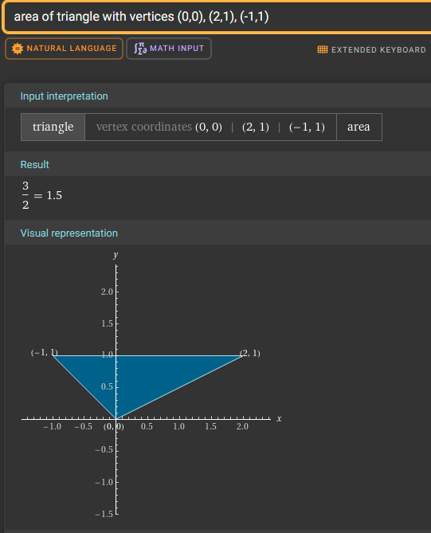
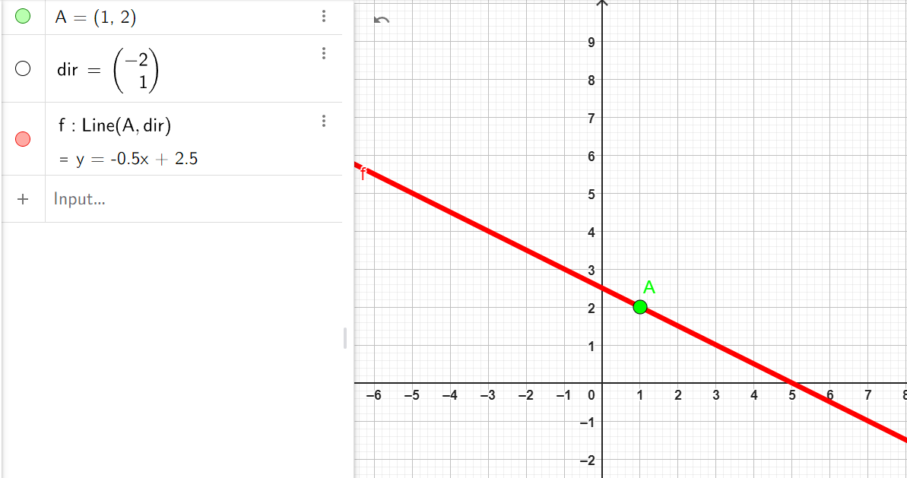

## 11. Vectors I - Detailed Solutions

1. ### **By what number should vector $a = [3, 4]$ be multiplied so that its length is equal to $1$?**

    - **Step 1:** we should Recall that the length (or magnitude) of a vector $a = [a_1, a_2]$ is calculated using the formula:
      $$ |a| = \sqrt{a_1^2 + a_2^2} $$
    - **Step 2:** Substituting the components of vector $a = [3, 4]$, calculate its length:
      $$ |a| = \sqrt{3^2 + 4^2} = \sqrt{9 + 16} = \sqrt{25} = 5 $$
    - **Step 3:** To make the length of $a$ equal to $1$, scale the vector by $\frac{1}{|a|}$.
    - **Step 4:** The scaled (or unit) vector is:
      $$ a\_{\text{unit}} = \frac{1}{|a|} \cdot a = \frac{1}{5} \cdot [3, 4] = [\frac{3}{5}, \frac{4}{5}] $$

        ## [Link Geogebra](https://www.geogebra.org/calculator/td3ucnqu)

        

---

 

2. ### **Calculate the length of vector $b = [1, 1]$ and find the unit vector of this vector.**

    #### **Step 1:** formula for the length (or magnitude) of a vector.

The length of a vector $\mathbf{b} = [b_x, b_y]$ is given by:

$$
|\mathbf{b}| = \sqrt{b_x^2 + b_y^2}.
$$

#### **Step 2:** components of the vector.

The vector is:

$$
\mathbf{b} = [1, 1].
$$

$$
b_x = 1, \quad b_y = 1.
$$

#### **Step 3:** Calculate the length of the vector.

we Substitute the components into the formula:

$$
|\mathbf{b}| = \sqrt{1^2 + 1^2}.
$$

Simplify:

$$
|\mathbf{b}| = \sqrt{1 + 1} = \sqrt{2}.
$$

$$
|\mathbf{b}| = \sqrt{2}.
$$

#### **Step 4:** Recall the formula for the unit vector.

The unit vector \($\mathbf{b}\_{\text{unit}}$\) is obtained by dividing each component of the vector by its length:

$$
\mathbf{b}_{\text{unit}} = \frac{\mathbf{b}}{|\mathbf{b}|}.
$$

#### **Step 5:** Compute the unit vector.

we Divide each component of $\mathbf{b}$ by $|\mathbf{b}| = \sqrt{2}$:

$$
\mathbf{b}_{\text{unit}} = \frac{1}{\sqrt{2}} \cdot [1, 1].
$$

Simplify:

$$
\mathbf{b}_{\text{unit}} = \left[\frac{1}{\sqrt{2}}, \frac{1}{\sqrt{2}}\right].
$$

## [Link Geogebra](https://www.geogebra.org/calculator/ppfnxevu)

---

 

3. ### **Plot the vector and the unit vector from the previous exercise.**

## [Link Geogebra](https://www.geogebra.org/calculator/hhr9b8a3)

---

 

4. ### **Calculate the length of vector $c = [1, 2, 3]$ and find the unit vector of this vector.**

#### **Step 1:** formula for the length (or magnitude) of a vector.

The length of a vector $\mathbf{c} = [c_x, c_y, c_z]$ is given by:

$$
|\mathbf{c}| = \sqrt{c_x^2 + c_y^2 + c_z^2}.
$$

#### **Step 2:** Components of the vector.

The vector is:

$$
\mathbf{c} = [1, 2, 3].
$$

$$
c_x = 1, \quad c_y = 2, \quad c_z = 3.
$$

#### **Step 3:** Calculate the length of the vector.

we Substitute the components into the formula:

$$
|\mathbf{c}| = \sqrt{1^2 + 2^2 + 3^2}.
$$

Simplify:

$$
|\mathbf{c}| = \sqrt{1 + 4 + 9} = \sqrt{14}.
$$

$$
|\mathbf{c}| = \sqrt{14}.
$$

#### **Step 4:** formula for the unit vector.

The unit vector \($\mathbf{c}\_{\text{unit}}$\) is obtained by dividing each component of the vector by its length:

$$
\mathbf{c}_{\text{unit}} = \frac{\mathbf{c}}{|\mathbf{c}|}.
$$

#### **Step 5:** Compute the unit vector.

we Divide each component of $\mathbf{c}$ by $|\mathbf{c}| = \sqrt{14}$:

$$
\mathbf{c}_{\text{unit}} = \frac{1}{\sqrt{14}} \cdot [1, 2, 3].
$$

Simplify:

$$
\mathbf{c}_{\text{unit}} = \left[\frac{1}{\sqrt{14}}, \frac{2}{\sqrt{14}}, \frac{3}{\sqrt{14}}\right].
$$

## [Link Geogebra](https://www.geogebra.org/calculator/rea8zcbh)

  
 

---

 

5. ### **Find the Cartesian coordinates of vector $v = [2, 3, 4]$ in the basis:**

    $ \mathbf{h}\_1 = [1, 0, 1] $  
     $ \mathbf{h}\_2 = [0, 1, 0] $  
     $ \mathbf{h}\_3 = [1, 0, -1] $

    #### **Step 1:** finding coordinates in a basis.

Given a vector $\mathbf{v}$ and a basis $\{\mathbf{h}_1, \mathbf{h}_2, \mathbf{h}_3\}$, we want to find the coefficients $c_1$, $c_2$, and $c_3$ such that:

$$
\mathbf{v} = c_1 \mathbf{h}_1 + c_2 \mathbf{h}_2 + c_3 \mathbf{h}_3.
$$

This forms the linear equation:

$$
\mathbf{v} = c_1 \begin{bmatrix} 1 \\ 0 \\ 1 \end{bmatrix} + c_2 \begin{bmatrix} 0 \\ 1 \\ 0 \end{bmatrix} + c_3 \begin{bmatrix} 1 \\ 0 \\ -1 \end{bmatrix}.
$$

#### **Step 2:** Write the equation as a matrix system.

we Combine the basis vectors into a matrix $H$ and express $\mathbf{v}$ as:

$$
H \cdot \mathbf{c} = \mathbf{v},
$$

where:

$$
H = \begin{bmatrix}
1 & 0 & 1 \\
0 & 1 & 0 \\
1 & 0 & -1
\end{bmatrix}, \quad
\mathbf{c} = \begin{bmatrix} c_1 \\ c_2 \\ c_3 \end{bmatrix}, \quad
\mathbf{v} = \begin{bmatrix} 2 \\ 3 \\ 4 \end{bmatrix}.
$$

This gives the system of equations:

$$
\begin{aligned}
1. & \quad c_1 + c_3 = 2, \\
2. & \quad c_2 = 3, \\
3. & \quad c_1 - c_3 = 4.
\end{aligned}
$$

#### **Step 3:** Solve the system of equations.

1. From equation (2), directly find:

    $$
    c_2 = 3.
    $$

2. Add equations (1) and (3) to eliminate $c_3$:

    $$
    (c_1 + c_3) + (c_1 - c_3) = 2 + 4,
    $$

    $$
    2c_1 = 6 \implies c_1 = 3.
    $$

3. Substitute $c_1 = 3$ into equation (1) to find $c_3$:
    $$
    3 + c_3 = 2 \implies c_3 = -1.
    $$

#### **Step 4:** Write the coordinates in the new basis.

The coordinates of $\mathbf{v}$ in the basis $\{\mathbf{h}_1, \mathbf{h}_2, \mathbf{h}_3\}$ are:

$$
\mathbf{c} = \begin{bmatrix} c_1 \\ c_2 \\ c_3 \end{bmatrix} = \begin{bmatrix} 3 \\ 3 \\ -1 \end{bmatrix}.
$$

## [Link Geogebra](https://www.geogebra.org/calculator/rea8zcbh)

 

---

---

---

 

## 12. Vectors II

1. ### **Perform the addition of vector $[2, 1]$ to vector $[-1, 1]$. Plot both vectors and their sum on a graph.**

#### **Step 1:** formula for vector addition.

To add two vectors $\mathbf{v}_1 = [v_{1x}, v_{1y}]$ and $\mathbf{v}_2 = [v_{2x}, v_{2y}]$, we add their corresponding components:

$$
\mathbf{v}_1 + \mathbf{v}_2 = [v_{1x} + v_{2x}, v_{1y} + v_{2y}].
$$

#### **Step 2:** Write down the given vectors.

The two vectors are:

$$
\mathbf{v}_1 = [2, 1], \quad \mathbf{v}_2 = [-1, 1].
$$

#### **Step 3:** Add the corresponding components.

we Add the $x$-components:

$$
v_{1x} + v_{2x} = 2 + (-1) = 1.
$$

we Add the $y$-components:

$$
v_{1y} + v_{2y} = 1 + 1 = 2.
$$

$$
\mathbf{v}_1 + \mathbf{v}_2 = [1, 2].
$$

## [Link Geogebra](https://www.geogebra.org/calculator/hhr9b8a3)

 

2. ### **Calculate the area of the triangle spanned by vectors $[2, 1]$ and $[-1, 1]$.**

#### **Step 1:** formula for the area of a triangle spanned by two vectors.

The area of the triangle spanned by two vectors $\mathbf{v}_1 = [v_{1x}, v_{1y}]$ and $\mathbf{v}_2 = [v_{2x}, v_{2y}]$ in 2D space is given by:

$$
\text{Area} = \frac{1}{2} \cdot |\mathbf{v}_1 \times \mathbf{v}_2|,
$$

where the cross product in 2D is calculated as:

$$
\mathbf{v}_1 \times \mathbf{v}_2 = v_{1x} \cdot v_{2y} - v_{1y} \cdot v_{2x}.
$$

#### **Step 2:** Write down the given vectors.

The two vectors are:

$$
\mathbf{v}_1 = [2, 1], \quad \mathbf{v}_2 = [-1, 1].
$$

#### **Step 3:** Compute the cross product of the two vectors.

Using the formula for the 2D cross product:

$$
\mathbf{v}_1 \times \mathbf{v}_2 = (2)(1) - (1)(-1).
$$

Simplify:

$$
\mathbf{v}_1 \times \mathbf{v}_2 = 2 - (-1) = 2 + 1 = 3.
$$

#### **Step 4:** Calculate the area.

The area of the triangle is half the absolute value of the cross product:

$$
\text{Area} = \frac{1}{2} \cdot |\mathbf{v}_1 \times \mathbf{v}_2|.
$$

we Substitute the value of the cross product:

$$
\text{Area} = \frac{1}{2} \cdot |3| = \frac{1}{2} \cdot 3 = 1.5.
$$

## [Link Geogebra](https://www.geogebra.org/calculator/hhr9b8a3)

---

  

3. ### **Calculate the volume of the parallelepiped spanned by vectors $[2, 1]$, $[-1, 1]$, and $[1, 2]$.**

#### **Step 1:** formula for the volume of a parallelepiped.

The volume of a parallelepiped spanned by three vectors $\mathbf{v}_1$, $\mathbf{v}_2$, and $\mathbf{v}_3$ in 3D space is calculated as the absolute value of the scalar triple product:

$$
\text{Volume} = |\mathbf{v}_1 \cdot (\mathbf{v}_2 \times \mathbf{v}_3)|.
$$

This scalar triple product can also be expressed as the determinant of a $3 \times 3$ matrix where the rows are the three vectors:

$$
\text{Volume} = |\det(M)|,
$$

where

$$
M = \begin{bmatrix}
2 & 1 & 0 \\
-1 & 1 & 0 \\
1 & 2 & 0
\end{bmatrix}.
$$

#### **Step 2:** Choose the row or column with zeros for expansion.

We expand the determinant along the **third column**, which contains all zeros. This simplifies the computation because each term in the expansion involving $0$ will contribute nothing.

The determinant of $M$ is given by:

$$
\det(M) = 0 \cdot \begin{vmatrix} -1 & 1 \\ 1 & 2 \end{vmatrix}
- 0 \cdot \begin{vmatrix} 2 & 1 \\ 1 & 2 \end{vmatrix}
+ 0 \cdot \begin{vmatrix} 2 & 1 \\ -1 & 1 \end{vmatrix}.
$$

Since every term involves multiplying by $0$, we have:

$$
\det(M) = 0.
$$

#### **Step 3:** Compute the volume.

The volume of the parallelepiped is the absolute value of the determinant:

$$
\text{Volume} = |\det(M)| = |0| = 0.
$$

## [Link Geogebra](https://www.geogebra.org/calculator/eupvaqp8)

## 

  

4. ### **Check if vectors $[2, 1]$ and $[-1, 1]$ are perpendicular.**

#### **Step 1:** condition for perpendicularity of two vectors.

Two vectors $\mathbf{v}_1 = [v_{1x}, v_{1y}]$ and $\mathbf{v}_2 = [v_{2x}, v_{2y}]$ are perpendicular if their dot product is zero:

$$
\mathbf{v}_1 \cdot \mathbf{v}_2 = 0.
$$

The dot product of two vectors in 2D is calculated as:

$$
\mathbf{v}_1 \cdot \mathbf{v}_2 = v_{1x} \cdot v_{2x} + v_{1y} \cdot v_{2y}.
$$

#### **Step 2:** We Write down the given vectors.

The two vectors are:

$$
\mathbf{v}_1 = [2, 1], \quad \mathbf{v}_2 = [-1, 1].
$$

#### **Step 3:** We Calculate the dot product.

Substitute the components of the vectors into the dot product formula:

$$
\mathbf{v}_1 \cdot \mathbf{v}_2 = (2)(-1) + (1)(1).
$$

Simplify:

$$
\mathbf{v}_1 \cdot \mathbf{v}_2 = -2 + 1 = -1.
$$

#### **Step 4:** We Determine if the vectors are perpendicular.

The dot product is:

$$
\mathbf{v}_1 \cdot \mathbf{v}_2 = -1.
$$

### Since the dot product is not ZERO, the vectors are **not perpendicular**.

## [Link Geogebra](https://www.geogebra.org/calculator/rqmnepsq)

---

  

5. ### **Calculate the angle in degrees between vectors $[4, 2, 1]$ and $[1, 3, 2]$.**

#### **Step 1:** formula for the angle between two vectors.

The angle $\theta$ between two vectors $\mathbf{v}_1$ and $\mathbf{v}_2$ can be calculated using the dot product formula:

$$
\cos \theta = \frac{\mathbf{v}_1 \cdot \mathbf{v}_2}{|\mathbf{v}_1| |\mathbf{v}_2|}.
$$

The angle in degrees is then:

$$
\theta = \arccos\left(\frac{\mathbf{v}_1 \cdot \mathbf{v}_2}{|\mathbf{v}_1| |\mathbf{v}_2|}\right) \cdot \frac{180}{\pi}.
$$

#### **Step 2:** Write down the given vectors.

The two vectors are:

$$
\mathbf{v}_1 = [4, 2, 1], \quad \mathbf{v}_2 = [1, 3, 2].
$$

#### **Step 3:** Compute the dot product of the vectors.

The dot product of two vectors is calculated as:

$$
\mathbf{v}_1 \cdot \mathbf{v}_2 = v_{1x} \cdot v_{2x} + v_{1y} \cdot v_{2y} + v_{1z} \cdot v_{2z}.
$$

We Substitute the components of the vectors:

$$
\mathbf{v}_1 \cdot \mathbf{v}_2 = (4)(1) + (2)(3) + (1)(2).
$$

Simplify:

$$
\mathbf{v}_1 \cdot \mathbf{v}_2 = 4 + 6 + 2 = 12.
$$

#### **Step 4:** Compute the magnitudes of the vectors.

The magnitude of a vector $\mathbf{v}_1 = [4, 2, 1]$ is:

$$
|\mathbf{v}_1| = \sqrt{4^2 + 2^2 + 1^2}.
$$

Simplify:

$$
|\mathbf{v}_1| = \sqrt{16 + 4 + 1} = \sqrt{21}.
$$

The magnitude of a vector $\mathbf{v}_2 = [1, 3, 2]$ is:

$$
|\mathbf{v}_2| = \sqrt{1^2 + 3^2 + 2^2}.
$$

Simplify:

$$
|\mathbf{v}_2| = \sqrt{1 + 9 + 4} = \sqrt{14}.
$$

#### **Step 5:** Substitute values into the cosine formula.

We Substitute the dot product and magnitudes into the formula for $\cos \theta$:

$$
\cos \theta = \frac{\mathbf{v}_1 \cdot \mathbf{v}_2}{|\mathbf{v}_1| |\mathbf{v}_2|}.
$$

We Substitute the values:

$$
\cos \theta = \frac{12}{\sqrt{21} \cdot \sqrt{14}}.
$$

Simplify:

$$
\cos \theta = \frac{12}{\sqrt{294}} = \frac{12}{17.15} \approx 0.6998.
$$

#### **Step 6:** Calculate the angle in degrees.

We Use the inverse cosine function to find $\theta$:

$$
\theta = \arccos(0.6998) \cdot \frac{180}{\pi}.
$$

Simplify:

$$
\theta \approx 45.57^\circ.
$$

## [Link Geogebra](https://www.geogebra.org/calculator/dyzgzsme)

---

  

6. ### **For three-dimensional vectors: $a = [a_x, a_y, a_z]$, $b = [b_x, b_y, b_z]$, $c = [c_x, c_y, c_z]$, prove that the following identity is satisfied:**
    $$ a \times (b \times c) = (a \cdot c)b - (a \cdot b)c. $$

#### **Step 1:** we must Recall the vector triple product identity.

The vector triple product identity is:

$$
\mathbf{a} \times (\mathbf{b} \times \mathbf{c}) = (\mathbf{a} \cdot \mathbf{c})\mathbf{b} - (\mathbf{a} \cdot \mathbf{b})\mathbf{c}.
$$

Our goal is to prove this identity by expanding both sides.

#### **Step 2:** Expand $\mathbf{b} \times \mathbf{c}$ in terms of components.

The cross product $\mathbf{b} \times \mathbf{c}$ is:

$$
\mathbf{b} \times \mathbf{c} =
\begin{vmatrix}
\mathbf{i} & \mathbf{j} & \mathbf{k} \\
b_x & b_y & b_z \\
c_x & c_y & c_z
\end{vmatrix}.
$$

This expands to:

$$
\mathbf{b} \times \mathbf{c} =
\left( b_y c_z - b_z c_y \right)\mathbf{i} -
\left( b_x c_z - b_z c_x \right)\mathbf{j} +
\left( b_x c_y - b_y c_x \right)\mathbf{k}.
$$

#### **Step 3:** Expand $\mathbf{a} \times (\mathbf{b} \times \mathbf{c})$.

The cross product $\mathbf{a} \times (\mathbf{b} \times \mathbf{c})$ involves substituting $\mathbf{b} \times \mathbf{c}$ from Step 2 and performing another cross product. Using the determinant definition:

$$
\mathbf{a} \times (\mathbf{b} \times \mathbf{c}) =
\begin{vmatrix}
\mathbf{i} & \mathbf{j} & \mathbf{k} \\
a_x & a_y & a_z \\
(b_y c_z - b_z c_y) & (b_z c_x - b_x c_z) & (b_x c_y - b_y c_x)
\end{vmatrix}.
$$

Expanding this determinant yields a vector in terms of $\mathbf{i}$, $\mathbf{j}$, and $\mathbf{k}$.

#### **Step 4:** Simplify the right-hand side of the identity.

The right-hand side of the identity is:

$$
(\mathbf{a} \cdot \mathbf{c})\mathbf{b} - (\mathbf{a} \cdot \mathbf{b})\mathbf{c}.
$$

1. Compute the scalar dot products:

    - $\mathbf{a} \cdot \mathbf{c} = a_x c_x + a_y c_y + a_z c_z$,
    - $\mathbf{a} \cdot \mathbf{b} = a_x b_x + a_y b_y + a_z b_z$.

2. Substitute into the expression:
    $$
    (\mathbf{a} \cdot \mathbf{c})\mathbf{b} - (\mathbf{a} \cdot \mathbf{b})\mathbf{c}.
    $$

This produces a vector in terms of components $\mathbf{i}$, $\mathbf{j}$, and $\mathbf{k}$.

#### **Step 5:** Verify equality of both sides.

1. Expand both sides explicitly in terms of components.
2. Compare each component (for $\mathbf{i}$, $\mathbf{j}$, and $\mathbf{k}$) to confirm that the two sides are identical.
3. **Left-hand side (LHS):**
   The result of
   \[
   $\mathbf{a} \times (\mathbf{b} \times \mathbf{c}$)
   \]
   is:
   \[
   $(0, 0, 0)$.
   \]

4. **Right-hand side (RHS):**
   Similarly, the RHS evaluates to:
   \[
   $(0, 0, 0)$,
   \]
   as shown in your previous screenshot.

This confirms the vector identity holds true!

 

---

---

---

 

# 13. Vectors III

1. ### **Divide the line segment connecting points $A(-1, 2)$ and $B(3, -2)$ in the ratio $1:3$. Illustrate the result on a graph.**

#### **Step 1:** Recall the section formula.

The coordinates of a point $P(x, y)$ that divides the line segment joining two points $A(x_1, y_1)$ and $B(x_2, y_2)$ in the ratio $m:n$ are given by:

$$
P = \left(\frac{mx_2 + nx_1}{m + n}, \frac{my_2 + ny_1}{m + n}\right).
$$

#### **Step 2:** Write down the given points and the ratio.

The given points are:

$$
A(x_1, y_1) = (-1, 2), \quad B(x_2, y_2) = (3, -2).
$$

The ratio is:

$$
m : n = 1 : 3.
$$

#### **Step 3:** Apply the section formula.

We must Use the section formula, calculate the coordinates of point $P$.

1. **Calculate the $x$-coordinate:**

    $$
    x = \frac{m x_2 + n x_1}{m + n}.
    $$

    We Substitute the values:

    $$
    x = \frac{(1)(3) + (3)(-1)}{1 + 3}.
    $$

    Simplify:

    $$
    x = \frac{3 - 3}{4} = 0.
    $$

2. **Calculate the $y$-coordinate:**
    $$
    y = \frac{m y_2 + n y_1}{m + n}.
    $$
    Substitute the values:
    $$
    y = \frac{(1)(-2) + (3)(2)}{1 + 3}.
    $$
    Simplify:
    $$
    y = \frac{-2 + 6}{4} = \frac{4}{4} = 1.
    $$

the point $P$ is:

$$
P(0, 1).
$$

## [Link Geogebra](https://www.geogebra.org/calculator/thmwzpft)

---

 

2. ### **Project vector $a = (3, 4)$ onto the OX and OY axes. Illustrate the result on a graph:**

#### **Step 1:** We must Recall the concept of projection.

The projection of a vector onto an axis involves finding the component of the vector along that axis.

1. **Projection onto the $OX$-axis (horizontal axis):**
   The projection onto the \(OX\)-axis keeps the \(x\)-component of the vector while setting the \(y\)-component to \(0\).

2. **Projection onto the $OY$-axis (vertical axis):**
   The projection onto the \(OY\)-axis keeps the \(y\)-component of the vector while setting the \(x\)-component to \(0\).

#### **Step 2:** the vector.

The vector is:

$$
\mathbf{a} = (3, 4).
$$

#### **Step 3:** Compute the projections.

1. **Projection onto the $OX$-axis:**
   Retain the \(x\)-component and set \(y = 0\):

    $$
    \text{Projection onto } OX: \mathbf{a}_{OX} = (3, 0).
    $$

2. **Projection onto the $OY$-axis:**
   Retain the \(y\)-component and set \(x = 0\):
    $$
    \text{Projection onto } OY: \mathbf{a}_{OY} = (0, 4).
    $$

## [Link Geogebra](https://www.geogebra.org/calculator/dkggpvtu)

---

 

3. ### **Project vector $a = (2, 3)$ onto vector $b = (1, 1)$. Illustrate the result on a graph:**

#### **Step 1:** Recall the formula for projection of a vector onto another vector.

The projection of vector $\mathbf{a}$ onto vector $\mathbf{b}$ is given by:

$$
\text{Proj}_{\mathbf{b}} \mathbf{a} = \frac{\mathbf{a} \cdot \mathbf{b}}{\mathbf{b} \cdot \mathbf{b}} \mathbf{b}.
$$

Here:

-   \($\mathbf{a} \cdot \mathbf{b}$\) is the dot product of \($\mathbf{a}$\) and \($\mathbf{b}$\),
-   \($\mathbf{b} \cdot \mathbf{b}$\) is the dot product of \($\mathbf{b}$\) with itself, which gives the square of the magnitude of \($\mathbf{b}$\).

#### **Step 2:** Write the given vectors.

The vectors are:

$$
\mathbf{a} = (2, 3), \quad \mathbf{b} = (1, 1).
$$

#### **Step 3:** Compute the dot products.

1. **Dot product of $\mathbf{a}$ and $\mathbf{b}$:**

    $$
    \mathbf{a} \cdot \mathbf{b} = (2)(1) + (3)(1) = 2 + 3 = 5.
    $$

2. **Dot product of $\mathbf{b}$ with itself:**
    $$
    \mathbf{b} \cdot \mathbf{b} = (1)(1) + (1)(1) = 1 + 1 = 2.
    $$

#### **Step 4:** Calculate the projection.

Substitute the values into the projection formula:

$$
\text{Proj}_{\mathbf{b}} \mathbf{a} = \frac{\mathbf{a} \cdot \mathbf{b}}{\mathbf{b} \cdot \mathbf{b}} \mathbf{b}.
$$

Substitute the dot products:

$$
\text{Proj}_{\mathbf{b}} \mathbf{a} = \frac{5}{2} \mathbf{b}.
$$

Substitute \(\mathbf{b} = (1, 1)\):

$$
\text{Proj}_{\mathbf{b}} \mathbf{a} = \frac{5}{2} (1, 1).
$$

Simplify:

$$
\text{Proj}_{\mathbf{b}} \mathbf{a} = \left(\frac{5}{2}, \frac{5}{2}\right).
$$

---

 

4. ### **Project vector $b = (1, 1)$ onto vector $a = (2, 3)$. Illustrate the result on a graph:**

#### **Step 1:** We Recall the formula for projection of a vector onto another vector.

The projection of vector $\mathbf{b}$ onto vector $\mathbf{a}$ is given by:

$$
\text{Proj}_{\mathbf{a}} \mathbf{b} = \frac{\mathbf{b} \cdot \mathbf{a}}{\mathbf{a} \cdot \mathbf{a}} \mathbf{a}.
$$

-   \($\mathbf{b} \cdot \mathbf{a}$\) is the dot product of \($\mathbf{b}$\) and \($\mathbf{a}$\),
-   \($\mathbf{a} \cdot \mathbf{a}$\) is the dot product of \($\mathbf{a}$\) with itself, which gives the square of the magnitude of \($\mathbf{a}$\).

#### **Step 2:** Write the given vectors.

The vectors are:

$$
\mathbf{b} = (1, 1), \quad \mathbf{a} = (2, 3).
$$

#### **Step 3:** Compute the dot products.

1. **Dot product of $\mathbf{b}$ and $\mathbf{a}$:**

    $$
    \mathbf{b} \cdot \mathbf{a} = (1)(2) + (1)(3) = 2 + 3 = 5.
    $$

2. **Dot product of $\mathbf{a}$ with itself:**
    $$
    \mathbf{a} \cdot \mathbf{a} = (2)(2) + (3)(3) = 4 + 9 = 13.
    $$

#### **Step 4:** Calculate the projection.

Substitute the values into the projection formula:

$$
\text{Proj}_{\mathbf{a}} \mathbf{b} = \frac{\mathbf{b} \cdot \mathbf{a}}{\mathbf{a} \cdot \mathbf{a}} \mathbf{a}.
$$

Substitute the dot products:

$$
\text{Proj}_{\mathbf{a}} \mathbf{b} = \frac{5}{13} \mathbf{a}.
$$

Substitute \(\mathbf{a} = (2, 3)\):

$$
\text{Proj}_{\mathbf{a}} \mathbf{b} = \frac{5}{13} (2, 3).
$$

Simplify:

$$
\text{Proj}_{\mathbf{a}} \mathbf{b} = \left(\frac{10}{13}, \frac{15}{13}\right).
$$

## [Link Geogebra](https://www.geogebra.org/calculator/hpwx7ywp)

 

---

---

---

 

## 14. Equations of lines on a plane

-   ### **The line passes through points $A(1, 2)$ and $B(3, 1)$. Find the equation of the line.**

#### **Step 1:** We must Recall the slope-intercept form of a line.

The equation of a line can be written as:

$$
y = mx + b,
$$

where:

-   \(m\) is the slope of the line,
-   \(b\) is the \(y\)-intercept.

To find the equation of the line, we first calculate the slope \(m\) and then find the intercept \(b\).

#### **Step 2:** Compute the slope of the line.

The slope \(m\) is calculated using the formula:

$$
m = \frac{y_2 - y_1}{x_2 - x_1},
$$

where \((x_1, y_1)\) and \((x_2, y_2)\) are the coordinates of two points on the line.

We Substitute the coordinates of \(A(1, 2)\) and \(B(3, 1)\):

$$
m = \frac{1 - 2}{3 - 1}.
$$

Simplify:

$$
m = \frac{-1}{2} = -\frac{1}{2}.
$$

#### **Step 3:** Write the equation of the line in point-slope form.

The point-slope form of a line is:

$$
y - y_1 = m(x - x_1).
$$

We Substitute \(m = -\frac{1}{2}\) and one of the points, say \(A(1, 2)\):

$$
y - 2 = -\frac{1}{2}(x - 1).
$$

#### **Step 4:** Simplify to slope-intercept form.

we must Expand and simplify the equation:

$$
y - 2 = -\frac{1}{2}x + \frac{1}{2}.
$$

We Add 2 to both sides:

$$
y = -\frac{1}{2}x + \frac{1}{2} + 2.
$$

We Combine like terms:

$$
y = -\frac{1}{2}x + \frac{5}{2}.
$$

$$
y = -\frac{1}{2}x + \frac{5}{2}.
$$

## [Link Geogebra](https://www.geogebra.org/calculator/w4tmxm6y)

---

 

-   ### **The line passes through point $A(1, 2)$ and is parallel to the line $y = 2x + 3$. Find the equation of the line.**

#### **Step 1:** We must Recall the properties of parallel lines.

If two lines are parallel, they have the same slope. The given line is:

$$
y = 2x + 3.
$$

The slope of this line is:

$$
m = 2.
$$

The line we are looking for will also have a slope of \(m = 2\).

#### **Step 2:** Use the point-slope form of the line equation.

The point-slope form of a line is:

$$
y - y_1 = m(x - x_1),
$$

where:

-   \((x_1, y_1)\) is a point on the line,
-   \(m\) is the slope of the line.

We Substitute \(m = 2\) and the point \(A(1, 2)\) into the formula:

$$
y - 2 = 2(x - 1).
$$

#### **Step 3:** Simplify the equation.

We Expand and simplify:

$$
y - 2 = 2x - 2.
$$

We Add 2 to both sides:

$$
y = 2x.
$$

$$
y = 2x.
$$

## [Link Geogebra](https://www.geogebra.org/calculator/qnrpaepb)

## 

---

 

-   ### **The line passes through point $A(1, 2)$ and is perpendicular to the line $y = 2x + 3$. Find the equation of the line.**

#### **Step 1:** Recall the relationship between slopes of perpendicular lines.

If two lines are perpendicular, the product of their slopes is:

$$
m_1 \cdot m_2 = -1,
$$

where \(m_1\) and \(m_2\) are the slopes of the two lines.

The slope of the given line \(y = 2x + 3\) is:

$$
m_1 = 2.
$$

The slope of the perpendicular line is:

$$
m_2 = -\frac{1}{m_1}.
$$

Substitute \(m_1 = 2\):

$$
m_2 = -\frac{1}{2}.
$$

#### **Step 2:** Use the point-slope form of the line equation.

The point-slope form of a line is:

$$
y - y_1 = m(x - x_1),
$$

where:

-   \((x_1, y_1)\) is a point on the line,
-   \(m\) is the slope of the line.

We Substitute \(m = -\frac{1}{2}\) and the point \(A(1, 2)\):

$$
y - 2 = -\frac{1}{2}(x - 1).
$$

#### **Step 3:** Simplify the equation.

We must Expand and simplify:

$$
y - 2 = -\frac{1}{2}x + \frac{1}{2}.
$$

We Add 2 to both sides:

$$
y = -\frac{1}{2}x + \frac{1}{2} + 2.
$$

Combine like terms:

$$
y = -\frac{1}{2}x + \frac{5}{2}.
$$

$$
y = -\frac{1}{2}x + \frac{5}{2}.
$$

## [Link Geogebra](https://www.geogebra.org/calculator/u7jzb2ce)

---

 

-   ### **We have two lines $y = 2x + 3$ and $y = 3x + 2$. Find the intersection point of these lines and calculate the angle between them.**

#### **Step 1:** Set up the equations of the lines.

The equations of the lines are:

1. Line 1: \(y = 2x + 3\),
2. Line 2: \(y = 3x + 2\).

To find the intersection point, solve the system of equations:

$$
y = 2x + 3, \quad y = 3x + 2.
$$

#### **Step 2:** Find the intersection point.

Equate the two expressions for \(y\):

$$
2x + 3 = 3x + 2.
$$

Simplify the equation:

$$
3 = x + 2.
$$

we Solve for \(x\):

$$
x = 1.
$$

we must Substitute \(x = 1\) into either equation to find \(y\). Using \(y = 2x + 3\):

$$
y = 2(1) + 3 = 5.
$$

$$
(1, 5).
$$

#### **Step 3:** Recall the formula for the angle between two lines.

The angle \(\theta\) between two lines with slopes \(m_1\) and \(m_2\) is given by:

$$
\tan \theta = \left| \frac{m_2 - m_1}{1 + m_1 m_2} \right|,
$$

where \(m_1\) and \(m_2\) are the slopes of the lines.

#### **Step 4:** Compute the angle.

The slopes of the lines are:

-   \(m_1 = 2\) (slope of \(y = 2x + 3\)),
-   \(m_2 = 3\) (slope of \(y = 3x + 2\)).

We Substitute these values into the formula:

$$
\tan \theta = \left| \frac{3 - 2}{1 + (2)(3)} \right|.
$$

Simplify:

$$
\tan \theta = \left| \frac{1}{1 + 6} \right| = \left| \frac{1}{7} \right|.
$$

Now, find \(\theta\) by taking the arctangent:

$$
\theta = \arctan\left(\frac{1}{7}\right).
$$

$$
\theta \approx 8.13^\circ.
$$

## [Link Geogebra](https://www.geogebra.org/calculator/payhfxjr)

---

 

-   ### **Write the equation of the line passing through point $A(1, 2)$ and parallel to the vector $r = [2, 3]$.**

#### **Step 1:** Recall the parametric equation of a line.

The parametric equation of a line passing through a point \((x_0, y_0)\) and parallel to a vector \(\mathbf{r} = [a, b]\) is given by:

$$
x = x_0 + at, \quad y = y_0 + bt,
$$

where \(t\) is the parameter.

#### **Step 2:** Write down the given point and vector.

The given point is:

$$
A(1, 2),
$$

and the direction vector of the line is:

$$
\mathbf{r} = [2, 3].
$$

#### **Step 3:** Substitute into the parametric equations.

we must Substitute \(x_0 = 1\), \(y_0 = 2\), \(a = 2\), and \(b = 3\) into the parametric equation:

$$
x = 1 + 2t,
$$

$$
y = 2 + 3t.
$$

Thus, the parametric equations of the line are:

$$
x = 1 + 2t, \quad y = 2 + 3t.
$$

#### **Step 4:** Convert to a single equation in slope-intercept form (optional).

To eliminate the parameter \(t\), solve for \(t\) in the equation for \(x\):

$$
t = \frac{x - 1}{2}.
$$

Substitute this into the equation for \(y\):

$$
y = 2 + 3\left(\frac{x - 1}{2}\right).
$$

Simplify:

$$
y = 2 + \frac{3}{2}(x - 1),
$$

$$
y = 2 + \frac{3}{2}x - \frac{3}{2},
$$

$$
y = \frac{3}{2}x + \frac{1}{2}.
$$

$$
y = \frac{3}{2}x + \frac{1}{2}.
$$

## [Link Geogebra](https://www.geogebra.org/calculator/zb6zsyyc)

## 

---

 

-   ### **We have the line $y = 2x + 3$. Find an example of a line perpendicular and parallel to it.**

#### **Step 1:** Recall the properties of parallel and perpendicular lines.

1. **Parallel lines**: Two lines are parallel if they have the same slope. The equation of a parallel line will be in the form:

    $$
    y = 2x + c,
    $$

    where \(c\) is a different constant.

2. **Perpendicular lines**: Two lines are perpendicular if the product of their slopes is:
    $$
    m_1 \cdot m_2 = -1.
    $$
    The slope of the given line is \(m_1 = 2\), so the slope of a perpendicular line is:
    $$
    m_2 = -\frac{1}{2}.
    $$

#### **Step 2:** Write the equation of a line parallel to \(y = 2x + 3\).

An example of a line parallel to \(y = 2x + 3\) would be:

$$
y = 2x + 1,
$$

where we chose \(c = 1\).

#### **Step 3:** Write the equation of a line perpendicular to \(y = 2x + 3\).

The slope of a perpendicular line is \($m = -\frac{1}{2}$\). An example of such a line is:

$$
y = -\frac{1}{2}x + 4,
$$

where we chose the \(y\)-intercept to be \(4\).

## [Link Geogebra](https://www.geogebra.org/calculator/gbfrbcju)

## 

 

-   ### **We have the line $y = 2x + 3$ and point $A(1, 2)$. Find the distance from point $A$ to the line.**

#### **Step 1:** Recall the formula for the distance from a point to a line.

The distance \(d\) from a point \($(x_1, y_1)$\) to a line in the form \($Ax + By + C = 0$\) is given by:

$$
d = \frac{|Ax_1 + By_1 + C|}{\sqrt{A^2 + B^2}}.
$$

-   \($A$\), \($B$\), and \($C$\) are the coefficients of the line equation,
-   \($(x_1, y_1)$\) is the given point.

#### **Step 2:** Rewrite the line equation in standard form.

The given line is:

$$
y = 2x + 3.
$$

Rearrange into the form \($Ax + By + C = 0$\):

$$
2x - y + 3 = 0.
$$

Thus:

-   \($A = 2$\),
-   \($B = -1$\),
-   \($C = 3$\).

#### **Step 3:** Substitute the point and coefficients into the formula.

The given point is \($A(1, 2)$\), so \($x_1 = 1$\) and \($y_1 = 2$\). Substitute these values and the coefficients into the distance formula:

$$
d = \frac{|2(1) - (2) + 3|}{\sqrt{2^2 + (-1)^2}}.
$$

#### **Step 4:** Simplify the numerator and denominator.

1. we must Compute the numerator:

    $$
    2(1) - (2) + 3 = 2 - 2 + 3 = 3.
    $$

2. we must Compute the denominator:
    $$
    \sqrt{2^2 + (-1)^2} = \sqrt{4 + 1} = \sqrt{5}.
    $$

$$
d = \frac{|3|}{\sqrt{5}}.
$$

#### **Step 5:** Simplify the distance.

The absolute value of \(3\) is \(3\), so:

$$
d = \frac{3}{\sqrt{5}}.
$$

To rationalize the denominator:

$$
d = \frac{3\sqrt{5}}{5}.
$$

## [Link Geogebra](https://www.geogebra.org/calculator/gjdhe645)

## 

---

 

-   ### **The line intersects the coordinate axes at points $A(2, 0)$ and $B(0, 3)$. Find the equation of the line.**

#### **Step 1:** Recall the general equation of a line.

The equation of a line passing through two points \($(x_1, y_1)$\) and \($(x_2, y_2)$\) can be written in slope-intercept form:

$$
y - y_1 = m(x - x_1),
$$

where $m$ is the slope of the line:

$$
m = \frac{y_2 - y_1}{x_2 - x_1}.
$$

#### **Step 2:** Write the given points.

The line passes through:

$$
A(2, 0) \quad \text{(the $x$-intercept)},
$$

$$
B(0, 3) \quad \text{(the $y$-intercept)}.
$$

#### **Step 3:** Compute the slope.

Using the formula for the slope:

$$
m = \frac{y_2 - y_1}{x_2 - x_1}.
$$

Substitute the points $A(2, 0)$ and $B(0, 3)$:

$$
m = \frac{3 - 0}{0 - 2}.
$$

Simplify:

$$
m = \frac{3}{-2} = -\frac{3}{2}.
$$

#### **Step 4:** Write the equation in point-slope form.

Using the point-slope form $y - y_1 = m(x - x_1)$, substitute $m = -\frac{3}{2}$ and point $B(0, 3)$:

$$
y - 3 = -\frac{3}{2}(x - 0).
$$

Simplify:

$$
y - 3 = -\frac{3}{2}x.
$$

we Add $3$ to both sides:

$$
y = -\frac{3}{2}x + 3.
$$

$$
y = -\frac{3}{2}x + 3.
$$

#### **Step 5:** Verification using intercept form (optional).

The intercept form of a line is:

$$
\frac{x}{a} + \frac{y}{b} = 1,
$$

where $a$ and $b$ are the $x$- and $y$-intercepts, respectively. Here:

$$
a = 2, \quad b = 3.
$$

we Substitute these values:

$$
\frac{x}{2} + \frac{y}{3} = 1.
$$

we Multiply through by $6$ to eliminate fractions:

$$
3x + 2y = 6.
$$

Rearrange into slope-intercept form:

$$
y = -\frac{3}{2}x + 3.
$$

## [Link Geogebra](https://www.geogebra.org/calculator/yub4j9rt)

---

 

-   ### **Calculate the angle between the line $y = x + 3$ and the OX axis.**

#### **Step 1:** Recall the formula for the angle between a line and the $OX$ axis.

The angle \(\theta\) between a line with slope \($m$\) and the \($OX$\)-axis is given by:

$$
\theta = \arctan(m),
$$

where \(m\) is the slope of the line.

#### **Step 2:** Identify the slope of the given line.

The equation of the line is:

$$
y = x + 3.
$$

In slope-intercept form \($y = mx + b$\), the slope \($m$\) is the coefficient of \($x$\). Here:

$$
m = 1.
$$

#### **Step 3:** Substitute the slope into the formula.

Using \($\theta = \arctan(m)$\):

$$
\theta = \arctan(1).
$$

#### **Step 4:** Calculate the angle.

The value of \($\arctan(1)$\) is:

$$
\theta = 45^\circ.
$$

## [Link Geogebra](https://www.geogebra.org/calculator/b2vp9qqg)

## 

---

 

-   ### **Provide a vector perpendicular to the line $x + y + 1 = 0$.**

#### **Step 1:** Recall the general form of a line and the perpendicular vector.

The general equation of a line in two dimensions is:

$$
Ax + By + C = 0.
$$

A vector perpendicular to the line is given by:

$$
\mathbf{v} = [A, B],
$$

where \(A\) and \(B\) are the coefficients of \(x\) and \(y\) in the line equation.

#### **Step 2:** Identify the coefficients of the line.

The given line is:

$$
x + y + 1 = 0.
$$

From this equation:

-   \($A = 1$\),
-   \($B = 1$\).

#### **Step 3:** Write the perpendicular vector.

Using the coefficients \(A\) and \(B\), the perpendicular vector is:

$$
\mathbf{v} = [1, 1].
$$

#### **Step 4:** Verify the result.

To confirm that \($\mathbf{v} = [1, 1]$\) is perpendicular to the line, note that any vector parallel to the line is given by \($[-B, A]$\), or \($[-1, 1]$\) for this line. The dot product of a perpendicular vector \($[1, 1]$\) and a parallel vector \($[-1, 1]$\) should be zero:

$$
\mathbf{v} \cdot \mathbf{u} = (1)(-1) + (1)(1) = -1 + 1 = 0.
$$

Since the dot product is zero, \($[1, 1]$\) is indeed perpendicular to the line.

---

 

---

---

---

 
