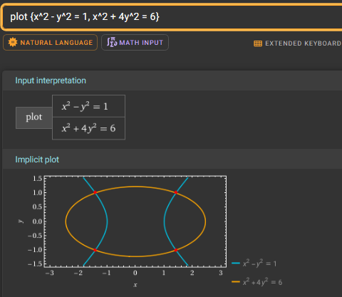
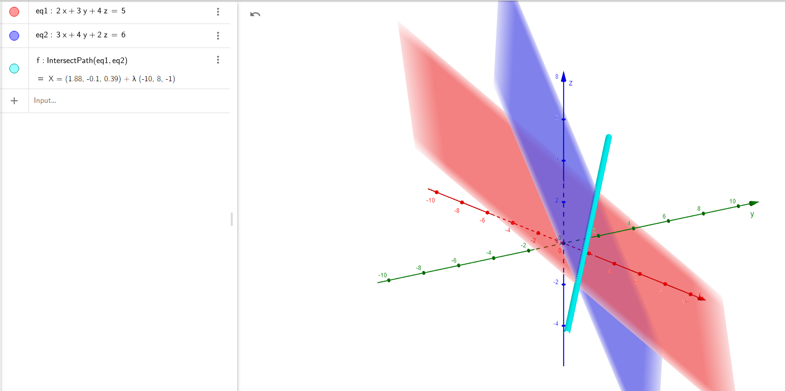

### 15. Equations of second-order curves (conic sections)

## **Find the equation of a circle with center at point $A(1, 2)$ and radius $r = 3$.**

### **Step 1:** We must Recall the general equation of a circle.

The equation of a circle with center \($(h, k)$\) and radius \($r$\) is:

$$
(x - h)^2 + (y - k)^2 = r^2,
$$

where:

-   \($(h, k)$\) is the center of the circle,
-   \($r$\) is the radius.

### **Step 2:** We Substitute the given values.

The center of the circle is \($A(1, 2)$\), so \($h = 1$\) and \($k = 2$\), and the radius is \($r = 3$\). Substituting these values into the general equation:

$$
(x - 1)^2 + (y - 2)^2 = 3^2.
$$

### **Step 3:** We Simplify the equation.

Simplify the right-hand side:

$$
(x - 1)^2 + (y - 2)^2 = 9.
$$

## [Geogebra Link](https://www.geogebra.org/calculator/gxhyswhy)

---

---

 

## **Find the equation of a parabola intersecting the $O_x$ axis at points $x = 2$, $x = 4$, and passing through point $y(3) = 1$.**

### **Step 1:** We must Recall the general form of a parabola with roots.

If a parabola intersects the \($x$\)-axis at \($x = r_1$\) and \($x = r_2$\), its equation can be written as:

$$
y = a(x - r_1)(x - r_2),
$$

where:

-   \($r_1$\) and \($r_2$\) are the roots (the \($x$\)-intercepts),
-   \($a$\) is a constant to be determined using an additional point.

### **Step 2:** We Write the equation using the given roots.

The given roots are \($x = 2$\) and \($x = 4$\). Substituting into the general form:

$$
y = a(x - 2)(x - 4).
$$

### **Step 3:** We must Use the given point to determine \($a$\).

The parabola passes through the point \($(3, 1)$\), where \($x = 3$\) and \($y = 1$\). Substitute these values into the equation:

$$
1 = a(3 - 2)(3 - 4).
$$

Simplify:

$$
1 = a(1)(-1).
$$

$$
1 = -a.
$$

Solve for \($a$\):

$$
a = -1.
$$

### **Step 4:** We Write the final equation of the parabola.

we Substitute \($a = -1$\) into the equation:

$$
y = -1(x - 2)(x - 4).
$$

we Simplify:

$$
y = -(x^2 - 6x + 8).
$$

we Distribute the negative sign:

$$
y = -x^2 + 6x - 8.
$$

### **Step 5:** Verification.

1. **Check the roots \($x = 2$\) and \($x = 4$\):**

    - Substituting \($x = 2$\):
        $$
        y = -2^2 + 6(2) - 8 = -4 + 12 - 8 = 0.
        $$
    - Substituting \($x = 4$\):
        $$
        y = -4^2 + 6(4) - 8 = -16 + 24 - 8 = 0.
        $$

    Both roots satisfy the equation.

2. **Check the point \($(3, 1)$\):**

    - Substituting \($x = 3$\):
        $$
        y = -(3^2) + 6(3) - 8 = -9 + 18 - 8 = 1.
        $$

    Conclution: The point satisfies the equation.

    ## [GEOGEBRA LINK](https://www.geogebra.org/calculator/rg5yy9kq)

    
    

    ***

    ***

     

## **Find the center of the ellipse with the equation $x^2 + 4y^2 - 4x - 16y + 16 = 0$.**

### **Step 1:** We must Recall the standard form of an ellipse.

The general form of an ellipse equation is:

$$
\frac{(x - h)^2}{a^2} + \frac{(y - k)^2}{b^2} = 1,
$$

where:

-   \($(h, k)$\) is the center of the ellipse,
-   \($a$\) and \($b$\) are the semi-major and semi-minor axes.

To determine the center, we rewrite the given equation into this form by completing the square for \($x$\) and \($y$\).

### **Step 2:** We Group and complete the square.

The given equation is:

$$
x^2 + 4y^2 - 4x - 16y + 16 = 0.
$$

1. **We Group the \($x$\)-terms and \($y$\)-terms**:

    $$
    (x^2 - 4x) + 4(y^2 - 4y) = -16.
    $$

2. **We Complete the square for \($x$\):**
   Take half the coefficient of \($x$\), square it, and add it inside the parentheses:

    $$
    x^2 - 4x = (x - 2)^2 - 4.
    $$

3. **We Complete the square for \($y$\):**
   Factor out \($4$\) from the \($y$\)-terms, then complete the square inside:

    $$
    y^2 - 4y = (y - 2)^2 - 4.
    $$

    Multiply \($-4$\) by \($4$\) to adjust the constant term outside:

    $$
    4(y^2 - 4y) = 4\left((y - 2)^2 - 4\right) = 4(y - 2)^2 - 16.
    $$

### **Step 3:** Substitute back into the equation.

We Substitute the completed squares into the original equation:

$$
(x - 2)^2 - 4 + 4(y - 2)^2 - 16 = -16.
$$

We Simplify the constant terms:

$$
(x - 2)^2 + 4(y - 2)^2 - 20 = -16.
$$

We Add \(20\) to both sides:

$$
(x - 2)^2 + 4(y - 2)^2 = 4.
$$

### **Step 4:** then we must Identify the center of the ellipse.

The equation is now in the form:

$$
(x - 2)^2 + 4(y - 2)^2 = 4.
$$

From this equation:

-   The center of the ellipse is:
    $$
    (h, k) = (2, 2).
    $$

## [GEOGEBRA LINK](https://www.geogebra.org/calculator/kqymtuwb)

---

---

 

## **Find the slope $(m > 0)$ of the line $y = mx - 5$ that is tangent to the circle with the equation $x^2 + y^2 = 1$.**

### **Step 1:** We must Recall the conditions for a line tangent to a circle.

The general equation of a circle centered at the origin is:

$$
x^2 + y^2 = r^2.
$$

Here, the circle has:

-   Center at \($(0, 0)$\),
-   Radius \($r = 1$\).

For a line \($y = mx + c$\) to be tangent to a circle, the perpendicular distance from the center of the circle to the line must be equal to the radius \($r$\).

The formula for the perpendicular distance from a point \($(x_0, y_0)$\) to a line \($Ax + By + C = 0$\) is:

$$
d = \frac{|Ax_0 + By_0 + C|}{\sqrt{A^2 + B^2}}.
$$

### **Step 2:** We should Rewrite the line equation in general form.

The given line is:

$$
y = mx - 5.
$$

Rearranging into the general form \($Ax + By + C = 0$\):

$$
mx - y - 5 = 0.
$$

Here:

-   \($A = m$\),
-   \($B = -1$\),
-   \($C = -5$\).

The center of the circle is \($(0, 0)$\), so \($x_0 = 0$\) and \($y_0 = 0$\).

### **Step 3:** We Apply the tangency condition.

The perpendicular distance \($d$\) from the center of the circle \($(0, 0)$\) to the line \($mx - y - 5 = 0$\) is:

$$
d = \frac{|m(0) - 1(0) - 5|}{\sqrt{m^2 + (-1)^2}}.
$$

Simplify the numerator and denominator:

$$
d = \frac{|-5|}{\sqrt{m^2 + 1}}.
$$

The tangency condition states that this distance \($d$\) must equal the radius of the circle \($r = 1$\):

$$
\frac{5}{\sqrt{m^2 + 1}} = 1.
$$

### **Step 4:** We must Solve for \($m$\).

1. Multiply through by \($\sqrt{m^2 + 1}$\) to eliminate the denominator:

    $$
    5 = \sqrt{m^2 + 1}.
    $$

2. Square both sides to remove the square root:

    $$
    5^2 = m^2 + 1.
    $$

    $$
    25 = m^2 + 1.
    $$

3. Subtract \($1$\) from both sides:

    $$
    m^2 = 24.
    $$

4. Solve for \($m$\) (taking the positive root, as \($m > 0$\)):
    $$
    m = \sqrt{24} = 2\sqrt{6}.
    $$

### **Step 5:** The Final answer.

The slope \($m$\) of the line tangent to the circle is:

$$
m = 2\sqrt{6}.
$$

## [GEOGEBRA LINK](https://www.geogebra.org/calculator/bgakahg6)

---

---

 

## **Find the intersection points of the hyperbola $x^2 - y^2 = 1$ with the ellipse's line $x^2 + 4y^2 = 6$.**

### **Step 1:** We must recall the system of equations.

We need to solve the system of two equations:

1. **Hyperbola:** \($x^2 - y^2 = 1$\),
2. **Ellipse:** \($x^2 + 4y^2 = 6$\).

### **Step 2:** We Solve for \(x^2\) from the hyperbola equation.

From the hyperbola equation \($x^2 - y^2 = 1$\), isolate \($x^2$\):

$$
x^2 = y^2 + 1.
$$

### **Step 3:** We Substitute \($x^2$\) into the ellipse equation.

Substitute \($x^2 = y^2 + 1$\) into the ellipse equation \($x^2 + 4y^2 = 6$\):

$$
(y^2 + 1) + 4y^2 = 6.
$$

We Simplify:

$$
y^2 + 4y^2 + 1 = 6.
$$

$$
5y^2 + 1 = 6.
$$

We Subtract 1 from both sides:

$$
5y^2 = 5.
$$

We Divide by 5:

$$
y^2 = 1.
$$

### **Step 4:** Solve for \($y$\).

we Taking the square root of both sides:

$$
y = \pm 1.
$$

### **Step 5:** Solve for \($x$\) using \($x^2 = y^2 + 1$\).

We Substitute \($y = 1$\) and \($y = -1$\) into \($x^2 = y^2 + 1$\):

1. For \($y = 1$\):

    $$
    x^2 = 1^2 + 1 = 2.
    $$

    Taking the square root:

    $$
    x = \pm \sqrt{2}.
    $$

2. For \($y = -1$\):
    $$
    x^2 = (-1)^2 + 1 = 2.
    $$
    Taking the square root:
    $$
    x = \pm \sqrt{2}.
    $$

### **Step 6:** We Write the intersection points.

The intersection points are:

$$
(\sqrt{2}, 1), \quad (-\sqrt{2}, 1), \quad (\sqrt{2}, -1), \quad (-\sqrt{2}, -1).
$$

## [GEOGEBRA LINK](https://www.geogebra.org/calculator/xu3wubu8)

---

---

 

## **For the given hyperbola $x^2 - y^2 = 1$, find the distance between its branches.**

#### **Step 1:**We must Analyze the hyperbola equation.

The given hyperbola is:

$$
x^2 - y^2 = 1.
$$

This is a **horizontal hyperbola** centered at the origin with the general form:

$$
\frac{x^2}{a^2} - \frac{y^2}{b^2} = 1,
$$

where:

-   \($a^2 = 1 \implies a = 1$\),
-   \($b^2 = 1 \implies b = 1$\).

The transverse axis of the hyperbola lies along the \($x$\)-axis.

### **Step 2:** What is the distance between the branches.

The **branches** of a hyperbola are symmetric about the center and open along the transverse axis. The **distance between the branches** at any point depends on the \($y$\)-coordinate.

To find the distance between the branches at a given \($y$\), solve for the corresponding \($x$\)-values.

### **Step 3:** We Solve for \($x$\) at a given \($y$\).

The equation of the hyperbola is:

$$
x^2 - y^2 = 1.
$$

Rearrange for \($x^2$\):

$$
x^2 = y^2 + 1.
$$

Take the square root:

$$
x = \pm \sqrt{y^2 + 1}.
$$

The distance between the branches at a given \($y$\) is the horizontal distance between the two \($x$\)-values:

$$
\text{Distance} = \left| \sqrt{y^2 + 1} - \left(-\sqrt{y^2 + 1}\right) \right|.
$$

We Simplify:

$$
\text{Distance} = 2\sqrt{y^2 + 1}.
$$

### **Step 4:** Special case at \($y = 0$\).

At \($y = 0$\), the distance between the branches is:

$$
\text{Distance} = 2\sqrt{0^2 + 1} = 2\sqrt{1} = 2.
$$

$$
\text{Distance} = 2.
$$

## [GEOGEBRA LINK](https://www.geogebra.org/calculator/wz4psnrv)

---

---

 

---

---

---

 

# 16. Equations of planes in space

## **The plane passes through points $A(1, 2, 3)$, $B(3, 4, 5)$, and $C(2, 1, 4)$. Find the equation of the plane.**

### **Step 1:** We must Recall the general equation of a plane.

The general equation of a plane in three-dimensional space is:

$$
Ax + By + Cz = D,
$$

where \($A$\), \($B$\), and \($C$\) are components of a normal vector to the plane, and \($D$\) is a constant.

To determine the plane, we need:

1. A normal vector to the plane,
2. A point on the plane to find \($D$\).

### **Step 2:** We Find two vectors lying on the plane.

The given points are:

-   \($A(1, 2, 3)$\),
-   \($B(3, 4, 5)$\),
-   \($C(2, 1, 4)$\).

To find two vectors on the plane:

1. Compute \($\mathbf{AB}$\) (from \($A$\) to \($B$\)):

    $$
    \mathbf{AB} = B - A = (3 - 1, 4 - 2, 5 - 3) = (2, 2, 2).
    $$

2. Compute \($\mathbf{AC}$\) (from \($A$\) to \($C$\)):
    $$
    \mathbf{AC} = C - A = (2 - 1, 1 - 2, 4 - 3) = (1, -1, 1).
    $$

### **Step 3:** We Find the normal vector using the cross product.

The normal vector \($\mathbf{n}$\) to the plane can be found by taking the cross product of \($\mathbf{AB}$\) and \($\mathbf{AC}$\):

$$
\mathbf{n} = \mathbf{AB} \times \mathbf{AC}.
$$

The vectors are:

-   \($\mathbf{AB} = (2, 2, 2)$\),
-   \($\mathbf{AC} = (1, -1, 1)$\).

The cross product is:

$$
\mathbf{n} =
\begin{vmatrix}
\mathbf{i} & \mathbf{j} & \mathbf{k} \\
2 & 2 & 2 \\
1 & -1 & 1
\end{vmatrix}.
$$

We Expand the determinant:

$$
\mathbf{n} = \mathbf{i} \begin{vmatrix} 2 & 2 \\ -1 & 1 \end{vmatrix}
- \mathbf{j} \begin{vmatrix} 2 & 2 \\ 1 & 1 \end{vmatrix}
+ \mathbf{k} \begin{vmatrix} 2 & 2 \\ 1 & -1 \end{vmatrix}.
$$

Simplify each minor:

1. For \($\mathbf{i}$\):
    $$
    \begin{vmatrix} 2 & 2 \\ -1 & 1 \end{vmatrix} = (2)(1) - (2)(-1) = 2 + 2 = 4.
    $$
2. For \($\mathbf{j}$\):
    $$
    \begin{vmatrix} 2 & 2 \\ 1 & 1 \end{vmatrix} = (2)(1) - (2)(1) = 2 - 2 = 0.
    $$
3. For \($\mathbf{k}$\):
    $$
    \begin{vmatrix} 2 & 2 \\ 1 & -1 \end{vmatrix} = (2)(-1) - (2)(1) = -2 - 2 = -4.
    $$

The normal vector is:

$$
\mathbf{n} = (4, 0, -4).
$$

### **Step 4:** We Write the equation of the plane.

The equation of the plane is:

$$
4x + 0y - 4z = D.
$$

To find \($D$\), substitute the coordinates of point \($A(1, 2, 3)$\) into the equation:

$$
4(1) + 0(2) - 4(3) = D.
$$

Simplify:

$$
4 - 0 - 12 = D.
$$

$$
D = -8.
$$

### **Step 5:** Final equation of the plane.

The equation of the plane is:

$$
4x - 4z = -8.
$$

Simplification:

$$
x - z = -2.
$$

## [GEOGEBRA LINK](https://www.geogebra.org/calculator/d8reu7gp)

---

---

 

## **The plane passes through point $A(1, 2, 3)$ and is parallel to the plane $2x + 3y + 4z = 5$. Find the equation of the plane.**

### **Step 1:** We must Recall the general equation of a plane.

The general form of the equation of a plane is:

$$
Ax + By + Cz = D,
$$

where:

-   \($A$\), \($B$\), and \($C$\) are components of the normal vector to the plane,
-   \($D$\) is a constant.

If two planes are parallel, their normal vectors are the same.

### **Step 2:** We Identify the normal vector of the given plane.

The equation of the given plane is:

$$
2x + 3y + 4z = 5.
$$

Here, the normal vector to the plane is:

$$
\mathbf{n} = (2, 3, 4).
$$

Since the required plane is parallel to the given plane, it will have the same normal vector.

### **Step 3:** We Use the point \($A(1, 2, 3)$\) to find \($D$\).

The equation of the required plane is:

$$
2x + 3y + 4z = D.
$$

To find \($D$\), substitute the coordinates of point \($A(1, 2, 3)$\) into the equation:

$$
2(1) + 3(2) + 4(3) = D.
$$

Simplify:

$$
2 + 6 + 12 = D.
$$

$$
D = 20.
$$

### **Step 4:** We Write the final equation of the plane.

The equation of the plane is:

$$
2x + 3y + 4z = 20.
$$

## [GEOGEBRA LINK](https://www.geogebra.org/calculator/rhcfd82f)

---

---

 

## **The plane passes through point $A(1, 2, 3)$ and is perpendicular to the normal vector $\mathbf{n} = [2, 3, 4]$. Find the equation of the plane.**

### **Step 1:** We must Recall the general equation of a plane.

The general form of the equation of a plane is:

$$
Ax + By + Cz = D,
$$

where:

-   \($(A, B, C)$\) is the normal vector to the plane,
-   \($D$\) is a constant that can be determined using a point on the plane.

### **Step 2:** We Use the given normal vector and point.

The normal vector to the plane is:

$$
\mathbf{n} = [2, 3, 4].
$$

Thus, the equation of the plane becomes:

$$
2x + 3y + 4z = D.
$$

We are also given the point \($A(1, 2, 3)$\) that lies on the plane. We substitute this point into the equation to determine \($D$\).

### **Step 3:** So we Find \($D$\).

Substitute \($x = 1$\), \($y = 2$\), and \($z = 3$\) into the equation \($2x + 3y + 4z = D$\):

$$
2(1) + 3(2) + 4(3) = D.
$$

Simplify:

$$
2 + 6 + 12 = D.
$$

$$
D = 20.
$$

### **Step 4:** Then we Write the final equation of the plane.

Substitute \($D = 20$\) into the plane equation:

$$
2x + 3y + 4z = 20.
$$

[GEOGEBRA LINK](https://www.geogebra.org/calculator/rntwyv5f)

---

---

 

## **We have two planes $2x + 3y + 4z = 5$ and $3x + 4y + 2z = 6$. Find the line of intersection of these planes.**

### **Step 1:** the problem is based in:

The line of intersection of two planes can be expressed in **parametric form**:

$$
\mathbf{r} = \mathbf{r_0} + t\mathbf{d},
$$

where:

-   \($\mathbf{r_0}$\) is a point on the line,
-   \($\mathbf{d}$\) is the direction vector of the line.

To solve for this line:

1. Compute the direction vector \($\mathbf{d}$\) as the cross product of the normal vectors of the planes.
2. Find a specific point \($\mathbf{r_0}$\) on the line of intersection.

### **Step 2:** We Determine the normal vectors of the planes.

The given planes are:

1. \($2x + 3y + 4z = 5$\),
2. \($3x + 4y + 2z = 6$\).

The normal vectors of these planes are:

-   \($\mathbf{n_1} = [2, 3, 4]$\),
-   \($\mathbf{n_2} = [3, 4, 2]$\).

### **Step 3:** Compute the direction vector \($\mathbf{d}$\).

The direction vector of the line of intersection is the cross product of \($\mathbf{n_1}$\) and \($\mathbf{n_2}$\):

$$
\mathbf{d} = \mathbf{n_1} \times \mathbf{n_2}.
$$

Using the determinant:

$$
\mathbf{d} =
\begin{vmatrix}
\mathbf{i} & \mathbf{j} & \mathbf{k} \\
2 & 3 & 4 \\
3 & 4 & 2
\end{vmatrix}.
$$

We Expand the determinant:

1. For \($\mathbf{i}$\):

    $$
    \begin{vmatrix} 3 & 4 \\ 4 & 2 \end{vmatrix} = (3)(2) - (4)(4) = 6 - 16 = -10.
    $$

2. For \($\mathbf{j}$\) (negated):

    $$
    \begin{vmatrix} 2 & 4 \\ 3 & 2 \end{vmatrix} = (2)(2) - (4)(3) = 4 - 12 = -8.
    $$

3. For \($\mathbf{k}$\):
    $$
    \begin{vmatrix} 2 & 3 \\ 3 & 4 \end{vmatrix} = (2)(4) - (3)(3) = 8 - 9 = -1.
    $$

the direction vector is:

$$
\mathbf{d} = [-10, 8, -1].
$$

#### **Step 4:** We must Find a point on the line of intersection.

To find a specific point \($(x_0, y_0, z_0)$\) on the line, solve the system of equations:

1. \($2x + 3y + 4z = 5$\),
2. \($3x + 4y + 2z = 6$\).

Set \($z = 0$\) (an arbitrary choice to simplify calculations). Substituting \($z = 0$\) into the two equations:

1. From \($2x + 3y + 4(0) = 5$\):

    $$
    2x + 3y = 5.
    $$

2. From \($3x + 4y + 2(0) = 6$\):
    $$
    3x + 4y = 6.
    $$

Solve this system of equations:

1. Multiply the first equation by 3:

    $$
    6x + 9y = 15.
    $$

2. Multiply the second equation by 2:
    $$
    6x + 8y = 12.
    $$

We Subtract the second equation from the first:

$$
(6x + 9y) - (6x + 8y) = 15 - 12.
$$

$$
y = 3.
$$

We Substitute \($y = 3$\) into \($2x + 3y = 5$\):

$$
2x + 3(3) = 5.
$$

$$
2x + 9 = 5.
$$

$$
2x = -4 \implies x = -2.
$$

the point \($(x_0, y_0, z_0)$\) is:

$$
(-2, 3, 0).
$$

#### **Step 5:** We Write the equation of the line.

The line of intersection can now be expressed as:

$$
\mathbf{r} = \mathbf{r_0} + t\mathbf{d},
$$

where:

-   \($\mathbf{r_0} = (-2, 3, 0)$\),
-   \($\mathbf{d} = [-10, 8, -1]$\).

[GEOGEBRA LINK](https://www.geogebra.org/calculator/up3ts2nj)

---

---

 

## **Write the equation of the plane passing through point $A(1, 2, 3)$ and parallel to vectors $\mathbf{v}_1 = [1, 0, 1]$ and $\mathbf{v}_2 = [0, 1, -1]$.**

### **Step 1:** We must Recall the general equation of a plane.

The general form of the equation of a plane is:

$$
Ax + By + Cz = D,
$$

where:

-   \($(A, B, C)$\) is the normal vector \($\mathbf{n}$\) to the plane,
-   \($D$\) is a constant.

To determine the equation of the plane:

1. Find the normal vector \($\mathbf{n}$\) to the plane using the cross product of the given vectors \($\mathbf{v_1}$\) and \($\mathbf{v_2}$\).
2. Use the point \($A(1, 2, 3)$\) to determine \($D$\).

### **Step 2:** Find the normal vector \($\mathbf{n}$\) using the cross product.

The given vectors are:

-   \($\mathbf{v_1} = [1, 0, 1]$\),
-   \($\mathbf{v_2} = [0, 1, -1]$\).

The normal vector \($\mathbf{n}$\) is the cross product of \($\mathbf{v_1}$\) and \($\mathbf{v_2}$\):

$$
\mathbf{n} = \mathbf{v_1} \times \mathbf{v_2}.
$$

Using the determinant:

$$
\mathbf{n} =
\begin{vmatrix}
\mathbf{i} & \mathbf{j} & \mathbf{k} \\
1 & 0 & 1 \\
0 & 1 & -1
\end{vmatrix}.
$$

We Expand the determinant:

1. For \($\mathbf{i}$\):
    $$
    \begin{vmatrix} 0 & 1 \\ 1 & -1 \end{vmatrix} = (0)(-1) - (1)(1) = 0 - 1 = -1.
    $$
2. For \($\mathbf{j}$\) (negated):
    $$
    \begin{vmatrix} 1 & 1 \\ 0 & -1 \end{vmatrix} = (1)(-1) - (1)(0) = -1 - 0 = -1.
    $$
3. For \($\mathbf{k}$\):
    $$
    \begin{vmatrix} 1 & 0 \\ 0 & 1 \end{vmatrix} = (1)(1) - (0)(0) = 1.
    $$

the normal vector is:

$$
\mathbf{n} = [-1, 1, 1].
$$

### **Step 3:** Writting the plane equation.

The equation of the plane is:

$$
-1(x - x_0) + 1(y - y_0) + 1(z - z_0) = 0,
$$

where \($(x_0, y_0, z_0)$\) is the given point \($A(1, 2, 3)$\).

Substitute \($x_0 = 1$\), \($y_0 = 2$\), and \($z_0 = 3$\):

$$
-1(x - 1) + 1(y - 2) + 1(z - 3) = 0.
$$

Simplify:

$$
-x + 1 + y - 2 + z - 3 = 0.
$$

Combine like terms:

$$
-x + y + z - 4 = 0.
$$

Rearranging gives the equation of the plane:

$$
x - y - z = -4.
$$

## [GEOGEBRA LINK](https://www.geogebra.org/calculator/f5gtfdsc)

---

---

 

## **We have the plane $2x + 3y + 4z = 5$. Find an example of a plane parallel and perpendicular to it.**

### **Step 1:** We must Recall the properties of planes.

1. **Parallel planes**: Two planes are parallel if they have the same normal vector.
2. **Perpendicular planes**: Two planes are perpendicular if the dot product of their normal vectors is zero.

For the given plane:

$$
2x + 3y + 4z = 5,
$$

the **normal vector** is:

$$
\mathbf{n} = [2, 3, 4].
$$

### **Step 2:** As an Example of a parallel plane.

For a plane to be parallel to \($2x + 3y + 4z = 5$\), it must have the same normal vector \($[2, 3, 4]$\), but the constant \($D$\) can be different.

An example of a parallel plane is:

$$
2x + 3y + 4z = 10.
$$

Here:

-   The normal vector remains \($[2, 3, 4]$\),
-   The constant \($D = 10$\) is different from \($D = 5$\).

### **Step 3:** As an Example of a perpendicular plane.

For a plane to be perpendicular to \($2x + 3y + 4z = 5$\), its normal vector must satisfy:

$$
\mathbf{n_1} \cdot \mathbf{n_2} = 0,
$$

where \($\mathbf{n_1} = [2, 3, 4]$\) is the normal vector of the given plane and \($\mathbf{n_2} = [A, B, C]$\) is the normal vector of the new plane.

The dot product is:

$$
2A + 3B + 4C = 0.
$$

We must Choose specific values for \($A$\), \($B$\), and \($C$\) that satisfy this equation. For example:

-   Let \($A = 4$\) and \($B = -2$\). Solve for \($C$\):
    $$
    2(4) + 3(-2) + 4C = 0.
    $$
    Simplify:
    $$
    8 - 6 + 4C = 0.
    $$
    $$
    4C = -2 \implies C = -\frac{1}{2}.
    $$

So example of a perpendicular plane is:

$$
4x - 2y - \frac{1}{2}z = 7.
$$

Here, the normal vector \($[4, -2, -\frac{1}{2}]$\) satisfies the perpendicular condition.

### **Step 4:** The Verification.

1. **For the parallel plane** \($2x + 3y + 4z = 10$\):

    - The normal vector is \($[2, 3, 4]$\), the same as the given plane.

2. **For the perpendicular plane** \($4x - 2y - \frac{1}{2}z = 7$\):
    - Dot product with the given normal vector:
        $$
        [2, 3, 4] \cdot [4, -2, -\frac{1}{2}] = 2(4) + 3(-2) + 4\left(-\frac{1}{2}\right).
        $$
        Simplify:
        $$
        8 - 6 - 2 = 0.
        $$
    - The dot product is zero, confirming perpendicularity.

### **Conclusion:**

1. An example of a **parallel plane** is:

    $$
    2x + 3y + 4z = 10.
    $$

2. An example of a **perpendicular plane** is:
    $$
    4x - 2y - \frac{1}{2}z = 7.
    $$

## [GEOGEBRA LINK](https://www.geogebra.org/calculator/dynsbgmv)

---

---

 

## **We have the plane $2x + 3y + 4z = 5$ and point $A(1, 2, 3)$. Find the distance from point $A$ to this plane.**

### **Step 1:** We must Recall the formula for the distance from a point to a plane.

The distance \($d$\) from a point \($P(x_0, y_0, z_0)$\) to a plane \($Ax + By + Cz = D$\) is given by:

$$
d = \frac{|Ax_0 + By_0 + Cz_0 - D|}{\sqrt{A^2 + B^2 + C^2}}.
$$

Here:

-   \($A, B, C$\) are the coefficients of \($x, y, z$\) in the plane equation,
-   \($D$\) is the constant on the right-hand side,
-   \($(x_0, y_0, z_0)$\) are the coordinates of the given point.

### **Step 2:** We must Identify the values from the given problem.

The plane equation is:

$$
2x + 3y + 4z = 5.
$$

Here:

-   \($A = 2$\),
-   \($B = 3$\),
-   \($C = 4$\),
-   \($D = 5$\).

The point \($A(1, 2, 3)$\) gives:

-   \($x_0 = 1$\),
-   \($y_0 = 2$\),
-   \($z_0 = 3$\).

### **Step 3:** We Substitute into the distance formula.

$$
d = \frac{|2(1) + 3(2) + 4(3) - 5|}{\sqrt{2^2 + 3^2 + 4^2}}.
$$

### **Step 4:** We Simplify the numerator and denominator.

1. **Numerator**:

    $$
    2(1) + 3(2) + 4(3) - 5 = 2 + 6 + 12 - 5 = 15.
    $$

2. **Denominator**:
    $$
    \sqrt{2^2 + 3^2 + 4^2} = \sqrt{4 + 9 + 16} = \sqrt{29}.
    $$

### **Step 5:** Calculate the distance.

Now, compute the distance:

$$
d = \frac{|15|}{\sqrt{29}}.
$$

$$
d = 2.789.
$$

## [GEOGEBRA LINK](https://www.geogebra.org/calculator/x8ch8uvv)

## 

---

 

## **The plane intersects the coordinate axes at points $A(2, 0, 0)$, $B(0, 3, 0)$, and $C(0, 0, 4)$. Find the equation of the plane.**

### **Step 1:** We must Recall the general form of the equation of a plane.

The general form of a plane in three-dimensional space is:

$$
\frac{x}{a} + \frac{y}{b} + \frac{z}{c} = 1,
$$

where:

-   \($a$\), \($b$\), and \($c$\) are the intercepts of the plane on the \($x$\)-, \($y$\)-, and \($z$\)-axes, respectively.

### **Step 2:** We Identify the intercepts.

From the given points:

-   \($A(2, 0, 0)$\): The plane intersects the \($x$\)-axis at \($x = 2$\),
-   \($B(0, 3, 0)$\): The plane intersects the \($y$\)-axis at \($y = 3$\),
-   \($C(0, 0, 4)$\): The plane intersects the \($z$\)-axis at \($z = 4$\).

We have:

-   \($a = 2$\),
-   \($b = 3$\),
-   \($c = 4$\).

### **Step 3:** We Write the equation of the plane.

So we Substitute the intercepts \($a = 2$\), \($b = 3$\), and \($c = 4$\) into the plane equation:

$$
\frac{x}{2} + \frac{y}{3} + \frac{z}{4} = 1.
$$

### **Step 4:** We Convert to standard form (optional).

To write the equation in standard form \($Ax + By + Cz = D$\), We have to multiply through by the least common multiple (LCM) of the denominators \($2, 3, 4$\). The LCM is \($12$\).

Multiply each term by \($12$\):

$$
12 \left( \frac{x}{2} \right) + 12 \left( \frac{y}{3} \right) + 12 \left( \frac{z}{4} \right) = 12(1).
$$

Simplification:

$$
6x + 4y + 3z = 12.
$$

### **Step 5:** So the Final equation of the plane.

$$
6x + 4y + 3z = 12.
$$

### **Step 6:** The Verification.

1. \*\* Substitute the given points \($A(2, 0, 0)$\), \($B(0, 3, 0)$\), and \($C(0, 0, 4)$\) into the equation \($6x + 4y + 3z = 12$\):
    - For \($A(2, 0, 0)$\):
        $$
        6(2) + 4(0) + 3(0) = 12.
        $$
    - For \($B(0, 3, 0)$\):
        $$
        6(0) + 4(3) + 3(0) = 12.
        $$
    - For \($C(0, 0, 4)$\):
        $$
        6(0) + 4(0) + 3(4) = 12.
        $$
        ### In conclution All points satisfy the equation.

## [GEOGEBRA LINK](https://www.geogebra.org/calculator/tmnv6zbk)

---

---

 

## **Calculate the angle between the plane $x + y + z = 1$ and the plane $x = 0$ (i.e., the $yz$ plane).**

### **Step 1:** Recall the formula for the angle between two planes.

The angle \($\theta$\) between two planes is given by the formula:

$$
\cos\theta = \frac{|\mathbf{n_1} \cdot \mathbf{n_2}|}{\|\mathbf{n_1}\| \|\mathbf{n_2}\|},
$$

where:

-   \($\mathbf{n_1}$\) and \($\mathbf{n_2}$\) are the normal vectors of the planes,
-   \(\|$\mathbf{n_1}$\|\) and \(\|$\mathbf{n_2}$\|\) are the magnitudes of the normal vectors.

### **Step 2:** We must Identify the normal vectors of the planes.

1. For the plane \($x + y + z = 1$\), the normal vector is:

    $$
    \mathbf{n_1} = [1, 1, 1].
    $$

2. For the plane \($x = 0$\) (the \($yz$\)-plane), the normal vector is:
    $$
    \mathbf{n_2} = [1, 0, 0].
    $$

### **Step 3:** Now We must Compute the dot product of the normal vectors.

The dot product of \($\mathbf{n_1} = [1, 1, 1]$\) and \($\mathbf{n_2} = [1, 0, 0]$\) is:

$$
\mathbf{n_1} \cdot \mathbf{n_2} = (1)(1) + (1)(0) + (1)(0) = 1.
$$

### **Step 4:** Now We must Compute the magnitudes of the normal vectors.

1. The magnitude of \($\mathbf{n_1} = [1, 1, 1]$\) is:

    $$
    \|\mathbf{n_1}\| = \sqrt{1^2 + 1^2 + 1^2} = \sqrt{3}.
    $$

2. The magnitude of \($\mathbf{n_2} = [1, 0, 0]$\) is:
    $$
    \|\mathbf{n_2}\| = \sqrt{1^2 + 0^2 + 0^2} = 1.
    $$

### **Step 5:** We must Compute the cosine of the angle.

So Substitute the values into the formula:

$$
\cos\theta = \frac{|\mathbf{n_1} \cdot \mathbf{n_2}|}{\|\mathbf{n_1}\| \|\mathbf{n_2}\|}.
$$

Simplify:

$$
\cos\theta = \frac{|1|}{\sqrt{3} \cdot 1}.
$$

$$
\cos\theta = \frac{1}{\sqrt{3}}.
$$

### **Step 6:** We Find the angle \($\theta$\).

Take the inverse cosine to find \($\theta$\):

$$
\theta = \cos^{-1}\left(\frac{1}{\sqrt{3}}\right).
$$

### final calculation:

$$
\theta \approx 54.74^\circ.
$$

## [GEOGEBRA LINK](https://www.geogebra.org/calculator/mccfwwqk)

## 

---

 

## **Find the vector perpendicular to the plane $x + y + z = 1$.**

### **Step 1:** We must Recall the property of the normal vector to a plane.

The general equation of a plane is:

$$
Ax + By + Cz = D,
$$

where:

-   \($(A, B, C)$\) represents the normal vector (or a vector perpendicular to the plane).

### **Step 2:** Identify the normal vector.

From the given plane equation:

$$
x + y + z = 1,
$$

we can see that:

-   \($A = 1$\),
-   \($B = 1$\),
-   \($C = 1$\).

The normal vector to the plane is:

$$
\mathbf{n} = [1, 1, 1].
$$

To verify that the normal vector **n = [1, 1, 1]** is perpendicular to the plane \($x + y + z = 1$\), we check the **dot product** of **n** with two vectors **v₁** and **v₂** that lie in the plane.

### Step 1: Define the Normal Vector

From the plane equation \($x + y + z = 1$\), the normal vector is:

$$
\mathbf{n} = [1, 1, 1].
$$

### Step 2: We must Choose Two Vectors in the Plane

To form vectors in the plane:

1. I choose points on the plane where the plane equation holds.
2. I construct vectors between these points.

Two such vectors are:

-   **v₁ = (1, -1, 0)**
-   **v₂ = (1, 0, -1)**

And finally Both vectors lie in the plane since their components satisfy:

$$
x + y + z = 1.
$$

### Step 3: Compute the Dot Product

The dot product of two vectors \($\mathbf{a} = [a_1, a_2, a_3]$\) and \($\mathbf{b} = [b_1, b_2, b_3]$\) is:

$$
\mathbf{a} \cdot \mathbf{b} = a_1 b_1 + a_2 b_2 + a_3 b_3.
$$

1. **For v₁ = (1, -1, 0):**

    $$
    \mathbf{n} \cdot \mathbf{v}_1 = (1)(1) + (1)(-1) + (1)(0).
    $$

    We Simplify:

    $$
    \mathbf{n} \cdot \mathbf{v}_1 = 1 - 1 + 0 = 0.
    $$

2. **For v₂ = (1, 0, -1):**

    $$
    \mathbf{n} \cdot \mathbf{v}_2 = (1)(1) + (1)(0) + (1)(-1).
    $$

    We Simplify:

    $$
    \mathbf{n} \cdot \mathbf{v}_2 = 1 + 0 - 1 = 0.
    $$

### Step 4: Conclusion

The dot product of **n** with both **v₁** and **v₂** equals **0**, which confirms that the normal vector **n = [1, 1, 1]** is **orthogonal** (perpendicular) to every vector lying in the plane \(x + y + z = 1\).

$$
\mathbf{n} \cdot \mathbf{v}_1 = 0, \quad \mathbf{n} \cdot \mathbf{v}_2 = 0.
$$

### **Conclusion:**

The vector perpendicular to the plane \(x + y + z = 1\) is:

$$
\mathbf{n} = [1, 1, 1].
$$

## [GEOGEBRA LINK](https://www.geogebra.org/calculator/qcnrwzwj)

---

---

 

---

---

---

 

## 17. Equations of second-order surfaces

## **Write the equation of a sphere with center at point $P = (1, 2, 3)$ and radius $r = 3$.**

### **Step 1:** We must Recall the general equation of a sphere.

The equation of a sphere with center \($(h, k, l)$\) and radius \($r$\) is given by:

$$
(x - h)^2 + (y - k)^2 + (z - l)^2 = r^2,
$$

We have:

-   \($(h, k, l)$\) is the center of the sphere,
-   \($r$\) is the radius of the sphere.

### **Step 2:** We Substitute the given values.

The center of the sphere is \($P(1, 2, 3)$\), so:

-   \($h = 1$\),
-   \($k = 2$\),
-   \($l = 3$\).

The radius is \($r = 3$\).

We Substitute these values into the general equation:

$$
(x - 1)^2 + (y - 2)^2 + (z - 3)^2 = 3^2.
$$

We Simplify:

$$
(x - 1)^2 + (y - 2)^2 + (z - 3)^2 = 9.
$$

### **Step 3:** The Final equation of the sphere.

The equation of the sphere is:

$$
(x - 1)^2 + (y - 2)^2 + (z - 3)^2 = 9.
$$

## [GEOGEBRA LINK](https://www.geogebra.org/calculator/wjzewmyg)

---

---

 

## **Do the spheres with equations $x^2 + y^2 + z^2 = 1$ and $x^2 + y^2 + z^2 = 2$ have any common points?**

### **Step 1:** We must Analyze the given equations of the spheres.

1. The first sphere is:

    $$
    x^2 + y^2 + z^2 = 1.
    $$

    - This is a sphere centered at \($(0, 0, 0)$\) with radius \($r_1 = 1$\).

2. The second sphere is:
    $$
    x^2 + y^2 + z^2 = 2.
    $$
    - This is a sphere centered at \($(0, 0, 0)$\) with radius \($r_2 = \sqrt{2}$\).

### **Step 2:** To Determine the relationship between the spheres.

Both spheres are centered at the same point, \($(0, 0, 0)$\), but have different radii:

-   Radius of the first sphere: \($r_1 = 1$\),
-   Radius of the second sphere: \($r_2 = \sqrt{2} \approx 1.414$\).

The smaller sphere (radius \($1$\)) is completely contained within the larger sphere (radius \($\sqrt{2}$\)) because the radii are not equal, and they share the same center.

For the two spheres to have common points, their equations must be satisfied simultaneously. However, since both spheres are centered at the origin and have different radii, their surfaces **do not intersect**.

### Conclusion:

### the spheres do not have any common points.

## [GEOGEBRA LINK](https://www.geogebra.org/calculator/bjjfnrqs)

---

---

 

## **What curve in space is formed by the intersection of the sphere $x^2 + y^2 + z^2 = 1$ with the sphere $(x - 1)^2 + y^2 + z^2 = 1$? Find the equation of this curve.**

### **Step 1:** We must Understand the given equations of the spheres.

1. The first sphere has the equation:

    $$
    x^2 + y^2 + z^2 = 1.
    $$

    - This sphere is centered at \($O(0, 0, 0)$\) with radius \($r = 1$\).

2. The second sphere has the equation:
    $$
    (x - 1)^2 + y^2 + z^2 = 1.
    $$
    - This sphere is centered at \($C(1, 0, 0)$\) with radius \($r = 1$\).

### **Step 2:** Now we Determine the relationship between the spheres.

The centers of the two spheres are:

-   \($O(0, 0, 0)$\) for the first sphere,
-   \($C(1, 0, 0)$\) for the second sphere.

The distance \($d$\) between the centers \($O$\) and \($C$\) is:

$$
d = \sqrt{(1 - 0)^2 + (0 - 0)^2 + (0 - 0)^2} = \sqrt{1} = 1.
$$

Since the distance \($d = 1$\) is equal to the radii of both spheres, the spheres intersect in a **circle**.

### **Step 3:** Now we Find the equation of the curve.

To find the equation of the curve formed by the intersection of the two spheres:

1. Start with the equations of the spheres:

    - First sphere: \($x^2 + y^2 + z^2 = 1$\),
    - Second sphere: \($(x - 1)^2 + y^2 + z^2 = 1$\).

2. We Expand the second sphere:

    $$
    (x - 1)^2 + y^2 + z^2 = 1.
    $$

    We Expand \($(x - 1)^2$\):

    $$
    x^2 - 2x + 1 + y^2 + z^2 = 1.
    $$

    We Simplify:

    $$
    x^2 + y^2 + z^2 - 2x + 1 = 1.
    $$

    We Subtract \($x^2 + y^2 + z^2 = 1$\) (first sphere's equation) from this:

    $$
    (x^2 + y^2 + z^2 - 2x + 1) - (x^2 + y^2 + z^2) = 1 - 1.
    $$

    We Simplify:

    $$
    -2x + 1 = 0.
    $$

3. We Solve for \($x$\):
    $$
    x = \frac{1}{2}.
    $$

### **Step 4:** To Interpret the result.

The equation \($x = \frac{1}{2}$\) represents a **plane** perpendicular to the \($x$\)-axis at \($x = \frac{1}{2}$\).

The intersection of this plane with the first sphere \($x^2 + y^2 + z^2 = 1$\) is a **circle** lying in the plane \($x = \frac{1}{2}$\) with radius \(r = $\sqrt{1 - \left(\frac{1}{2}\right)^2}$\).

### **Step 5:** To Find the radius of the circle.

The radius \($r\_{\text{circle}}$\) is determined by:

$$
r_{\text{circle}} = \sqrt{R^2 - d^2},
$$

where:

-   \($R = 1$\) (radius of the sphere),
-   \($d = \frac{1}{2}$\) (distance from the center of the sphere to the plane \($x = \frac{1}{2}$\)).

Now we Substitute the values:

$$
r_{\text{circle}} = \sqrt{1 - \left(\frac{1}{2}\right)^2}.
$$

We Simplify:

$$
r_{\text{circle}} = \sqrt{1 - \frac{1}{4}} = \sqrt{\frac{3}{4}} = \frac{\sqrt{3}}{2}.
$$

### **Step 6:** So the Final result.

The intersection of the spheres \($x^2 + y^2 + z^2 = 1$\) and \($(x - 1)^2 + y^2 + z^2 = 1$\) is a circle lying in the plane:

$$
x = \frac{1}{2},
$$

with center:

$$
\left(\frac{1}{2}, 0, 0\right)
$$

and radius:

$$
r = \frac{\sqrt{3}}{2}.
$$

## [GEOGEBRA LINK](https://www.geogebra.org/calculator/akespwke)

---

---

 

## **Write the equation of the tangent plane to the paraboloid $z = (x - 1)^2 + y^2 + 1$ at point $P(1, 0, 1)$.**

### **Step 1:** We must Recall the general equation of the tangent plane.

For a surface \($z = f(x, y)$\), the equation of the tangent plane at a point \($(x_0, y_0, z_0)$\) is given by:

$$
z - z_0 = f_x(x_0, y_0)(x - x_0) + f_y(x_0, y_0)(y - y_0),
$$

where:

-   \($f_x$\) and \($f_y$\) are the partial derivatives of \($f(x, y)$\) with respect to \($x$\) and \($y$\), respectively,
-   \($(x_0, y_0, z_0)$\) is the point of tangency.

### **Step 2:** The we Identify the function and given point.

The given surface is:

$$
z = (x - 1)^2 + y^2 + 1.
$$

The point of tangency is:

$$
P(1, 0, 1).
$$

Thus:

-   \($x_0 = 1$\),
-   \($y_0 = 0$\),
-   \($z_0 = 1$\).

### **Step 3:** We Compute the partial derivatives \($f_x$\) and \($f_y$\).

The surface function is:

$$
f(x, y) = (x - 1)^2 + y^2 + 1.
$$

1. **Partial derivative with respect to \($x$\):**

    $$
    f_x = \frac{\partial}{\partial x} \left[ (x - 1)^2 + y^2 + 1 \right].
    $$

    Differentiate:

    $$
    f_x = 2(x - 1).
    $$

2. **Partial derivative with respect to \($y$\):**
    $$
    f_y = \frac{\partial}{\partial y} \left[ (x - 1)^2 + y^2 + 1 \right].
    $$
    Differentiate:
    $$
    f_y = 2y.
    $$

### **Step 4:** We Evaluate the partial derivatives at \(P(1, 0, 1)\).

At \($x_0 = 1$\) and \($y_0 = 0$\):

-   \($f_x(1, 0) = 2(1 - 1) = 0$\),
-   \($f_y(1, 0) = 2(0) = 0$\).

### **Step 5:** We Write the equation of the tangent plane.

So we Substitute the values into the tangent plane formula:

$$
z - z_0 = f_x(x_0, y_0)(x - x_0) + f_y(x_0, y_0)(y - y_0).
$$

Here:

-   \($z_0 = 1$\),
-   \($f_x(1, 0) = 0$\),
-   \($f_y(1, 0) = 0$\),
-   \($x_0 = 1$\), \($y_0 = 0$\).

Simplify:

$$
z - 1 = 0(x - 1) + 0(y - 0).
$$

$$
z = 1.
$$

### **Step 6:** Based in all of this the Final result.

The equation of the tangent plane to the paraboloid \($z = (x - 1)^2 + y^2 + 1$\) at the point \($P(1, 0, 1)$\) is:

$$
z = 1.
$$

## [GEOGEBRA LINK](https://www.geogebra.org/calculator/qrwmp4es)

---

---

 

---

---

---

 
