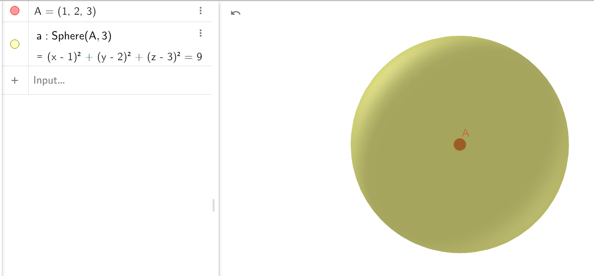
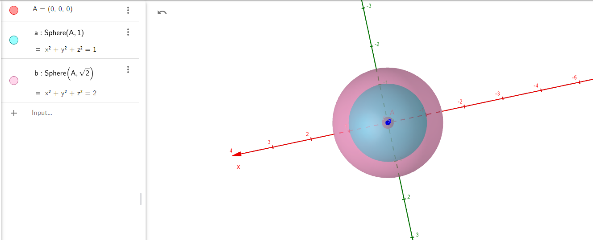
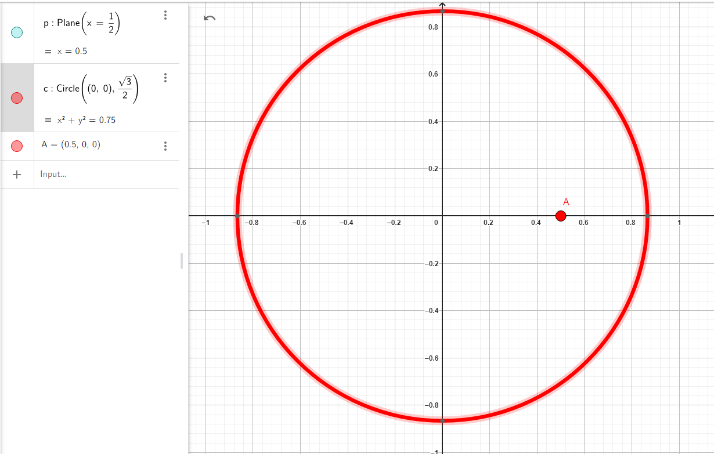
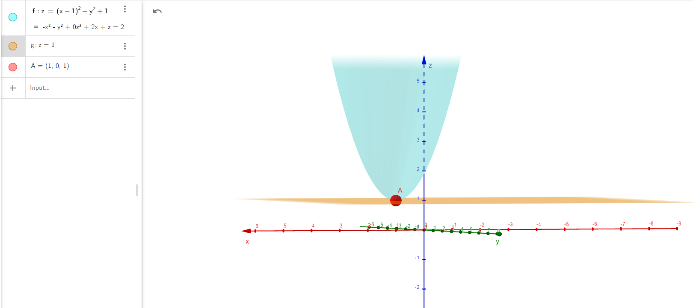
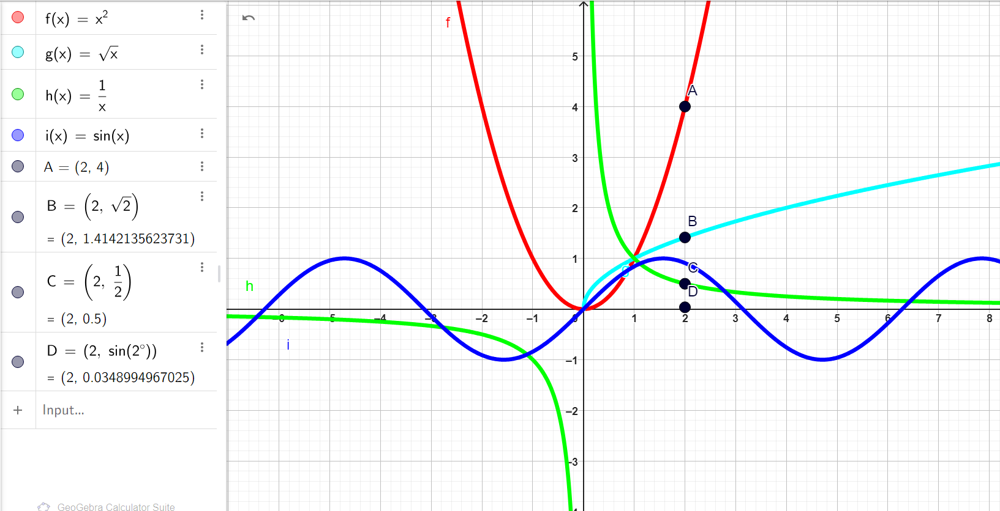
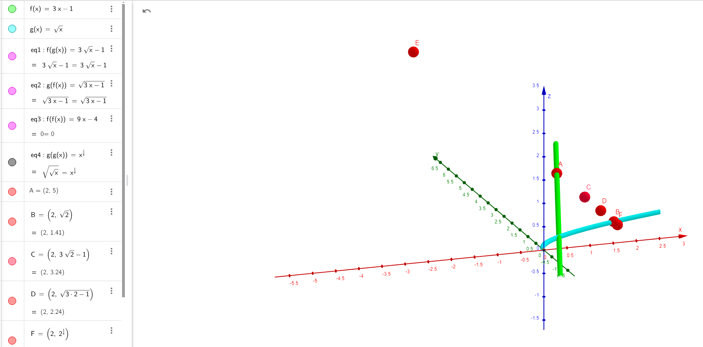
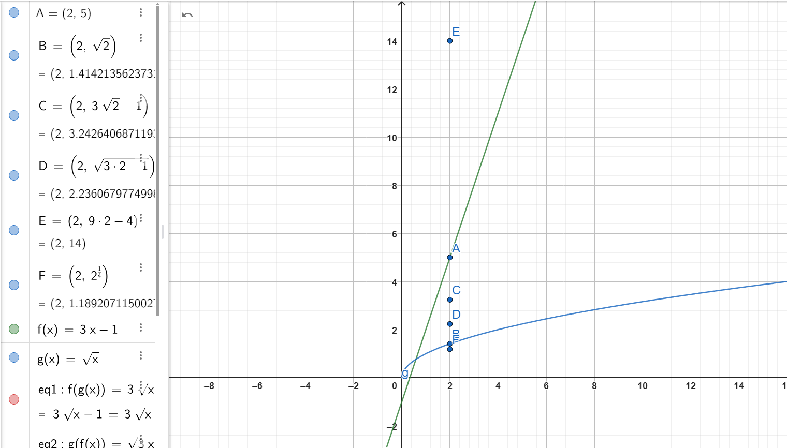

## **Write the equation of a sphere with center at point $P = (1, 2, 3)$ and radius $r = 3$.**

### **Step 1:** Recall the general equation of a sphere.

The general equation of a sphere with center \($(h, k, l)$\) and radius \($r$\) is given by:

$$
(x - h)^2 + (y - k)^2 + (z - l)^2 = r^2,
$$

where:

-   \($(h, k, l)$\) is the center of the sphere,
-   \($r$\) is the radius of the sphere.

### **Step 2:** Substitute the given values.

The center of the sphere is \($P(1, 2, 3)$\), so:

-   \($h = 1$\),
-   \($k = 2$\),
-   \($l = 3$\).

The radius is \($r = 3$\).

We Substitute these values into the general equation:

$$
(x - 1)^2 + (y - 2)^2 + (z - 3)^2 = 3^2.
$$

We Simplify:

$$
(x - 1)^2 + (y - 2)^2 + (z - 3)^2 = 9.
$$

### **Step 3:** Final equation of the sphere.

The equation of the sphere is:

$$
(x - 1)^2 + (y - 2)^2 + (z - 3)^2 = 9.
$$

## [GEOGEBRA LINK](https://www.geogebra.org/calculator/aeebhv7d)

---

---

---

## **Do the spheres with equations $x^2 + y^2 + z^2 = 1$ and $x^2 + y^2 + z^2 = 2$ have any common points?**

### **Step 1:** We must Analyze the given equations of the spheres.

1. The first sphere has the equation:

    $$
    x^2 + y^2 + z^2 = 1.
    $$

    - This sphere is centered at \($(0, 0, 0)$\) with radius \($r_1 = 1$\).

2. The second sphere has the equation:
    $$
    x^2 + y^2 + z^2 = 2.
    $$
    - This sphere is also centered at \($(0, 0, 0)$\), but with radius \($r_2 = \sqrt{2}$\).

### **Step 2:** Now we must Analyze the relationship between the spheres.

Both spheres are centered at the same point, \($(0, 0, 0)$\), but have different radii:

-   Radius of the first sphere: \($r_1 = 1$\),
-   Radius of the second sphere: \($r_2 = \sqrt{2} \approx 1.414$\).

The spheres are concentric (this means: they have the same center) but have different radii. Since the radii are not equal, the spheres do **not** intersect.

the spheres have the same center but different radii, they do not share any common points. The smaller sphere is entirely contained within the larger sphere, and their surfaces do not intersect.

### **Conclusion:**

#### **The spheres with equations \($x^2 + y^2 + z^2 = 1$\) and \($x^2 + y^2 + z^2 = 2$\) do not have any common points because they are concentric spheres with different radii and do not intersect.**

## [GEOGEBRA LINK](https://www.geogebra.org/calculator/j53tkdcv)

---

---

---

## **What curve in space is formed by the intersection of the sphere $x^2 + y^2 + z^2 = 1$ with the sphere $(x - 1)^2 + y^2 + z^2 = 1$? Find the equation of this curve.**

### **Step 1:** We must Analyze the given equations of the spheres.

1. The first sphere has the equation:

    $$
    x^2 + y^2 + z^2 = 1.
    $$

    - This sphere is centered at \($(0, 0, 0)$\) with radius \($r_1 = 1$\).

2. The second sphere has the equation:
    $$
    (x - 1)^2 + y^2 + z^2 = 1.
    $$
    - This sphere is centered at \($(1, 0, 0)$\) with radius \($r_2 = 1$\).

### **Step 2:** We Determine the relationship between the spheres.

Both spheres are centered along the \($x$\)-axis:

-   The first sphere is centered at \($O(0, 0, 0)$\),
-   The second sphere is centered at \($C(1, 0, 0)$\).

The distance between the centers \($O$\) and \($C$\) is:

$$
d = \sqrt{(1 - 0)^2 + (0 - 0)^2 + (0 - 0)^2} = 1.
$$

Since the distance between the centers \($d = 1$\) is equal to the radii of both spheres, the spheres intersect in a **circle**.

### **Step 3:** Find the equation of the curve.

To find the equation of the curve formed by the intersection of the two spheres:

1. Start with the equations of the spheres:

    - First sphere: \($x^2 + y^2 + z^2 = 1$\),
    - Second sphere: \($(x - 1)^2 + y^2 + z^2 = 1$\).

2. Expand the second sphere:

    $$
    (x - 1)^2 + y^2 + z^2 = 1.
    $$

    Expanding \($(x - 1)^2$\):

    $$
    x^2 - 2x + 1 + y^2 + z^2 = 1.
    $$

    Simplifying:

    $$
    x^2 + y^2 + z^2 - 2x + 1 = 1.
    $$

    Subtract \($x^2 + y^2 + z^2 = 1$\) (first sphere's equation) from this:

    $$
    (x^2 + y^2 + z^2 - 2x + 1) - (x^2 + y^2 + z^2) = 1 - 1.
    $$

    Simplifying:

    $$
    -2x + 1 = 0.
    $$

3. Solve for \($x$\):
    $$
    x = \frac{1}{2}.
    $$

### **Step 4:** The Interpretation of the result.

The equation \($x = \frac{1}{2}$\) represents a **plane** that cuts through both spheres at \($x = \frac{1}{2}$\). The intersection of this plane with the first sphere \($x^2 + y^2 + z^2 = 1$\) is a **circle** lying in the plane \($x = \frac{1}{2}$\).

### **Step 5:** Now let's Find the radius of the circle.

The radius \($r_{\text{circle}}$\) of the circle can be found using the Pythagorean theorem:

$$
r_{\text{circle}} = \sqrt{R^2 - d^2},
$$

where:

-   \($R = 1$\) (radius of the sphere),
-   \($d = \frac{1}{2}$\) (distance from the center of the sphere to the plane \($x = \frac{1}{2}$\)).

then we must Substitute the values:

$$
r_{\text{circle}} = \sqrt{1 - \left(\frac{1}{2}\right)^2}.
$$

Simplify:

$$
r_{\text{circle}} = \sqrt{1 - \frac{1}{4}} = \sqrt{\frac{3}{4}} = \frac{\sqrt{3}}{2}.
$$

### **Step 6:** The Final result.

The intersection of the two spheres is a circle lying in the plane:

$$
x = \frac{1}{2},
$$

with center:

$$
\left(\frac{1}{2}, 0, 0\right),
$$

and radius:

$$
r = \frac{\sqrt{3}}{2}.
$$

### **Conclusion:**

The intersection of the spheres \($x^2 + y^2 + z^2 = 1$\) and \($(x - 1)^2 + y^2 + z^2 = 1$\) is a circle with:

-   Plane: \($x = \frac{1}{2}$\),
-   Center: \($\left(\frac{1}{2}, 0, 0\right)$\),
-   Radius: \($\frac{\sqrt{3}}{2}$\).

## [GEOGEBRA LINK](https://www.geogebra.org/calculator/j3uyymkb)

---

---

---

## **Write the equation of the tangent plane to the paraboloid $z = (x - 1)^2 + y^2 + 1$ at point $P(1, 0, 1)$.**

### **Step 1:** We must Recall the formula for the equation of the tangent plane.

The equation of the tangent plane to a surface \($z = f(x, y)$\) at a point \($(x_0, y_0, z_0)$\) is given by:

$$
z - z_0 = f_x(x_0, y_0)(x - x_0) + f_y(x_0, y_0)(y - y_0),
$$

where:

-   \($f_x$\) and \($f_y$\) are the partial derivatives of \($f(x, y)$\) with respect to \($x$\) and \($y$\),
-   \($(x_0, y_0, z_0)$\) is the point of tangency.

### **Step 2:** We have to Identify the function and the given point.

The given surface is:

$$
z = (x - 1)^2 + y^2 + 1.
$$

The point of tangency is:

$$
P(1, 0, 1).
$$

Thus:

-   \($x_0 = 1$\),
-   \($y_0 = 0$\),
-   \($z_0 = 1$\).

### **Step 3:** We must Compute the partial derivatives \($f_x$\) and \($f_y$\).

1. **Partial derivative with respect to \($x$\):**

    $$
    f_x = \frac{\partial}{\partial x} \left[ (x - 1)^2 + y^2 + 1 \right].
    $$

    Differentiate:

    $$
    f_x = 2(x - 1).
    $$

2. **Partial derivative with respect to \($y$\):**
    $$
    f_y = \frac{\partial}{\partial y} \left[ (x - 1)^2 + y^2 + 1 \right].
    $$
    Differentiate:
    $$
    f_y = 2y.
    $$

### **Step 4:** We Evaluate the partial derivatives at \($P(1, 0, 1)$\).

At \($x_0 = 1$\) and \($y_0 = 0$\):

-   \($f_x(1, 0) = 2(1 - 1) = 0$\),
-   \($f_y(1, 0) = 2(0) = 0$\).

### **Step 5:** We Write the equation of the tangent plane.

Substitute the values into the tangent plane formula:

$$
z - z_0 = f_x(x_0, y_0)(x - x_0) + f_y(x_0, y_0)(y - y_0).
$$

Here:

-   \($z_0 = 1$\),
-   \($f_x(1, 0) = 0$\),
-   \($f_y(1, 0) = 0$\),
-   \($x_0 = 1$\), \($y_0 = 0$\).

Simplify:

$$
z - 1 = 0(x - 1) + 0(y - 0).
$$

We get:

$$
z = 1.
$$

### **Step 6:** So the Final result.

The equation of the tangent plane to the paraboloid \($z = (x - 1)^2 + y^2 + 1$\) at the point \($P(1, 0, 1)$\) is:

$$
z = 1.
$$

### **Conclusion:**

The equation of the tangent plane to the paraboloid \($z = (x - 1)^2 + y^2 + 1$\) at the point \($P(1, 0, 1)$\) is:

$$
z = 1.
$$

## [GEOGEBRA](https://www.geogebra.org/calculator/sftskg2h)

---

---

---

## **Draw in a single GeoGebra notebook the following functions:**

-   \( $f(x) = x^2$ \),
-   \( $g(x) = \sqrt{x}$ \),
-   \( $h(x) = \frac{1}{x}$ \),
-   \( $i(x) = \sin(x)$ \).

**Find the value of all the above functions at \( x = 2 \).**

### **1:** Evaluate \($ f(x) = x^2 $\) at \( $x = 2$ \).

Substitute \( $x = 2$ \) into the function \( $f(x) = x^2$ \):

$$
f(2) = 2^2.
$$

Now, We perform the exponentiation:

$$
f(2) = 4.
$$

### **2:** Evaluate \($ g(x) = \sqrt{x}$ \) at \($ x = 2 $\).

We Substitute \($ x = 2$ \) into the function \($ g(x) = \sqrt{x}$ \):

$$
g(2) = \sqrt{2}.
$$

To get a numerical approximation of \( $\sqrt{2}$ \), We must calculate:

$$
g(2) \approx 1.414.
$$

### **3:** Evaluate \($ h(x) = \frac{1}{x}$ \) at \( $x = 2$ \).

We Substitute \($ x = 2 $\) into the function \( $h(x) = \frac{1}{x}$ \):

$$
h(2) = \frac{1}{2}.
$$

Now we Perform the division:

$$
h(2) = 0.5.
$$

### **4:** Evaluate \( $i(x) = \sin(x)$ \) at \($ x = 2$ \).

We Substitute \($ x = 2$ \) into the function \($ i(x) = \sin(x)$ \):

$$
i(2) = \sin(2).
$$

The approximation for \( $\sin(2)$ \) (where the angle is in radians):

$$
i(2) \approx 0.909.
$$

### **5:** Results:

-   \( $f(2) = 4$ \),
-   \( $g(2) \approx 1.414$ \),
-   \( $h(2) = 0.5$ \),
-   \( $i(2) \approx 0.909$ \).

### **Conclusion:**

The values of the functions at \( $x = 2$ \) are:

-   \( $f(2) = 4 $\),
-   \( $g(2) \approx 1.414$ \),
-   \( $h(2) = 0.5$ \),
-   \( $i(2) \approx 0.909$ \).

## [GEOGEBRA](https://www.geogebra.org/calculator/zuxqd6ut)

---

---

---

## **2. Let \($ f(x) = 3x - 1$ \) and \( $g(x) = \sqrt{x}$ \). Find:**

-   \($ f(g(x))$ \),
-   \( $g(f(x))$ \),
-   \( $f(f(x))$\),
-   \( $g(g(x))$ \).

## **And visualize functions in a single GeoGebra notebook.**

### **1. \( $f(g(x))$ \):**

We must Recall that \($ f(x) = 3x - 1 $\) and \( $g(x) = \sqrt{x}$ \).

now let's Substitute \($ g(x) = \sqrt{x}$ \) into \( $f(x)$ \):

$$
f(g(x)) = f(\sqrt{x}) = 3(\sqrt{x}) - 1.
$$

This simplifies to:

$$
f(g(x)) = 3\sqrt{x} - 1.
$$

So, \( $f(g(x)) = 3\sqrt{x} - 1$ \).

### **2. \($ g(f(x))$ \):**

We Substitute \( $f(x) = 3x - 1$ \) into \( $g(x) = \sqrt{x}$ \):

$$
g(f(x)) = g(3x - 1) = \sqrt{3x - 1}.
$$

So, \( $g(f(x)) = \sqrt{3x - 1}$ \).

### **3. \($f(f(x)) $\):**

We Substitute \( $f(x) = 3x - 1$ \) into itself:

$$
f(f(x)) = f(3x - 1).
$$

Now, we apply the function \( $f$ \) to \( $(3x - 1)$ \):

$$
f(f(x)) = 3(3x - 1) - 1.
$$

Simplify:

$$
f(f(x)) = 9x - 3 - 1 = 9x - 4.
$$

So, \( $f(f(x)) = 9x - 4$ \).

### **4. \( $g(g(x))$ \):**

We must Substitute \( $g(x) = \sqrt{x}$ \) into itself:

$$
g(g(x)) = g(\sqrt{x}) = \sqrt{\sqrt{x}}.
$$

This simplifies to:

$$
g(g(x)) = x^{1/4}.
$$

So, \( $g(g(x)) = x^{1/4}$ \).

### **Conclusion:**

-   \( $f(g(x)) = 3\sqrt{x} - 1$ \),
-   \( $g(f(x)) = \sqrt{3x - 1}$ \),
-   \( $f(f(x)) = 9x - 4 $\),
-   \( $g(g(x)) = x^{1/4}$ \).

## [GEOGEBRA LINK 1](https://www.geogebra.org/calculator/nkjtuwfr)

## [GEOGEBRA LINK 2](https://www.geogebra.org/calculator/yvskmdwm)

---

## **3. Let \( $f(x) = e^x$ \) and \( $g(x) = \ln(x)$ \). Check: \( $f(g(x))$ \) and \( 4g(f(x))$ \). What do you notice?**

### **1. Calculate \( $f(g(x))$ \):**

Substitute \( $g(x) = \ln(x)$ \) into \( $f(x) = e^x$ \):

$$
f(g(x)) = f(\ln(x)) = e^{\ln(x)}.
$$

By the property of logarithms and exponentials, \( $e^{\ln(x)} = x$ \):

$$
f(g(x)) = x.
$$

---

---

---

### **2. Calculate \( $g(f(x))$ \):**

Substitute \( $f(x) = e^x$ \) into \( $g(x) = \ln(x)$ \):

$$
g(f(x)) = g(e^x) = \ln(e^x).
$$

By the property of logarithms, \( $\ln(e^x) = x$ \):

$$
g(f(x)) = x.
$$

### **Conclusion:**

-   \( $f(g(x)) = x$ \),
-   \($g(f(x)) = x$ \).

**What do I notice?**

-   The composition of the exponential and logarithmic functions, \( $f(g(x))$ \) and \( $g(f(x))$ \), results in the identity function \( $x$ \). This shows that \( $e^x$ \) and \( $\ln(x)$ \) are inverse functions of each other.

---

---

---

## **4. We have the function \($ f = (1, 7), (2, 9), (3, 11)$ \). Give the inverse function \( $f^{-1}$ \).**

### **Step 1:** We write the function as a set of ordered pairs:

$$
f = \{(1, 7), (2, 9), (3, 11)\}.
$$

The inverse function, \( $f^{-1}$ \), is formed by swapping the \($x$\)- and \($y$\)-coordinates of each ordered pair:

$$
f^{-1} = \{(7, 1), (9, 2), (11, 3)\}.
$$

Thus, the inverse function \( $f^{-1}$ \) is:

$$
f^{-1} = \{(7, 1), (9, 2), (11, 3)\}.
$$

---

---

---

## **5. We have the function \( $f = (1, 7), (2, 9), (3, 11)$ \). Give the inverse function \( $f^{-1}$ \).**

This is identical to problem 4, so the answer is the same as above:

$$
f^{-1} = \{(7, 1), (9, 2), (11, 3)\}.
$$

---

---

---

## **6. We have the function \( $f(x) = x - 1$ \). Give the inverse function \( $f^{-1}$ \).**

### **Step 1:** now let's Solve for \( $f^{-1}$ \).

The function \( $f(x) = x - 1$ \) maps \( $x$ \) to \( $x - 1$ \). To find the inverse, we solve for \( $x$ \) in terms of \( $y$ \):

Let \($ y = f(x) = x - 1 $\), so:

$$
y = x - 1.
$$

Solving for \($ x $\):

$$
x = y + 1.
$$

Thus, the inverse function is:

$$
f^{-1}(y) = y + 1.
$$

So, the inverse function \($ f^{-1}$ \) is:

$$
f^{-1}(x) = x + 1.
$$

### **Conclusion:**

-   The inverse function \($ f^{-1}$ \) for \( $f(x) = x - 1$ \) is \( $f^{-1}(x) = x + 1 $\).

---

---

---

# **#21. Derivatives**

## **1. Compute the derivatives of the following functions:**

---

### **1. \($ y(x) = -3x + 3 $\)**

This is a simple linear function. The derivative of any linear function \($ ax + b $\) is simply the coefficient \( $a$ \).

The derivative of \( $-3x$ \) with respect to \( $x$ \) is \( $-3$ \), and the derivative of the constant \( $3$ \) is \( $0$ \).

We got:

$$
y'(x) = -3.
$$

---

### **2. \( $y(x) = \pi x + \sin(x)$ \)**

To differentiate this function, use the following rules:

1. The derivative of \( $\pi x $\) is \( $\pi$ \) because \( $\pi$ \) is a constant.
2. The derivative of \( $\sin(x)$ \) is \( $\cos(x)$ \).

We got:

$$
y'(x) = \pi + \cos(x).
$$

---

### **3. \( $y(x) = 4 + \sin(2)$ \)**

Notice that \( $\sin(2)$ \) is a constant because \( $2$ \) is a fixed number. The derivative of a constant is always zero.

we got:

$$
y'(x) = 0.
$$

---

### **4. \( $y(x) = 2x^3 - 3x^2 + 8x - 9$ \)**

To differentiate this polynomial, we apply the power rule: \( $\frac{d}{dx} \left( x^n \right) = nx^{n-1}$ \).

1. The derivative of \( $2x^3$ \) is:
   $$ \frac{d}{dx}(2x^3) = 2 \cdot 3x^{3-1} = 6x^2. $$

2. The derivative of \( $-3x^2$ \) is:
   $$ \frac{d}{dx}(-3x^2) = -3 \cdot 2x^{2-1} = -6x. $$

3. The derivative of \( $8x$ \) is:
   $$ \frac{d}{dx}(8x) = 8. $$

4. The derivative of the constant \( $-9$ \) is:
   $$ \frac{d}{dx}(-9) = 0. $$

putting everything together, we got :

$$
y'(x) = 6x^2 - 6x + 8.
$$

---

### **5. \($ y(x) = 6x^{1/3}$ \)**

To differentiate this function, we again apply the power rule. First, rewrite the expression as \( $y(x) = 6x^{1/3}$ \).

Using the power rule \( $\frac{d}{dx} x^n = nx^{n-1}$ \), the derivative of \( $x^{1/3}$ \) is:

$$
\frac{d}{dx}(x^{1/3}) = \frac{1}{3}x^{1/3 - 1} = \frac{1}{3}x^{-2/3}.
$$

Now multiply by the constant \( $6$ \):

$$
y'(x) = 6 \cdot \frac{1}{3}x^{-2/3} = \frac{2}{x^{2/3}}.
$$

We got:

$$
y'(x) = \frac{2}{x^{2/3}}.
$$

---

### **6. \( $y(x) = \sqrt{x}$ \)**

Rewrite \( $\sqrt{x}$ \) as \( $x^{1/2}$ \).

Now, using the power rule:

$$
\frac{d}{dx}(x^{1/2}) = \frac{1}{2}x^{1/2 - 1} = \frac{1}{2}x^{-1/2}.
$$

We got:

$$
y'(x) = \frac{1}{2\sqrt{x}}.
$$

---

### **7. \( $y(x) = \cos(x) + \sin(x)$ \)**

1. The derivative of \( $\cos(x)$ \) is \( $-\sin(x)$ \).
2. The derivative of \( $\sin(x)$ \) is \( $\cos(x)$ \).

We got:

$$
y'(x) = -\sin(x) + \cos(x).
$$

---

### **8. \( $y(x) = 2\sin(x)\cos(x)$ \)**

To differentiate this, we use the **product rule**, which states that the derivative of \( $u(x)v(x)$ \) is \( $u'(x)v(x) + u(x)v'(x)$ \). Here \( $u(x) = \sin(x)$ \) and \( $v(x) = \cos(x)$ \).

1. The derivative of \( $\sin(x)$ \) is \( $\cos(x)$ \).
2. The derivative of \( $\cos(x)$ \) is \( $-\sin(x)$ \).

Now, applying the product rule:

$$
y'(x) = 2\left( \cos(x)\cos(x) + \sin(x)(-\sin(x)) \right).
$$

Simplify:

$$
y'(x) = 2(\cos^2(x) - \sin^2(x)).
$$

Using the double angle identity for cosine:

$$
y'(x) = 2\cos(2x).
$$

We got:

$$
y'(x) = 2\cos(2x).
$$

---

### **9. \( $y(x) = x \sin(x)$ \)**

To differentiate this, we again use the **product rule**:

1. The derivative of \( $x$ \) is \( $1$ \).
2. The derivative of \( $\sin(x)$ \) is \( $\cos(x)$ \).

Now apply the product rule:

$$
y'(x) = 1 \cdot \sin(x) + x \cdot \cos(x) = \sin(x) + x\cos(x).
$$

We got:

$$
y'(x) = \sin(x) + x\cos(x).
$$

---

### **10. \( $y(x) = (x + 1)(x + 1)$ \)**

First, simplify the expression:

$$
y(x) = (x + 1)^2.
$$

Now apply the power rule:

$$
y'(x) = 2(x + 1).
$$

We got:

$$
y'(x) = 2(x + 1).
$$

---

### **11. \( $y(x) = e^x$ \)**

The derivative of \( $e^x$ \) is simply \( $e^x$ \), as it is one of the fundamental derivatives:

We got:

$$
y'(x) = e^x.
$$

---

### **12. \( $y(x) = (x + 1) \exp(x)$ \)**

Use the **product rule**:

1. The derivative of \( $x + 1$ \) is \( $1$ \).
2. The derivative of \( $\exp(x)$ \) is \( $\exp(x)$ \).

Now apply the product rule:

$$
y'(x) = 1 \cdot \exp(x) + (x + 1) \cdot \exp(x) = (x + 2)\exp(x).
$$

We got:

$$
y'(x) = (x + 2)\exp(x).
$$

---

### **13. \( $y(x) = \sin(x^2)$ \)**

Use the **chain rule**. Let \( $u = x^2$ \), so \( $y(x) = \sin(u)$ \).

1. The derivative of \( $\sin(u)$ \) is \( $\cos(u)$ \).
2. The derivative of \( $u = x^2$ \) is \( $2x$ \).

Now multiply the derivatives:

$$
y'(x) = 2x \cdot \cos(x^2).
$$

We got:

$$
y'(x) = 2x \cos(x^2).
$$

---

### **14. \( $y(x) = \exp(-2x)$ \)**

Use the chain rule:

1. The derivative of \( $\exp(-2x)$ \) is \( $\exp(-2x)$ \) multiplied by the derivative of \( $-2x$ \), which is \( $-2$ \).

We got:

$$
y'(x) = -2 \exp(-2x).
$$

---

### **15. \( $y(x) = \frac{1}{\sin(x + 1)}$ \)**

To differentiate \( $\frac{1}{\sin(x + 1)}$ \), we use the quotient rule, or equivalently, we apply the chain rule after rewriting the expression as \( $y(x) = \sin(x + 1)^{-1}$ \).

1. The derivative of \( $\sin(x + 1)^{-1}$ \) is \( $-\sin(x + 1)^{-2} \cdot \cos(x + 1)$ \) (chain rule).

We got:

$$
y'(x) = -\frac{\cos(x + 1)}{\sin^2(x + 1)}.
$$

---

### **16. \( $y(x) = \sqrt{2x + 1}$ \)**

Rewriting \( $\sqrt{2x + 1}$ \) as \( $(2x + 1)^{1/2}$ \), we apply the chain rule:

1. The derivative of \( $(2x + 1)^{1/2}$ \) is \( $\frac{1}{2}(2x + 1)^{-1/2}$ \).
2. The derivative of \( $2x + 1$ \) is \( $2$ \).

We got:

$$
y'(x) = \frac{1}{2} \cdot \frac{2}{\sqrt{2x + 1}} = \frac{1}{\sqrt{2x + 1}}.
$$

---

---

---

# **#19. Limits of Sequences**

### **1. Calculate:**

#### \( $\lim_{n \to \infty} \frac{n^2 + 3n}{2n^2 - 2n}$ \)

1. **Step 1:** First, divide both the numerator and the denominator by \( $n^2$ \), the highest power of \( $n$ \) in the expression:

    $$
    \frac{n^2 + 3n}{2n^2 - 2n} = \frac{\frac{n^2}{n^2} + \frac{3n}{n^2}}{\frac{2n^2}{n^2} - \frac{2n}{n^2}} = \frac{1 + \frac{3}{n}}{2 - \frac{2}{n}}.
    $$

    Here we performed division by \( $n^2$ \) on both the numerator and denominator to simplify the expression.

2. **Step 2:** Now, take the limit as \( $n \to \infty$ \). As \( $n$ \) goes to infinity, both \( $\frac{3}{n}$ \) and \( $\frac{2}{n}$ \) approach \( $0$ \). Therefore:

    $$
    \lim_{n \to \infty} \frac{1 + \frac{3}{n}}{2 - \frac{2}{n}} = \frac{1 + 0}{2 - 0} = \frac{1}{2}.
    $$

We got:

$$
\lim_{n \to \infty} \frac{n^2 + 3n}{2n^2 - 2n} = \frac{1}{2}.
$$

---

#### \( $\lim_{n \to \infty} \frac{(2n + 3)^3}{n^2 - 1}$ \)

1. **Step 1:** Expand the cubic term \( $(2n + 3)^3$ \) using the binomial expansion:

    $$
    (2n + 3)^3 = 8n^3 + 12n^2 + 18n + 27.
    $$

    This is an application of the binomial expansion formula.

2. **Step 2:** Now, divide both the numerator and the denominator by \( $n^3$ \), the highest power in the numerator:

    $$
    \frac{(2n + 3)^3}{n^2 - 1} = \frac{\frac{8n^3 + 12n^2 + 18n + 27}{n^3}}{\frac{n^2 - 1}{n^3}} = \frac{8 + \frac{12}{n} + \frac{18}{n^2} + \frac{27}{n^3}}{\frac{1}{n} - \frac{1}{n^3}}.
    $$

3. **Step 3:** Take the limit as \( $n \to \infty$ \). As \( $n$ \) goes to infinity, all the terms with \( $n$ \), \( $n^2$ \), and \( $n^3$ \) in the denominator go to zero:

    $$
    \lim_{n \to \infty} \frac{8 + 0 + 0 + 0}{0 - 0} = \infty.
    $$

We got:

$$
\lim_{n \to \infty} \frac{(2n + 3)^3}{n^2 - 1} = \infty.
$$

---

### **2. Prove using the Squeeze Theorem:**

#### \( $\lim_{n \to \infty} \frac{\sin(n)}{n}$ \)

The **Squeeze Theorem** states that if \( $f(x) \leq g(x) \leq h(x)$ \) for all \( $x$ \) in an interval, and \( $\lim_{x \to a} f(x) = \lim_{x \to a} h(x) = L$ \), then \( $\lim_{x \to a} g(x) = L$ \).

1. **Step 1:** We know that for all \( $n$ \), we have the inequality:

    $$
    -1 \leq \sin(n) \leq 1.
    $$

2. **Step 2:** Now, divide the inequality by \( $n$ \) (since \( $n > 0$ \)):

    $$
    \frac{-1}{n} \leq \frac{\sin(n)}{n} \leq \frac{1}{n}.
    $$

    This step divides the entire inequality by \( $n$ \).

3. **Step 3:** Now, take the limit of both sides as \( $n \to \infty$ \):

    $$
    \lim_{n \to \infty} \frac{-1}{n} = 0, \quad \lim_{n \to \infty} \frac{1}{n} = 0.
    $$

    As \( $n \to \infty$ \), both of these terms approach 0.

4. **Step 4:** By the Squeeze Theorem:

    $$
    \lim_{n \to \infty} \frac{\sin(n)}{n} = 0.
    $$

We got:

$$
\lim_{n \to \infty} \frac{\sin(n)}{n} = 0.
$$

---

### **3. Find the limit of the sequence:**

#### \( $a_n = \left(1 + \frac{1}{n}\right)^n$ \)

1. **Step 1:** Recognize that the sequence is in the form \( $\left(1 + \frac{1}{n}\right)^n $\), which is a well-known limit that approaches \( $e$ \) as \( $n \to \infty$ \).

We got:

$$
\lim_{n \to \infty} \left(1 + \frac{1}{n}\right)^n = e.
$$

---

# **#20. Limits of Real Functions**

### **1. Compute:**

#### \( $\lim_{x \to \infty} \frac{x^3 + 2x^2}{x^4 - 3x^3}$ \)

1. **Step 1:** Divide both the numerator and the denominator by \($x^4$ \), the highest power in the denominator:

    $$
    \frac{x^3 + 2x^2}{x^4 - 3x^3} = \frac{\frac{x^3}{x^4} + \frac{2x^2}{x^4}}{\frac{x^4}{x^4} - \frac{3x^3}{x^4}} = \frac{\frac{1}{x} + \frac{2}{x^2}}{1 - \frac{3}{x}}.
    $$

2. **Step 2:** Take the limit as \( $x \to \infty$ \). As \( $x$ \) goes to infinity, the terms \( $\frac{1}{x}$ \), \( $\frac{2}{x^2}$ \), and \( $\frac{3}{x}$ \) go to zero:

    $$
    \lim_{x \to \infty} \frac{\frac{1}{x} + \frac{2}{x^2}}{1 - \frac{3}{x}} = \frac{0 + 0}{1 - 0} = 0.
    $$

We got:

$$
\lim_{x \to \infty} \frac{x^3 + 2x^2}{x^4 - 3x^3} = 0.
$$

---

### **2. Find:**

#### \( $\lim_{x \to 0} \frac{\sin(3x)}{2x + 1}$ \)

1. **Step 1:** Use the fact that \( $\lim_{x \to 0} \frac{\sin(x)}{x} = 1$ \).

2. **Step 2:** First, factor out \( $3$ \) from \( $\sin(3x)$ \):

    $$
    \frac{\sin(3x)}{2x + 1} = \frac{3 \cdot \sin(3x)}{3(2x + 1)}.
    $$

3. **Step 3:** Now apply the limit:

    $$
    \lim_{x \to 0} \frac{3 \cdot \sin(3x)}{3(2x + 1)} = \frac{3 \cdot 1}{3 \cdot 1} = 1.
    $$

We got:

$$
\lim_{x \to 0} \frac{\sin(3x)}{2x + 1} = 1.
$$

---

### **3. Find the asymptotes of the function:**

#### \( $f(x) = \frac{x^2 + 1}{x^2 + 1}$ \)

1. **Step 1:** Simplify the expression. Notice that the numerator and denominator are identical:

    $$
    f(x) = \frac{x^2 + 1}{x^2 + 1} = 1.
    $$

2. **Step 2:** Since \( $f(x) = 1$ \) for all \( $x$ \), there are no vertical or horizontal asymptotes.

### We got that: the function has no asymptotes.

---
