# 22. Extremum

# 6. The profit function is $P(u) = -2u^2 + 50u - 300$, where $u$ is the number of units sold. Find the number of units that maximize profit.

$$
    P(u) = -2u^2 + 50u - 300
$$

where \( $u$ \) is the number of units sold. Find the number of units \( $u$ \) that maximize the profit.

### **Step 1:Recognize that the problem asks for the extremum of the quadratic function.**

The given function is a quadratic equation of the form:

$$
P(u) = au^2 + bu + c
$$

where:

-   \( $a = -2$ \),
-   \( $b = 50$ \),
-   \( $c = -300$ \).

Since the coefficient \( $a = -2$ \) is negative, the parabola opens downward. This indicates that the function has a maximum value.

### **Step 2: Find the critical point using the first derivative.**

The critical point occurs where the first derivative of \( $P(u)$ \) equals zero. First, calculate the derivative:

\[
$P'(u) = \frac{d}{du}\left(-2u^2 + 50u - 300\right) = -4u + 50$
\]

Set the derivative equal to zero:

$$
-4u + 50 = 0
$$

Solve for \( $u$ \):

$$
-4u = -50,
$$

$$
u = \frac{-50}{-4} = 12.5
$$

Thus, the critical point is at \( $u = 12.5$ \).

### **Step 3: Confirm if this critical point is a maximum or minimum.**

To confirm whether \( $u = 12.5$ \) is a maximum, calculate the second derivative of \( $P(u)$ \). The second derivative is:

$$
P''(u) = \frac{d}{du}\left(-4u + 50\right) = -4
$$

Since \( $P''(u) = -4$ \) is negative, the function is concave downward at \( u = 12.5 \). This confirms that \( u = 12.5 \) is indeed a maximum.

### **Step 4: Find the maximum profit.**

To find the maximum profit, substitute \( $u = 12.5$ \) into the original profit function \( $P(u)$ \):

\[
$P(12.5) = -2(12.5)^2 + 50(12.5) - 300$
\]

 
 

1. Compute \( $(12.5)^2$ \):

\[
$12.5^2 = 156.25$
\]

 
 

2. Multiply by \($-2$\):

\[
$-2(12.5)^2 = -2(156.25) = -312.5$
\]

 
 

3. Compute \( $50(12.5)$ \):

\[
$50(12.5) = 625$
\]

 
 

4. Add the terms:

\[
$P(12.5) = -312.5 + 625 - 300 = 12.5$
\]

 
 

The maximum profit is:

$$
P_{\text{max}} = 12.5
$$

### **Step 5: Rounding the number of units.**

Since \( $u$ \) represents the number of units sold, we can round \( $u = 12.5$ \) to the nearest whole number:

$$
u = 13.
$$

Due the number of units that maximizes profit is:

$$
u = 13 \text{ units}.
$$

## [GEOGEBRA LINK](https://www.geogebra.org/calculator/sggw4nj8)

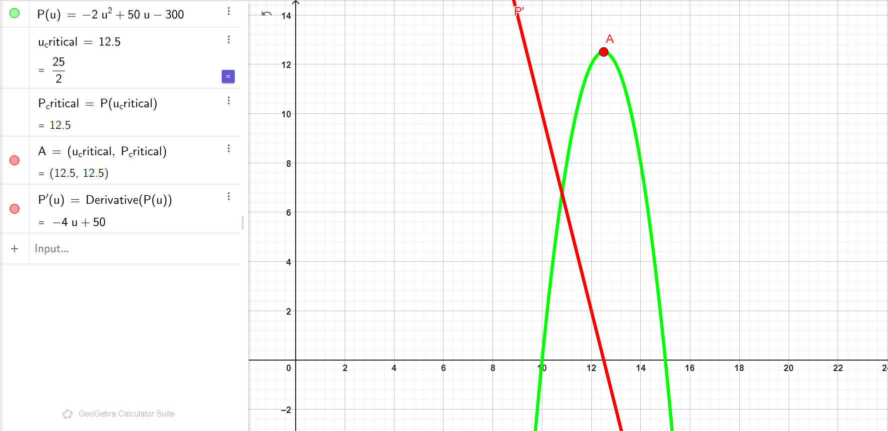

### Explanation of the Profit Function Graph

### Profit Function \( $P(u)$ \)

The profit function is:

$$
P(u) = -2u^2 + 50u - 300
$$

It is a downward-opening parabola since the leading coefficient (\( $-2$ \)) is negative, meaning it has a **maximum point**.

### Critical Point

The critical point is calculated using:

$$
u_{\text{critical}} = -\frac{b}{2a} = -\frac{50}{2 \times -2} = 12.5
$$

Substituting \( u = 12.5 \) into \( P(u) \):

$$
P(12.5) = -2(12.5)^2 + 50(12.5) - 300 = 12.5
$$

Thus, the critical point is:

$$
(12.5, 12.5)
$$

### Graph Explanation

-   The **GREEN curve** represents \( $P(u) = -2u^2 + 50u - 300$ \).
-   The **RED line** is the derivative:
    $$
    P'(u) = -4u + 50
    $$
    It crosses zero at \( $u = 12.5$ \), confirming the critical point.
-   The maximum point is labeled as \( $A(12.5, 12.5)$ \).

---

---

---

 
 
 
 
 
 
 
 
 
 
 
 

# 7. You have 10 meters of string, and you need to use it to enclose the largest possible rectangular. Find the dimensions of the rectangle.

### **Step 1: Define the problem mathematically.**

Let:

-   \( $L$ \) be the length of the rectangle.
-   \( $W$ \) be the width of the rectangle.

The perimeter of the rectangle is given as 10 meters:

$$
2L + 2W = 10
$$

Rearrange to express \( $W$ \) in terms of \( $L$ \):

$$
W = \frac{10 - 2L}{2} = 5 - L
$$

The area of the rectangle \( A \) is given by:

$$
A = L \cdot W
$$

Substitute \( $W = 5 - L$ \) into the area formula:

$$
A = L(5 - L) = 5L - L^2
$$

### **Step 2: Recognize the problem as a quadratic maximization problem.**

The area function is:

$$
A(L) = -L^2 + 5L
$$

which is a quadratic equation of the form:

$$
A(L) = -L^2 + bL + c
$$

where:

-   \( $a = -1$ \),
-   \( $b = 5$ \),
-   \( $c = 0$ \).

Since \( $a = -1$ \) is negative, the parabola opens downward, indicating that the function has a maximum value.

### **Step 3: Find the critical point using the first derivative.**

Take the derivative of \( $A(L)$ \) with respect to \( $L$ \):

$$
A'(L) = \frac{d}{dL}\left(-L^2 + 5L\right) = -2L + 5
$$

Set the derivative equal to zero to find the critical point:

$$
-2L + 5 = 0
$$

Solve for \( $L$ \):

$$
2L = 5
$$

$$
L = \frac{5}{2} = 2.5
$$

Thus, the critical point is at \( $L = 2.5$ \).

### **Step 4: Confirm that the critical point gives a maximum.**

Take the second derivative of \( $A(L)$ \):

$$
A''(L) = \frac{d}{dL}(-2L + 5) = -2
$$

Since \( $A''(L) = -2$ \) is negative, the function is concave downward at \( $L = 2.5$ \). This confirms that \( $L = 2.5$ \) gives the maximum area.

### **Step 5: Find the corresponding width and area.**

From the equation for the width:

$$
W = 5 - L
$$

Substitute \( $L = 2.5$ \):

$$
W = 5 - 2.5 = 2.5
$$

The dimensions of the rectangle are:

-   \( $L = 2.5$ \),
-   \( $W = 2.5$ \).

The maximum area is:

$$
A = L \cdot W = 2.5 \cdot 2.5 = 6.25
$$

## [GEOGEBRA LINK ](https://www.geogebra.org/calculator/shrdzcgn)

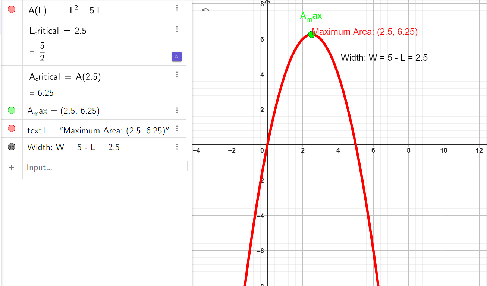

### Explanation of the Area Function Graph:

### Area Function \( $A(L)$ \)

The area function is:

$$
A(L) = -L^2 + 5L
$$

It is a downward-opening parabola since the leading coefficient (\( $-1$ \)) is negative, meaning it has a **maximum point**.

### Critical Point

The critical point is calculated using:

$$
L_{\text{critical}} = -\frac{b}{2a} = -\frac{5}{2 \times -1} = 2.5
$$

Substituting \( $L = 2.5$ \) into \( $A(L)$ \):

$$
A(2.5) = -2.5^2 + 5(2.5) = 6.25
$$

Thus, the critical point is:

$$
(2.5, 6.25)
$$

### Graph Explanation

-   The **RED curve** represents \( $A(L) = -L^2 + 5L$ \), showing the area of the rectangle as a function of \( $L$ \).
-   The **GREEN dot** marks the maximum point:
    $$
    A_{\text{max}} = (2.5, 6.25)
    $$

---

---

---

 
 
 
 
 
 
 
 
 
 
 
 

# 8. Find extremum od $f(x) = x^2 + 3x - 5$

### **Step 1: Recognize that the problem asks for the extremum of the quadratic function.**

The given function is a quadratic equation of the form:

$$
f(x) = ax^2 + bx + c,
$$

where:

-   \( $a = 1$ \),
-   \( $b = 3$ \),
-   \( $c = -5$ \).

Since the coefficient \( a = 1 \) is positive, the parabola opens upward. This indicates that the function has a minimum value.

### **Step 2: Find the critical point using the first derivative.**

The critical point occurs where the first derivative of \( $f(x)$ \) equals zero. First, calculate the derivative:

\[
$f'(x) = \frac{d}{dx}\left(x^2 + 3x - 5\right) = 2x + 3$
\]

Set the derivative equal to zero:

$$
2x + 3 = 0.
$$

Solve for \( $x$ \):

$$
2x = -3,
$$

$$
x = \frac{-3}{2} = -1.5.
$$

The critical point is at \( $x = -1.5$ \).

### **Step 3: Confirm if this critical point is a minimum or maximum.**

To confirm whether \( $x = -1.54 \) is a minimum, calculate the second derivative of \( $f(x)$ \). The second derivative is:

$$
f''(x) = \frac{d}{dx}\left(2x + 3\right) = 2
$$

Since \( $f''(x) = 2$ \) is positive, the function is concave upward at \( $x = -1.5$ \). This confirms that \( $x = -1.5$ \) gives a minimum value.

### **Step 4: Find the minimum value of the function.**

To find the minimum value, substitute \( $x = -1.5$ \) into the original function \( $f(x)$ \):

\[
$f(-1.5) = (-1.5)^2 + 3(-1.5) - 5$
\]

 
 

1. Compute \( $(-1.5)^2$ \):

\[
$(-1.5)^2 = 2.25$
\]

 
 

2. Compute \( $3(-1.5)$ \):

\[
$3(-1.5) = -4.5$
\]

 
 

3. Add the terms:

\[
$f(-1.5) = 2.25 - 4.5 - 5 = -7.25$
\]

 
 

Due this here we have the minimum value of the function is:

$$
f_{\text{min}} = -7.25
$$

## [GEOGEBRA LINK](https://www.geogebra.org/calculator/m7zszp9x)

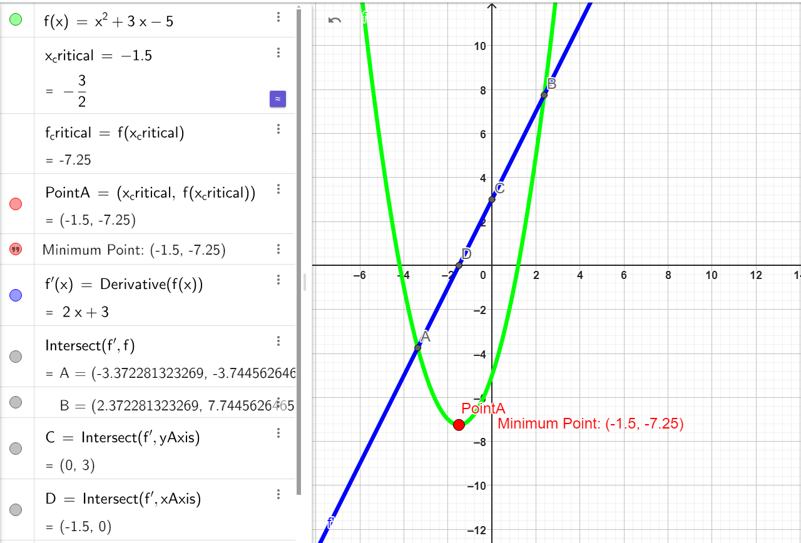

### Explanation of the Function Plot

### Function Representation

The quadratic function is:

$$
f(x) = x^2 + 3x - 5
$$

This is a parabola that opens upward since the leading coefficient (\( a = 1 \)) is positive, meaning it has a **minimum point**.

### Critical Point

The critical point is calculated using the vertex formula:

$$
x_{\text{critical}} = -\frac{b}{2a} = -\frac{3}{2 \cdot 1} = -1.5
$$

Substituting \( x = -1.5 \) into \( f(x) \) gives:

$$
f(-1.5) = (-1.5)^2 + 3(-1.5) - 5 = -7.25
$$

Thus, the minimum point is:

$$
(-1.5, -7.25)
$$

### Graph Explanation

1. The **green curve** represents the function \( $f(x) = x^2 + 3x - 5$ \).
2. The **blue line** represents the derivative:
    $$
    f'(x) = 2x + 3
    $$
    It shows the slope of the function, crossing the \( $x$ \)-axis at \( $x = -1.5$ \), confirming the critical point.
3. The minimum point \( $(-1.5, -7.25)$ \) is marked as **PointA**, with a red dot and label "Minimum Point: $(-1.5, -7.25)$"

---

---

---

---

 
 
 
 
 
 
 
 
 
 
 
 

# 9. Find extremum of $f(x) =\frac{x^2+2x+1}{x-1}$

### **Step 1: Recognize the function's form.**

The given function is a rational function of the form:

$$
f(x) = \frac{P(x)}{Q(x)},
$$

where:

-   \($ P(x) = x^2 + 2x + 1 $\),
-   \( $Q(x) = x - 1$ \)

Before proceeding, note that:

1. The denominator \( $Q(x) = x - 1 $\) cannot be zero. Hence, the domain is \( $x \neq 1 $\).
2. The function may have vertical asymptotes or critical points depending on its behavior.

### **Step 2: Simplify the numerator \( $P(x)$ \) if possible.**

Factorize \($ P(x)$ \):

$$
x^2 + 2x + 1 = (x + 1)^2.
$$

So the function becomes:

$$
f(x) = \frac{(x + 1)^2}{x - 1}
$$

### **Step 3: Find the first derivative \( $f'(x)$ \).**

Use the quotient rule for derivatives:

$$
f'(x) = \frac{P'(x)Q(x) - P(x)Q'(x)}{[Q(x)]^2}.
$$

Here:

-   \($ P(x) = (x + 1)^2 $\),
-   \($ Q(x) = x - 1 $\).

#### 3.1: Differentiate \( $P(x) = (x + 1)^2$ \):

$$
P'(x) = 2(x + 1).
$$

#### 3.2: Differentiate \( $Q(x) = x - 1$ \):

$$
Q'(x) = 1.
$$

#### 3.3: Substitute into the quotient rule:

\[
$f'(x) = \frac{}{(x - 1)^2}$
\]

 
 

Simplify the numerator:

\[
$f'(x) = \frac{2(x + 1)(x - 1) - (x + 1)^2}{(x - 1)^2}$
\]

 
 

Factorize the numerator:

\[
$f'(x) = \frac{(x + 1)\left[2(x - 1) - (x + 1)\right]}{(x - 1)^2}$
\]

 
 

Simplify further:

\[
$f'(x) = \frac{(x + 1)\left[2x - 2 - x - 1\right]}{(x - 1)^2}$
\]

 
 

\[
$f'(x) = \frac{(x + 1)(x - 3)}{(x - 1)^2}$
\]

### **Step 4: Find the critical points.**

The critical points occur when \( $f'(x) = 0$ \) or \( $f'(x)$ \) is undefined.

1. **Set \( $f'(x) = 0$ \):**

\[
$\frac{(x + 1)(x - 3)}{(x - 1)^2} = 0$
\]

The numerator is zero when:

$$
x + 1 = 0 \quad \text{or} \quad x - 3 = 0
$$

Solve for \( $x$ \):

\[
$x = -1 \quad \text{or} \quad x = 3$
\]

2. **Check where \($ f'(x)$ \) is undefined:**

\( f'(x) \) is undefined when the denominator \($(x - 1)^2 = 0$ \), i.e., \( $x = 1$ \).

#### Critical points are:

$$
x = -1, \, x = 3, \, x = 1 \, (\text{undefined}).
$$

### **Step 5: Test the critical points.**

Use the second derivative test or analyze the behavior of \($f'(x)$ \) around the critical points.

#### 5.1: Analyze intervals of \( $f'(x)$ \):

-   For \($ x < -1 $\): Choose \( $x = -24$ \).
-   For \( $-1 < x < 1$ \): Choose \( $x = 0 $\).
-   For \( $1 < x < 3$ \): Choose \($ x = 2$ \).
-   For \( $x > 3$ \): Choose \( $x = 4$ \).

Calculate the sign of \($ f'(x) $\) in each interval:

-   For \( $x = -2$ \): \( $f'(-2) = \frac{(-2 + 1)(-2 - 3)}{(-2 - 1)^2} = \frac{(-1)(-5)}{9} > 0 $\).
-   For \( $x = 0 $\): \( $f'(0) = \frac{(0 + 1)(0 - 3)}{(0 - 1)^2} = \frac{(1)(-3)}{1} < 0$ \).
-   For \( $x = 2$ \): \( $f'(2) = \frac{(2 + 1)(2 - 3)}{(2 - 1)^2} = \frac{(3)(-1)}{1} < 0$ \).
-   For \( $x = 4$ \): \( $f'(4) = \frac{(4 + 1)(4 - 3)}{(4 - 1)^2} = \frac{(5)(1)}{9} > 0$ \).

#### 5.2: Determine the behavior:

-   \( $x = -1$ \): Local maximum (sign changes from \( $+$ \) to \( $-$ \)).
-   \( $x = 3$ \): Local minimum (sign changes from \( $-$ \) to \( $+$ \)).
-   \( $x = 1$ \): Undefined (vertical asymptote).

### **Step 6: Find the function values at the critical points.**

1. At \( $x = -1$ \):

-   \[
    $f(-1) = \frac{(-1)^2 + 2(-1) + 1}{-1 - 1} = \frac{1 - 2 + 1}{-2} = \frac{0}{-2} = 0$
    \]

2. At \( $x = 3$ \):

-   \[
    $f(3) = \frac{(3)^2 + 2(3) + 1}{3 - 1} = \frac{9 + 6 + 1}{2} = \frac{16}{2} = 8$
    \]

## [GEOEBRA LINK](https://www.geogebra.org/calculator/nfqqnycz)

## 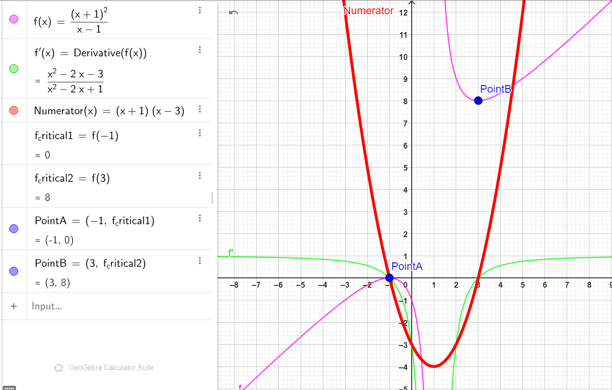

### Explanation of the Rational Function Plot

### Function Definition

The rational function is:

$$
f(x) = \frac{(x+1)^2}{x-1}
$$

It is defined for \( $x \neq 1$ \) (vertical asymptote at \( $x = 1$ \)).

### Graph Explanation

1. **Green Curve: Function \( $f(x)$ \)**

    - The green curve represents the rational function:
        $$
        f(x) = \frac{(x+1)^2}{x-1}
        $$

2. **Pink Curve: Derivative \( $f'(x)$ \)**

    - The pink curve represents the derivative:
        $$
        f'(x) = \frac{(x+1)(x-3)}{(x-1)^2}
        $$
    - It identifies where the slope of \( $f(x)$ \) changes. Critical points occur where \( $f'(x) = 0$ \), which happens when the numerator equals zero.

3. **Red Curve: Numerator of \( $f'(x)$ \)**
    - The red curve represents the numerator of the derivative:
        $$
        \text{Numerator of } f'(x) = (x+1)(x-3)
        $$
    - This visualizes the roots of \( $f'(x) = 0$ \), which are:

-   **Critical points**:
    -   \( $\text{PointA} = (-1, 0)$ \): Local maximum (blue marker).
    -   \( $\text{PointB} = (3, 8)$ \): Local minimum (blue marker).

---

---

---

 
 
 
 
 
 
 
 
 
 
 
 

# 23. Taylor Series

1. Find the Taylor series and visualize obtained functions in Geogebra:

# $f(x) = \cos(x)$ around $x = 0$ up to the 4th degree.

### **Step 1: Recall the Taylor series formula.**

The Taylor series of a function \( $f(x)$ \) around \( $x = 0$ \) is given by:

$$
f(x) = f(0) + f'(0)x + \frac{f''(0)x^2}{2!} + \frac{f'''(0)x^3}{3!} + \frac{f^{(4)}(0)x^4}{4!} + \dots
$$

### **Step 2: Compute the derivatives of \( $f(x) = \cos(x)$ \).**

1. The **first derivative**:

    $$
    f'(x) = -\sin(x)
    $$

2. The **second derivative**:

    $$
    f''(x) = -\cos(x)
    $$

3. The **third derivative**:

    $$
    f'''(x) = \sin(x)
    $$

4. The **fourth derivative**:
    $$
    f^{(4)}(x) = \cos(x)
    $$

### **Step 3: Evaluate the derivatives at \($ x = 0$ \).**

1. **\( $f(0)$ \):**

    $$
    f(0) = \cos(0) = 1
    $$

2. **\( $f'(0)$ \):**

    $$
    f'(0) = -\sin(0) = 0
    $$

3. **\( $f''(0)$ \):**

    $$
    f''(0) = -\cos(0) = -1
    $$

4. **\( $f'''(0)$ \):**

    $$
    f'''(0) = \sin(0) = 0
    $$

5. **\( $f^{(4)}(0)$ \):**
    $$
    f^{(4)}(0) = \cos(0) = 1
    $$

### **Step 4: Write the Taylor series up to the 4th degree.**

Substitute the computed values into the Taylor series formula:

1. **The 0th term:**

    $$
    f(0) = 1
    $$

2. **The 1st term:**

    $$
    f'(0)x = 0 \cdot x = 0
    $$

3. **The 2nd term:**

    $$
    \frac{f''(0)x^2}{2!} = \frac{-1 \cdot x^2}{2} = -\frac{x^2}{2}
    $$

4. **The 3rd term:**

    $$
    \frac{f'''(0)x^3}{3!} = \frac{0 \cdot x^3}{6} = 0
    $$

5. **The 4th term:**
    $$
    \frac{f^{(4)}(0)x^4}{4!} = \frac{1 \cdot x^4}{24} = \frac{x^4}{24}
    $$

Combine all terms:

$$
f(x) = 1 - \frac{x^2}{2} + \frac{x^4}{24}
$$

### **Step 5: Final result.**

The Taylor series of \( $f(x) = \cos(x)$ \) around \( $x = 0$ \) up to the 4th degree is:

$$
f(x) = 1 - \frac{x^2}{2} + \frac{x^4}{24}.
$$

## [GEOGEBRA LINK](https://www.geogebra.org/calculator/ztdypr9s)

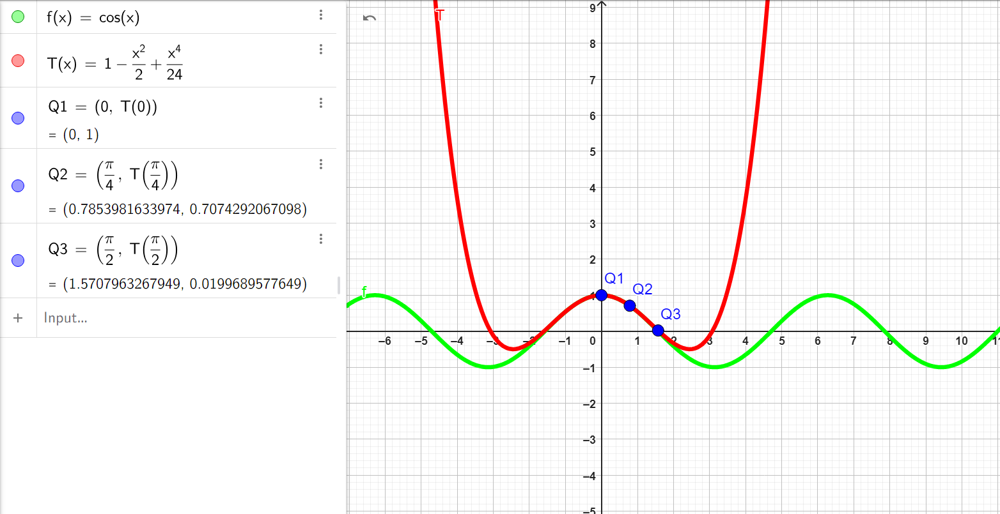

### Explanation of the Taylor Series Plot

### Functions Plotted

1. **Green Curve: \($ f(x) = \cos(x)$ \)**

    - Represents the original cosine function, showing the true behavior of \( $\cos(x)$ \).

2. **Red Curve: Taylor Series Approximation \( $T(x) = 1 - \frac{x^2}{2} + \frac{x^4}{24}$ \)**
    - The 4th-degree Taylor series approximation of \( $f(x)$ \) around \( $x = 0$ \).
    - The approximation is accurate near \( $x = 0$ \), but diverges as \( $|x|$ \) increases.

---

### Points Plotted

1. **Blue Points: Values on the Taylor Series \( T(x) \):**
    - \( $Q_1 = (0, T(0)) = (0, 1)$ \)
    - \( $Q_2 = (\pi/4, T(\pi/4)) \approx (0.785, 0.707)$ \)
    - \( $Q_3 = (\pi/2, T(\pi/2)) \approx (1.571, 0.020)$ \)

---

---

---

 
 
 
 
 
 
 
 
 
 
 
 

# **24. Integrals**

### **1. Compute:**

---

### **1.1 \( $\int 1 dx$ \)**

1. **Step 1:** Recall the integral of a constant:

    $$
    \int c dx = c \cdot x + C
    $$

    where \( c = 1 \).

2. **Step 2:** Compute:
    $$
    \int 1 dx = 1 \cdot x + C = x + C.
    $$

**Result:**

$$
\int 1 dx = x + C.
$$

---

### **1.2 \( $\int (x^2 + 2) dx$ \)**

1. **Step 1:** Apply the linearity of integrals:

    $$
    \int (x^2 + 2) dx = \int x^2 dx + \int 2 dx.
    $$

2. **Step 2:** Compute each term:

    - \( $\int x^2 dx = \frac{x^{2+1}}{2+1} = \frac{x^3}{3}$ \),
    - \( $\int 2 dx = 2 \cdot x$ \).

3. **Step 3:** Combine the results:
    $$
    \int (x^2 + 2) dx = \frac{x^3}{3} + 2x + C.
    $$

**Result:**

$$
\int (x^2 + 2) dx = \frac{x^3}{3} + 2x + C.
$$

---

### **1.3 \( $\int 2 \sin(x) dx$ \)**

1. **Step 1:** Use the constant multiple rule:

    $$
    \int 2 \sin(x) dx = 2 \cdot \int \sin(x) dx.
    $$

2. **Step 2:** Recall the integral of \( $\sin(x)$ \):

    $$
    \int \sin(x) dx = -\cos(x).
    $$

3. **Step 3:** Substitute:
    $$
    \int 2 \sin(x) dx = 2 \cdot (-\cos(x)) = -2\cos(x) + C.
    $$

**Result:**

$$
\int 2 \sin(x) dx = -2\cos(x) + C.
$$

---

### **1.4 \( $\int \frac{3}{x} dx$ \)**

1. **Step 1:** Use the constant multiple rule:

    $$
    \int \frac{3}{x} dx = 3 \cdot \int \frac{1}{x} dx.
    $$

2. **Step 2:** Recall the integral of \( $\frac{1}{x}$ \):

    $$
    \int \frac{1}{x} dx = \ln|x|.
    $$

3. **Step 3:** Substitute:
    $$
    \int \frac{3}{x} dx = 3 \cdot \ln|x| + C = 3\ln|x| + C.
    $$

**Result:**

$$
\int \frac{3}{x} dx = 3\ln|x| + C.
$$

---

### **1.5 \( $\int \frac{1}{x^2} dx$ \)**

1. **Step 1:** Rewrite \( $\frac{1}{x^2}$ \) as \( $x^{-2}$ \):

    $$
    \int \frac{1}{x^2} dx = \int x^{-2} dx.
    $$

2. **Step 2:** Use the power rule:

    $$
    \int x^n dx = \frac{x^{n+1}}{n+1} \quad \text{(for \( n \neq -1 \))}.
    $$

3. **Step 3:** Here, \( n = -2 \). Compute:

    $$
    \int x^{-2} dx = \frac{x^{-2+1}}{-2+1} = \frac{x^{-1}}{-1} = -\frac{1}{x}.
    $$

4. **Step 4:** Add the constant:
    $$
    \int \frac{1}{x^2} dx = -\frac{1}{x} + C.
    $$

**Result:**

$$
\int \frac{1}{x^2} dx = -\frac{1}{x} + C.
$$

---

### **1.6 \( $\int \left( \frac{1}{3}x^4 - 5 \right) dx$ \)**

1. **Step 1:** Split the integral:

    $$
    \int \left( \frac{1}{3}x^4 - 5 \right) dx = \int \frac{1}{3}x^4 dx - \int 5 dx.
    $$

2. **Step 2:** Compute each term:

    - \( $\int \frac{1}{3}x^4 dx = \frac{1}{3} \cdot \frac{x^{4+1}}{4+1} = \frac{x^5}{15}$ \),
    - \( $\int 5 dx = 5x$ \).

3. **Step 3:** Combine the results:
    $$
    \int \left( \frac{1}{3}x^4 - 5 \right) dx = \frac{x^5}{15} - 5x + C.
    $$

**Result:**

$$
\int \left( \frac{1}{3}x^4 - 5 \right) dx = \frac{x^5}{15} - 5x + C.
$$

---

### **1.7 \( $\int (\sin^2(x) + \cos^2(x)) dx$ \)**

1. **Step 1:** Recall the Pythagorean identity:

    $$
    \sin^2(x) + \cos^2(x) = 1.
    $$

2. **Step 2:** Substitute:

    $$
    \int (\sin^2(x) + \cos^2(x)) dx = \int 1 dx.
    $$

3. **Step 3:** Compute:
    $$
    \int 1 dx = x + C.
    $$

**Result:**

$$
\int (\sin^2(x) + \cos^2(x)) dx = x + C.
$$

---

### **1.8 \( $\int (5\sin(x) + 3e^x) dx$ \)**

1. **Step 1:** Split the integral:

    $$
    \int (5\sin(x) + 3e^x) dx = \int 5\sin(x) dx + \int 3e^x dx.
    $$

2. **Step 2:** Compute each term:

    - \( $\int 5\sin(x) dx = 5 \cdot (-\cos(x)) = -5\cos(x)$ \),
    - \( $\int 3e^x dx = 3e^x$ \).

3. **Step 3:** Combine the results:
    $$
    \int (5\sin(x) + 3e^x) dx = -5\cos(x) + 3e^x + C.
    $$

**Result:**

$$
\int (5\sin(x) + 3e^x) dx = -5\cos(x) + 3e^x + C.
$$

---

### **1.9 \( $\int \sqrt{x} dx$ \)**

1. **Step 1:** Rewrite \( $\sqrt{x}$ \) as \( $x^{1/2}$ \):

    $$
    \int \sqrt{x} dx = \int x^{1/2} dx.
    $$

2. **Step 2:** Use the power rule:

    $$
    \int x^n dx = \frac{x^{n+1}}{n+1}.
    $$

3. **Step 3:** Here, \( $n = 1/2$ \). Compute:

    $$
    \int x^{1/2} dx = \frac{x^{1/2+1}}{1/2+1} = \frac{x^{3/2}}{3/2} = \frac{2}{3}x^{3/2}.
    $$

4. **Step 4:** Add the constant:
    $$
    \int \sqrt{x} dx = \frac{2}{3}x^{3/2} + C.
    $$

---

### **1.10 \( $\int \sqrt{10x} dx$ \)**

1. **Step 1:** Rewrite \( $\sqrt{10x}$ \) as \( $(10x)^{1/2}$ \):

    $$
    \int \sqrt{10x} dx = \int (10x)^{1/2} dx.
    $$

2. **Step 2:** Factor out \( $10^{1/2}$ \) and separate:

    $$
    \int (10x)^{1/2} dx = \sqrt{10} \int x^{1/2} dx.
    $$

3. **Step 3:** Use the power rule for \( $x^{1/2}$ \):

    $$
    \int x^{1/2} dx = \frac{x^{3/2}}{3/2} = \frac{2}{3}x^{3/2}.
    $$

4. **Step 4:** Substitute back:
    $$
    \int \sqrt{10x} dx = \sqrt{10} \cdot \frac{2}{3}x^{3/2} = \frac{2\sqrt{10}}{3}x^{3/2} + C.
    $$

**Result:**

$$
\int \sqrt{10x} dx = \frac{2\sqrt{10}}{3}x^{3/2} + C.
$$

---

### **1.11 \( $\int \cos\left(\frac{5}{2}x + 3\right) dx$ \)**

1. **Step 1:** Use substitution. Let:

    $$
    u = \frac{5}{2}x + 3, \quad \frac{du}{dx} = \frac{5}{2}, \quad dx = \frac{2}{5} du.
    $$

2. **Step 2:** Substitute:

    $$
    \int \cos\left(\frac{5}{2}x + 3\right) dx = \int \cos(u) \cdot \frac{2}{5} du.
    $$

3. **Step 3:** Factor out the constant:

    $$
    \frac{2}{5} \int \cos(u) du.
    $$

4. **Step 4:** Recall the integral of \( $\cos(u)$ \):

    $$
    \int \cos(u) du = \sin(u).
    $$

5. **Step 5:** Substitute back:
    $$
    \frac{2}{5} \sin(u) + C = \frac{2}{5} \sin\left(\frac{5}{2}x + 3\right) + C.
    $$

**Result:**

$$
\int \cos\left(\frac{5}{2}x + 3\right) dx = \frac{2}{5} \sin\left(\frac{5}{2}x + 3\right) + C.
$$

---

### **1.12 \( $\int \frac{\cos(\ln(x))}{x} dx$ \)**

1. **Step 1:** Use substitution. Let:

    $$
    u = \ln(x), \quad \frac{du}{dx} = \frac{1}{x}, \quad dx = x \cdot du.
    $$

2. **Step 2:** Substitute:

    $$
    \int \frac{\cos(\ln(x))}{x} dx = \int \cos(u) du.
    $$

3. **Step 3:** Compute the integral of \( $\cos(u)$ \):

    $$
    \int \cos(u) du = \sin(u).
    $$

4. **Step 4:** Substitute back \( $u = \ln(x)$ \):
    $$
    \sin(\ln(x)) + C.
    $$

**Result:**

$$
\int \frac{\cos(\ln(x))}{x} dx = \sin(\ln(x)) + C.
$$

---

### **1.13 \( $\int x \ln(x) dx$ \)**

1. **Step 1:** Use integration by parts:

    $$
    \int u dv = uv - \int v du.
    $$

    Let \( $u = \ln(x), dv = x dx$ \).

2. **Step 2:** Compute \( $du$ \) and \( $v$ \):

    $$
    u = \ln(x), \quad du = \frac{1}{x} dx, \quad dv = x dx, \quad v = \frac{x^2}{2}.
    $$

3. **Step 3:** Apply the formula:

    $$
    \int x \ln(x) dx = \frac{x^2}{2} \ln(x) - \int \frac{x^2}{2} \cdot \frac{1}{x} dx.
    $$

4. **Step 4:** Simplify the remaining integral:

    $$
    \int \frac{x^2}{2} \cdot \frac{1}{x} dx = \int \frac{x}{2} dx = \frac{1}{2} \cdot \frac{x^2}{2} = \frac{x^2}{4}.
    $$

5. **Step 5:** Combine terms:
    $$
    \int x \ln(x) dx = \frac{x^2}{2} \ln(x) - \frac{x^2}{4} + C.
    $$

**Result:**

$$
\int x \ln(x) dx = \frac{x^2}{2} \ln(x) - \frac{x^2}{4} + C.
$$

---

### **1.14 \( $\int x e^x dx$ \)**

1. **Step 1:** Use integration by parts:

    $$
    \int u dv = uv - \int v du.
    $$

    Let \( $u = x, dv = e^x dx$ \).

2. **Step 2:** Compute \( $du$ \) and \( $v$ \):

    $$
    u = x, \quad du = dx, \quad dv = e^x dx, \quad v = e^x.
    $$

3. **Step 3:** Apply the formula:

    $$
    \int x e^x dx = x e^x - \int e^x dx.
    $$

4. **Step 4:** Compute the remaining integral:

    $$
    \int e^x dx = e^x.
    $$

5. **Step 5:** Combine terms:

    $$
    \int x e^x dx = x e^x - e^x + C.
    $$

6. **Step 6:** Factor out \( $e^x$ \):
    $$
    \int x e^x dx = e^x (x - 1) + C.
    $$

**Result:**

$$
\int x e^x dx = e^x (x - 1) + C.
$$

---

### **1.15 \( $\int e^{x^2} dx$ \)**

1. **Step 1:** Note that this integral cannot be solved using elementary functions.

2. **Step 2:** The solution involves a special function called the error function (\( $\text{erf}$ \)), which is beyond standard elementary calculus.

3. **Step 3:** State the result symbolically:
    $$
    \int e^{x^2} dx = \text{erf}(x) + C \quad \text{(expressed in terms of the error function)}.
    $$

---

---

---

 
 
 
 
 
 
 
 
 
 
 
 

# 2. Calculate integrals over the interval $[0, \pi]$ and visualize them in Geogebra:

### **2.1 \( $f(x) = 2x + 1$ \)**

We need to compute:

$$
\int_{0}^{\pi} (2x + 1) dx.
$$

1. **Step 1:** Integrate \( $f(x)$ \):

    $$
    \int (2x + 1) dx = \int 2x dx + \int 1 dx.
    $$

2. **Step 2:** Apply the power rule to \( $2x$ \) and the constant rule to \( $1$ \):

    $$
    \int 2x dx = x^2, \quad \int 1 dx = x.
    $$

3. **Step 3:** Combine the results:

    $$
    \int (2x + 1) dx = x^2 + x + C.
    $$

4. **Step 4:** Apply the limits \( $[0, \pi]$ \):

    $$
    \int_{0}^{\pi} (2x + 1) dx = \left[ x^2 + x \right]_{0}^{\pi}.
    $$

5. **Step 5:** Evaluate at \( $x = \pi$ \) and \( $x = 0$ \):

    - At \( $x = \pi$ \):
        $$
        (\pi^2 + \pi).
        $$
    - At \( x = 0 \):
        $$
        (0^2 + 0) = 0.
        $$

6. **Step 6:** Subtract the results:
    $$
    \int_{0}^{\pi} (2x + 1) dx = (\pi^2 + \pi) - 0 = \pi^2 + \pi.
    $$

**Result:**

$$
\int_{0}^{\pi} (2x + 1) dx = \pi^2 + \pi.
$$

## [GEOGEBRA LINK](https://www.geogebra.org/calculator/wxnjtp8r)

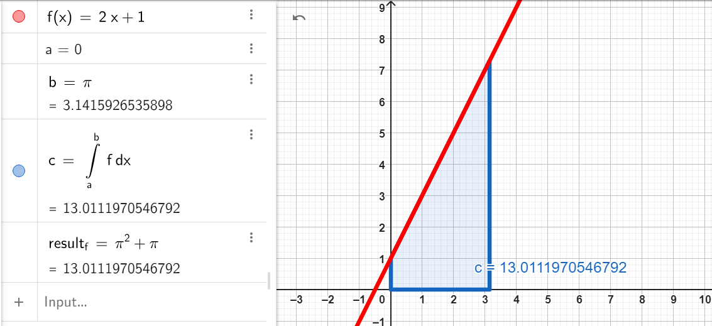

---

### **2.2 \( $g(x) = x^2$ \)**

We need to compute:

$$
\int_{0}^{\pi} x^2 dx.
$$

1. **Step 1:** Integrate \( $g(x)$ \) using the power rule:

    $$
    \int x^2 dx = \frac{x^3}{3} + C.
    $$

2. **Step 2:** Apply the limits \( $[0, \pi]$ \):

    $$
    \int_{0}^{\pi} x^2 dx = \left[ \frac{x^3}{3} \right]_{0}^{\pi}.
    $$

3. **Step 3:** Evaluate at \($x = \pi$ \) and \( $x = 0$ \):

    - At \( $x = \pi$ \):
        $$
        \frac{\pi^3}{3}.
        $$
    - At \( x = 0 \):
        $$
        \frac{0^3}{3} = 0.
        $$

4. **Step 4:** Subtract the results:
    $$
    \int_{0}^{\pi} x^2 dx = \frac{\pi^3}{3} - 0 = \frac{\pi^3}{3}.
    $$

**Result:**

$$
\int_{0}^{\pi} x^2 dx = \frac{\pi^3}{3}.
$$

## [GEOGEBRA LINK](https://www.geogebra.org/calculator/pvqhuyhs)

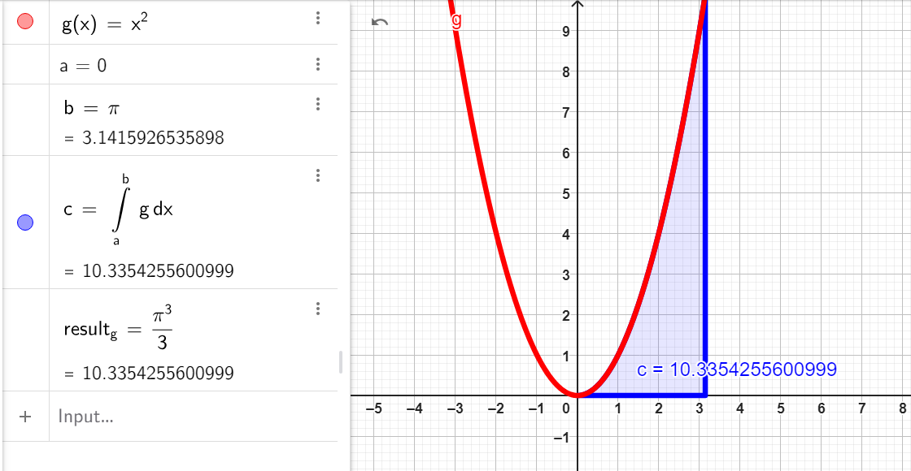

---

---

---

 
 
 
 
 
 
 
 
 
 
 
 

# 3. Calculate the area of the region bounded by the lines: $x = 1$, $x = 2$, $y = 0$, and $y = x^2 + 1$. Show it in Geogebra.

### **Step 1: Set up the integral.**

The area under the curve \( $y = x^2 + 1$ \) between \( $x = 1$ \) and \( $x = 2$ \) is given by:

$$
\text{Area} = \int_{1}^{2} (x^2 + 1) dx.
$$

### **Step 2: Integrate \( $x^2 + 1$ \).**

1. Break the integral into two parts:

    $$
    \int (x^2 + 1) dx = \int x^2 dx + \int 1 dx.
    $$

2. Apply the power rule for \( $x^2$ \) and the constant rule for \( $1$ \):

    - \( $\int x^2 dx = \frac{x^3}{3}$ \),
    - \( $\int 1 dx = x$ \).

3. Combine the results:
    $$
    \int (x^2 + 1) dx = \frac{x^3}{3} + x + C.
    $$

### **Step 3: Apply the limits \( $[1, 2]$ \).**

Now substitute the limits \( $1$ \) and \( $2$ \) into the integral:

$$
\text{Area} = \left[ \frac{x^3}{3} + x \right]_{1}^{2}.
$$

### **Step 4: Evaluate the definite integral.**

1. **At \( $x = 2$ \):**

    $$
    \frac{2^3}{3} + 2 = \frac{8}{3} + 2 = \frac{8}{3} + \frac{6}{3} = \frac{14}{3}.
    $$

2. **At \( $x = 1$ \):**

    $$
    \frac{1^3}{3} + 1 = \frac{1}{3} + 1 = \frac{1}{3} + \frac{3}{3} = \frac{4}{3}.
    $$

3. **Subtract the results:**
    $$
    \text{Area} = \frac{14}{3} - \frac{4}{3} = \frac{10}{3}.
    $$

### **Final Answer:**

The area of the region is:

$$
\text{Area} = \frac{10}{3}.
$$

## [GEOGEBRA LINK](https://www.geogebra.org/calculator/wa6xpjcn)

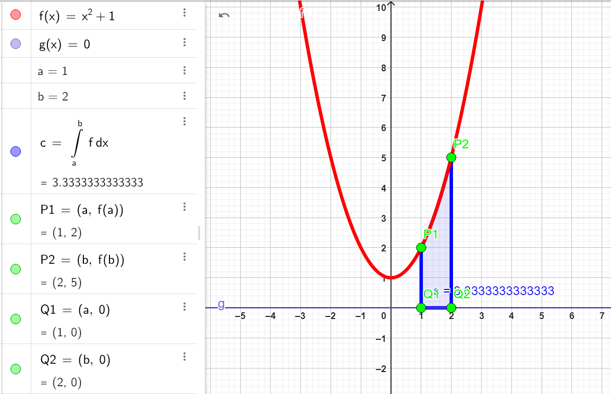

---

---

---

---

 
 
 
 
 
 
 
 
 
 
 
 

# 4. Calculate the area under the sine curve over the interval $[0, \pi]$, using:

$$P = \int_a^b f(x) \, dx = \int_0^\pi \sin(x) \, dx$$

### **Step 1: Set up the integral.**

The function is \( $f(x) = \sin(x)$ \). We want to calculate the definite integral of \( $\sin(x)$ \) over the interval \( $[0, \pi]$ \):

$$
P = \int_{0}^{\pi} \sin(x) \, dx
$$

### **Step 2: Integrate \( $\sin(x)$ \).**

The integral of \( $\sin(x)$ \) is:

$$
\int \sin(x) \, dx = -\cos(x) + C
$$

Thus, the definite integral becomes:

$$
P = \left[ -\cos(x) \right]_{0}^{\pi}
$$

### **Step 3: Evaluate the definite integral.**

1. **At \( $x = \pi$ \):**

    $$
    -\cos(\pi) = -(-1) = 1
    $$

2. **At \( $x = 0$ \):**

    $$
    -\cos(0) = -(1) = -1
    $$

3. **Subtract the results:**
    $$
    P = 1 - (-1) = 1 + 1 = 2
    $$

### **Final Answer:**

The area under the sine curve over the interval \( $[0, \pi]$ \) is:

$$
P = 2
$$

## [GEOGEBRA LINK](https://www.geogebra.org/calculator/fnraw6sn)

## 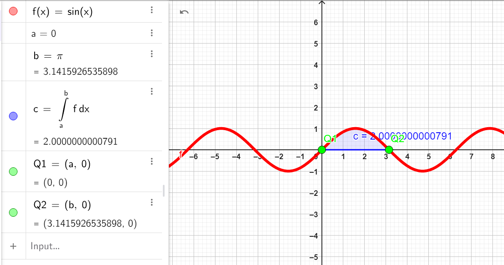

---

---

 
 
 
 
 
 
 
 
 
 
 
 

# 5. Calculate the length of the sine curve over the same interval using:

### **Step 1: Arc Length Formula**

The formula for the arc length of a curve \( $f(x)$\) over \( $[a, b]$ \) is:

$$
L = \int_{a}^{b} \sqrt{1 + (f'(x))^2} \, dx
$$

For \( $f(x) = \sin(x)$ \), the derivative is:

$$
f'(x) = \cos(x)
$$

Substitute \( $f'(x)$ \) into the formula:

$$
L = \int_{0}^{\pi} \sqrt{1 + \cos^2(x)} \, dx
$$

### **Step 2: Evaluate the Integral**

The integrand is:

$$
\sqrt{1 + \cos^2(x)}
$$

This does **not have a closed-form antiderivative**, so the integral must be evaluated **numerically**.

### **Step 3: Numerical Evaluation**

Using numerical integration, the result is approximately:

$$
L \approx 3.8202
$$

## [GEOGEBRA LINK](https://www.geogebra.org/calculator/arwmcfkx)

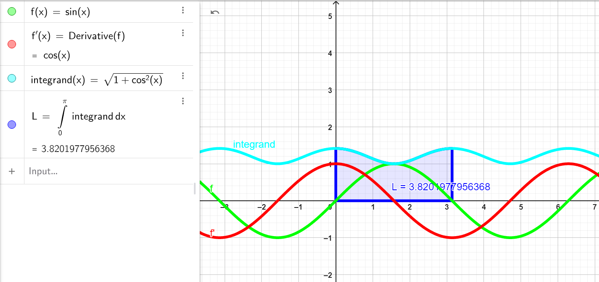

---

---

---

 
 
 
 
 
 
 
 
 
 
 
 

# 6. Find the distance of the moving particle between time $t=0$ and $t=2$ for the following position function: $x(t) = 3t^2 - 6t + 1$.

### **Step 1: Recall the formula for total distance traveled.**

The total distance traveled by a particle over an interval \($ [t_1, t_2]$ \) is given by the integral of the absolute value of velocity \( $|v(t)|$ \):

$$
\text{Distance} = \int_{t_1}^{t_2} |v(t)| \, dt
$$

Where \( v(t) \) is the velocity function, the derivative of the position function \($ x(t) $\):

$$
v(t) = \frac{dx(t)}{dt}.
$$

### **Step 2: Compute the velocity function \( $v(t)$ \).**

The given position function is:

$$
x(t) = 3t^2 - 6t + 1
$$

Differentiate \( $x(t)$ \) with respect to \( $t$ \):

$$
v(t) = \frac{dx(t)}{dt} = \frac{d}{dt}\left(3t^2 - 6t + 1\right)
$$

Perform the differentiation term by term:

1. \( $\frac{d}{dt}(3t^2) = 6t$ \),
2. \( $\frac{d}{dt}(-6t) = -6$ \),
3. \( $\frac{d}{dt}(1) = 0$ \).

$$
v(t) = 6t - 6
$$

### **Step 3: Identify when the velocity changes sign.**

The absolute value \( $|v(t)|$ \) depends on the sign of \( $v(t)$ \). Solve \( $v(t) = 0$ \) to find when the particle changes direction:

$$
v(t) = 6t - 6 = 0
$$

Solve for \( $t$ \):

$$
t = 1
$$

So, the velocity changes sign at \( $t = 1$ \). We now split the integral into two intervals: \( $[0, 1]$ \) and \( $[1, 2]$ \).

### **Step 4: Evaluate the total distance.**

The total distance traveled is:

$$
\text{Distance} = \int_{0}^{1} |v(t)| \, dt + \int_{1}^{2} |v(t)| \, dt
$$

#### For \( $t \in [0, 1]$ \), \( $v(t) = 6t - 6 \leq 0$ \):

On \( $[0, 1]$ \), \( $v(t)$ \) is negative, so:

$$
|v(t)| = -(6t - 6) = -6t + 6
$$

The integral becomes:

$$
\int_{0}^{1} |v(t)| \, dt = \int_{0}^{1} (-6t + 6) \, dt
$$

1. Integrate \( $-6t + 6$ \):

$$
\int (-6t + 6) \, dt = -3t^2 + 6t + C
$$

2. Evaluate from \( $t = 0$ \) to \( $t = 1$ \):

At \( $t = 1$ \):

$$
-3(1)^2 + 6(1) = -3 + 6 = 3
$$

At \( $t = 0$ \):

$$
-3(0)^2 + 6(0) = 0
$$

So:

$$
\int_{0}^{1} (-6t + 6) \, dt = 3 - 0 = 3
$$

#### For \( $t \in [1, 2]$ \), \( $v(t) = 6t - 6 \geq 0$ \):

On \( $[1, 2]$ \), \( $v(t)$ \) is positive, so:

$$
|v(t)| = 6t - 6
$$

The integral becomes:

$$
\int_{1}^{2} |v(t)| \, dt = \int_{1}^{2} (6t - 6) \, dt
$$

1. Integrate \( $6t - 6$ \):

$$
\int (6t - 6) \, dt = 3t^2 - 6t + C
$$

2. Evaluate from \( $t = 1$ \) to \( $t = 2$ \):

At \( $t = 2$ \):

$$
3(2)^2 - 6(2) = 3(4) - 12 = 12 - 12 = 0
$$

At \( $t = 1$ \):

$$
3(1)^2 - 6(1) = 3 - 6 = -3
$$

So:

$$
\int_{1}^{2} (6t - 6) \, dt = 0 - (-3) = 3
$$

### **Step 5: Add the distances.**

The total distance traveled is:

$$
\text{Distance} = \int_{0}^{1} |v(t)| \, dt + \int_{1}^{2} |v(t)| \, dt = 3 + 3 = 6
$$

### **Final Answer:**

The total distance traveled by the particle between \( $t = 0$ \) and \( $t = 2$ \) is:

$$
\text{Distance} = 6
$$

## [GEOGEBRA LINK](https://www.geogebra.org/calculator/fqhbmpjp)

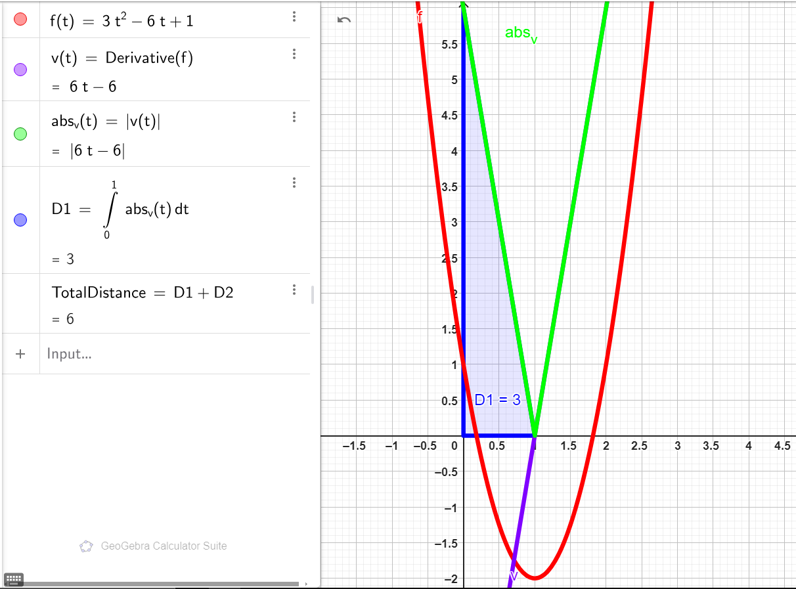

---

---

---

 
 
 
 
 
 
 
 
 
 
 
 
